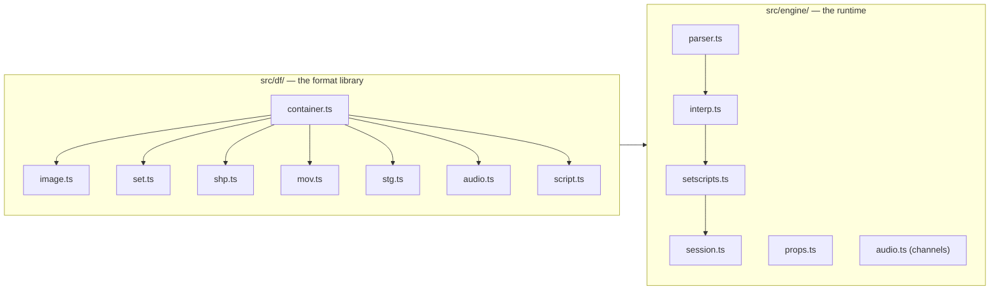

# Engine architecture

*Prerequisite: [How the game works](01-how-the-game-works.md).*

This doc is about *this project* — how the TypeScript code is organised — as
opposed to the game's file formats (those get their own docs). If you want to
find where something lives in the source, start here.

## Two layers: "read the files" vs "run the game"

The code splits cleanly in two, and it's worth keeping the split in your head
because the two halves came from very different places.



### `src/df/` — the format library ("how to *read* the files")

This is a faithful TypeScript port of the decoding logic in
[DFET](https://github.com/M3tox/DFET). Its only job is: **given the raw bytes of a game file,
produce plain data structures** — a list of scenes, a decoded image, a
palette, a chunk of audio samples. It knows *nothing* about how the game
plays. Every file in here corresponds to a format doc:

| File | Reads | Doc |
|------|-------|-----|
| [`container.ts`](https://github.com/dhobi/taoot-web/blob/master/src/df/container.ts) | the shared container skeleton | [DFile container](formats/README.md) |
| [`binary.ts`](https://github.com/dhobi/taoot-web/blob/master/src/df/binary.ts) | low-level byte reading (endianness, strings) | [DFile container](formats/README.md) |
| [`image.ts`](https://github.com/dhobi/taoot-web/blob/master/src/df/image.ts) | compressed frames, palettes, depth maps | [Image codec](formats/image-codec.md) |
| [`set.ts`](https://github.com/dhobi/taoot-web/blob/master/src/df/set.ts) | SET rooms/scenes/views | [SET](formats/set.md) |
| [`shp.ts`](https://github.com/dhobi/taoot-web/blob/master/src/df/shp.ts) | SHP props | [SHP](formats/shp.md) |
| [`mov.ts`](https://github.com/dhobi/taoot-web/blob/master/src/df/mov.ts) | MOV movies | [MOV](formats/mov.md) |
| [`stg.ts`](https://github.com/dhobi/taoot-web/blob/master/src/df/stg.ts) | STG stage/UI | [STG](formats/stg.md) |
| [`audio.ts`](https://github.com/dhobi/taoot-web/blob/master/src/df/audio.ts) | TRK/SFX/11K audio banks | [Audio](formats/audio.md) |
| [`script.ts`](https://github.com/dhobi/taoot-web/blob/master/src/df/script.ts) | the compiled-script binary | [Script container](formats/script-container.md) |

### `src/engine/` — the runtime ("how the game *behaves*")

This is the part DFET never needed and never had: the actual **game engine**.
Its behaviour was reconstructed by watching the real game and by
disassembling `TI.EXE`. Key files:

| File | Responsibility |
|------|----------------|
| [`parser.ts`](https://github.com/dhobi/taoot-web/blob/master/src/engine/parser.ts) | turns a decoded script's tokens into a syntax tree |
| [`interp.ts`](https://github.com/dhobi/taoot-web/blob/master/src/engine/interp.ts) | **the interpreter** — runs the scripts |
| [`setscripts.ts`](https://github.com/dhobi/taoot-web/blob/master/src/engine/setscripts.ts) | binds one SET's scripts to the interpreter and routes events |
| [`props.ts`](https://github.com/dhobi/taoot-web/blob/master/src/engine/props.ts) | the prop runtime — visibility, animation, compositing |
| [`audio.ts`](https://github.com/dhobi/taoot-web/blob/master/src/engine/audio.ts) | playback channels (sound / voice / theme) and the sound library |
| [`session.ts`](https://github.com/dhobi/taoot-web/blob/master/src/engine/session.ts) | **GameSession** — ties everything together and owns cross-set state |

The **[Scripting doc](03-scripting-language.md)** covers the interpreter in
detail; the rest of this doc is about how the pieces run together.

## The GameSession: the thing that persists

`GameSession` ([session.ts](https://github.com/dhobi/taoot-web/blob/master/src/engine/session.ts)) is the top of the
runtime. There is **one interpreter** whose variables live for the whole
play session, so your inventory and progress survive when you walk from one
set to another. The session owns:

- the interpreter and its global variables,
- the currently open SET (via a per-set binding, `SetScripts`),
- the audio banks and playback channels,
- the props runtime and the open "shop" (SHP) files,
- the stage layer (STG) — the UI band and any full-screen screen.

When you travel to a new set, the *set* is swapped out but the *session*
stays. That's the key architectural fact: **sets are disposable, the session
is not**.

## The render picture: layers on a 512×384 screen

The screen is **512×384**. It is drawn back-to-front:

```
┌────────────────────────────────┐  y = 0
│                                │
│   the current SET view         │   ← 512 × 264, only when "set visible"
│   (a pre-rendered background)   │
│                                │
├────────────────────────────────┤  y = 264
│   UI band: menu, held item,     │   ← STG flat image + house.shp props
│   watch  (STG + SHP props)      │
└────────────────────────────────┘  y = 384
```

1. A **stage flat** image (from an STG file) is the bottom layer / background.
2. The current **SET view** is composited into the top 512×264 (when the set
   is visible — full-screen screens like the map hide it).
3. **Props** (SHP) are drawn on top, ordered by depth so nearer things cover
   farther ones. In-world props are placed using the 3D projection recovered
   from `TI.EXE`; UI-band props sit at fixed screen positions.

## How one mouse click flows through the system

This is the single most useful thing to understand, because the same
"event travels down a chain" idea appears everywhere.

```mermaid
sequenceDiagram
  participant U as You (mouse click)
  participant V as Viewer
  participant PR as Props
  participant SS as SetScripts
  participant BOOT as Boot library

  U->>V: click at (x, y)
  V->>PR: is a prop under the cursor?
  alt a prop is hit
    PR->>PR: run that prop's `mousedown` handler
  else no prop
    V->>SS: is a view hotspot under the cursor?
    SS->>SS: object script → scene script → set main script
    Note over SS: whoever handles it wins;<br/>`passcode` forwards to the next level
  end
```

The chain for a pointer event over a hotspot is **object → scene → set main
→ stage**. Each level either handles the event (with an `exitcode`) or passes
it on (`passcode`, or simply having no handler). Keyboard events go through
an even longer chain that ends at the **boot** library's default movement
logic — which is why a scene script can quietly steal the ↑ key to send you
through a door instead of walking. The full event model is in the
**[Scripting doc](03-scripting-language.md)**.

## The heartbeat and timed events

The engine has a **heartbeat** that ticks roughly **15 times a second**
(every ~66 ms). On each tick it services timed things: script-scheduled
callbacks (`makeloop`), positional ambient sounds (`makecricket`), and looping
sounds. A separate, finer time base (1 tick = 1/60 s) drives `delay(n)` waits.

This timing layer is the current frontier of the port: its behaviour is fully
recovered from `TI.EXE` but not yet fully implemented. The short version of
what was learned:

- A "loop" is really a **one-shot delayed callback** — things *appear* to
  loop only because their handler re-schedules itself at the end.
- A "cricket" is a positional ambient one-shot bound to the current set,
  with stereo panning based on where it is relative to the camera; setting it
  to fire again with no gap makes a seamless loop, with a gap makes an
  intermittent hiss.

## Running and verifying

- `npm run dev` — dev server; lists every `.SET` under `gamefiles/` and lets
  you click one to walk around. Assets are fetched on demand.
- `npm test` — the regression suite ([tests/regression.ts](https://github.com/dhobi/taoot-web/blob/master/tests/regression.ts)),
  a set of end-to-end checks (hotspots, road arrival, blackjack rules, audio,
  travel, props). **Prefer extending this over writing throwaway tests.**
- `tools/` also has standalone dumpers (`dumpset`, `dumpshp`, `dumpaudio`,
  `dumpscripts`) that decode a file and write PNGs/WAVs/text so you can eyeball
  a format in isolation.

Now that you know where things live, the two deep topics are the
**[scripting language](03-scripting-language.md)** and, underneath all the
data, **[the DFile container format](formats/README.md)**.
