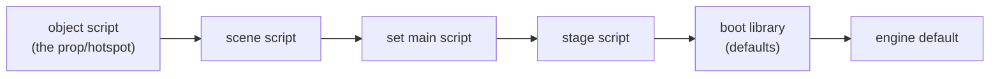

# The scripting language

*Prerequisite: [How the game works](01-how-the-game-works.md) and
[Engine architecture](02-engine-architecture.md).*

DreamFactory games are mostly **scripted**. The engine (`TI.EXE`) is a fixed
program that knows how to draw views, play sounds, and move props — but *what*
happens, *when*, is decided by little scripts stored inside the game files.
Getting the scripts to run is what turns a decoded pile of images into a game.

This doc explains the language, the event model, and the interpreter. The
*binary* layout of a compiled script on disk is a separate topic —
see **[the script container doc](formats/script-container.md)**.

## What the language looks like

The scripts read like a small C-ish language. Here's the shape (illustrative):

```
main
{
  code openset
  {
    if propvisible ("door") = "no"
    {
      voicesound ("welcome")
    }
    passcode
  }

  code mousedown
  {
    sendtoprop ("door", setupprop ("b59-hallb"))
    exitcode
  }
}
```

Things to notice:

- An object's script is a bag of named **`code` handlers**. Each handler is
  fired by a specific engine **event** — `openset`, `mousedown`, `setcursor`,
  `idle`, and so on. You don't call handlers by looping; the engine calls them
  when something happens.
- **`exitcode`** means "I handled this event, stop here." **`passcode`** means
  "not mine, pass it along." (More on that below — it's the heart of the
  event model.)
- Function-like things — `propvisible`, `voicesound`, `sendtoprop` — are
  **commands** (the language calls them all the same way whether they're
  built into the engine or defined by another script).

### Values, operators and quirks

There are numbers and strings, and the operators have a couple of surprises
that took reverse engineering to pin down:

| Operator | Meaning | Note |
|----------|---------|------|
| `+ - * /` | arithmetic | |
| `@` | **string concatenation** | not `+` |
| `&` `\|` | logical and / or | **short-circuit** |
| `=` | equality | **case-insensitive for strings** |

Two gotchas that the interpreter has to honour exactly, or real scripts
misbehave:

- **Mixed-type `=` compares as text.** An uninitialised global variable is
  `0`, and scripts rely on `"uparrow" = 0` being *false*. So comparisons
  coerce to text.
- The original compiler emitted some **oddities** the parser must tolerate:
  `//` comment lines that tokenize as two division operators, unterminated
  blocks, dead statements before the first `case`, and the occasional
  misspelled bare identifier (`reutrn`). The parser handles 100% of the
  ~1,000 scripts / ~2,900 code blocks in the shipped game.

## The event model: objects, handlers, and the chain

Every **object** in the game owns a script: the set, each scene, each prop,
each puppet, the stage, the boot. The engine turns things that happen into
**events**, and delivers each event to the relevant object's matching `code`
handler.

Common events:

| Event | Fires when |
|-------|-----------|
| `openset` / `closeset` | a set is entered / left |
| `openscene` / `closescene` | you arrive at / leave a scene |
| `mousedown` | you click on a hotspot |
| `setcursor` | the mouse hovers a hotspot (the handler picks the cursor) |
| `keydown` | a key is pressed (arg is a name like `"uparrow"`) |
| `idle` | the per-frame heartbeat |

### The chain, and how an event is "consumed"

An event is **not** delivered to just one handler. It flows down a **chain**
of objects, and each link either consumes it or forwards it:



The rule: run the current link's handler. If it ends with **`exitcode`**, the
event is consumed and the chain stops. If it ends normally *or* with
**`passcode`** — or the object has no handler for that event at all — the
event **forwards to the next link**.

This one mechanism explains a lot of the game's behaviour:

- **Default movement lives at the bottom.** Pressing ↑ fires `keydown` down
  the whole chain. Normally nothing consumes it and it reaches the boot
  library's default handler, which walks you forward. But a scene script can
  add its own `keydown` that consumes the event (`exitcode`) and instead send
  you through a door to another set. Same key, different outcome, decided by a
  script — no engine change needed.
- **Doors closing on exit.** The boot's default `closescene` handler sends
  the door prop back to its closed state, so props can't leak into the next
  scene.

### Talking to other objects: `sendto*`

A handler often needs to make *another* object do something. That's the
`sendto*` family: `sendtoprop`, `sendtoscene`, `sendtoset`, `sendtostage`,
`sendtoboot`. They look like function calls but they are **special forms**:

```
sendtoprop ("door", setupprop ("b59-hallb"))
```

means *"run `setupprop("b59-hallb")` inside the **door** prop's script."* The
second argument is a **deferred call** — it is not evaluated where it's
written; it's shipped to the target and run there, with the target as `me`.
The arguments *inside* it, though, are evaluated in the caller's frame first.

If the target has no such handler, the call falls back to the **boot library**
with `me` set to the target's name — that's how generic routines like
`initprop()` work for any prop.

## The boot library = the standard library

The **BOOTFILE**'s scripts are special: they define ~76 handlers that any
script can call by name — `changeset`, `spotmovie`, `progress`,
`setupactor`, and so on — plus `gotospecial` (defined in `MAIN.STG`). These
are the game's **standard library**.

That's why unqualified calls resolve in this order:

```
local script  →  engine builtins  →  stage script  →  boot library
```

So when a set script says `changeset(...)`, and no builtin or local handler
matches, it lands in the boot library, which ultimately calls the engine
primitives `opensetfile` / `closesetfile`. See
**[BOOTFILE](formats/bootfile.md)**.

## The interpreter

The runtime is three files:

1. **[`parser.ts`](https://github.com/dhobi/taoot-web/blob/master/src/engine/parser.ts)** — turns a decoded script's token
   stream into an abstract syntax tree (AST). It tolerates the compiler
   quirks listed above.
2. **[`interp.ts`](https://github.com/dhobi/taoot-web/blob/master/src/engine/interp.ts)** — the interpreter core: variable
   scopes (global + local), the operators, control flow (`if`, `switch`/
   `case`, loops), handler dispatch with `me`/`target` context, the
   `exitcode`/`passcode`/`return` signals, and a **builtin registry** where
   each engine command's real behaviour is filled in as it's recovered.
3. **[`setscripts.ts`](https://github.com/dhobi/taoot-web/blob/master/src/engine/setscripts.ts)** — binds a specific SET's
   scripts (main, per-scene, per-view-object) to interpreter instances and
   implements the event chain described above.

**Builtins** are the bridge from the language to the engine. `voicesound`,
`propxy`, `opensetfile`, `makeloop` — each is a TypeScript function registered
in the interpreter that does the real work (plays audio, moves a prop, swaps a
set). Reverse engineering the game is, in large part, discovering **what each
builtin is supposed to do** — the script *encoding* and the full command-name
table were already known from DFET and `TI.EXE`, but the per-command
*semantics* are documented nowhere and are recovered one command at a time
from the disassembly.

One more detail worth knowing: a builtin can be a **getter or a setter
depending on how many arguments it gets**. `propview(me)` reads a prop's
current view; `propview(me, "x")` sets it. Same name, arity decides.

### Where to look next

- How these scripts add up to the whole **plot** — the `mission`/`phase` model
  and the reconstructed story spine: **[the mission flow](04-mission-flow.md)**.
- The **on-disk format** of a compiled script (the command table, the string
  pool at the end of the container): **[script container](formats/script-container.md)**.
- How the language actually starts the game: **[BOOTFILE](formats/bootfile.md)**.
- The command-name → ID table lives inside `TI.EXE`; the tool that extracts it
  is [`tools/exetable.ts`](https://github.com/dhobi/taoot-web/blob/master/tools/exetable.ts), and the full opcode table is
  in [`src/df/script.ts`](https://github.com/dhobi/taoot-web/blob/master/src/df/script.ts).
