# The mission flow

*Prerequisite: [How the game works](01-how-the-game-works.md) and
[The scripting language](03-scripting-language.md).*

A natural question once the engine runs is: **can we see the whole game, start
to finish, from the data we already have?** The answer is yes — and it needs no
extra reverse engineering of `TI.EXE`. The plot does not live in the engine
binary. It lives entirely in the **scripts**, which we already decode. This page
explains how the story is encoded, and shows the mission graph reconstructed
straight from the shipped scripts.

## The whole plot is a handful of variables

The engine has no idea what "the story" is. It just runs scripts and remembers
some **global variables**. A few of those globals *are* the story: the scripts
branch on them to decide who is standing where, which door is unlocked, what a
character says, and where a click takes you.

Two globals matter most:

| Global | Meaning | Values |
|--------|---------|--------|
| `mission` | Which chapter of the plot you're in | `1`, `2`, `3`, then `4` (endgame), and finally `"good"` / `"bad"` |
| `phase` | How far through the current chapter | `0` … `4` |

Everything else keys off these. A script that places a character typically reads
like this (real example, from `BOIL.SET`):

```
if mission = 3 & phase = 1 & actorowner ("csea") != "thanks2"
    sendtoactor ("bsea", setupactor ("boil5"))
endif
```

That single `if` is the entire "flow logic" — a guard on `mission`/`phase` (plus
some puzzle state), and an effect. Multiply it across ~2000 script blocks and you
have the game.

### `progress()` is a *question*, not a command

Scripts constantly call `progress(m, p)`. It's easy to assume this *advances* the
story, but the BOOTFILE definition shows it only **asks** whether you've reached
at least mission `m`, phase `p`:

```
code progress (themission, thephase)
    global mission, phase
    if mission > themission
        return true
    endif
    if mission < themission
        return false
    endif
    if phase < thephase
        return false
    endif
    return true
endif
```

So `if progress(2, 3)` means *"have I reached mission 2 phase 3 or later?"* — a
gate, never a state change.

### What actually advances the story

The state is only ever moved forward by three BOOTFILE helpers:

- `advancephase()` — step to the next phase (and roll over into the next mission
  when the current one is done);
- `advanceday()` — jump to the start of a new mission/day;
- `advancetour()` — the guided-tour (demo) path.

Everywhere else, a script simply **calls one of these** when you finish a puzzle
or reach a story beat — most often at the end of a conversation. Those call sites
are the concrete moments the plot moves. We call them *beats* below.

## The mission spine

`advancephase` is one big switch on the current `mission`/`phase`. Reading it
gives the exact skeleton of the game:

```mermaid
graph LR
  START(["clock = bedsit<br/>game begins"]) --> M10

  subgraph M1["Mission 1"]
    M10["1.0"] --> M11["1.1"] --> M12["1.2"] --> M13["1.3"] --> M14["1.4"]
  end
  subgraph M2["Mission 2"]
    M20["2.0"] --> M21["2.1"] --> M22["2.2"] --> M23["2.3"]
  end
  subgraph M3["Mission 3"]
    M30["3.0"] --> M31["3.1"] --> M32["3.2"] --> M33["3.3"]
  end

  M14 -->|"advancephase"| M20
  M23 -->|"advancephase"| M30
  M33 -->|"advanceday"| ENDG

  ENDG(["mission 4<br/>endgame"]) --> ENDING["futures() contains<br/>'proz'?"]
  ENDING -->|yes| GOOD(["mission = good<br/>🏆 good ending"])
  ENDING -->|no| BAD(["mission = bad<br/>credits / play more"])
```



A few things this makes plain:

- The plot is a **linear spine** — mission 1 → 2 → 3 → endgame. There is no
  branching *chapter* structure; the freedom is inside each phase, not between
  them.
- A `mission` bump resets `phase` to `0`. When mission 3 finishes its last phase,
  `advancephase` doesn't go to a "mission 4 phase 1" — it calls `advanceday`,
  which is how the game crosses into the endgame.
- The ending is decided in one place (`opennarend`): you get `mission = "good"`
  only if your list of predicted `futures()` contains `"proz"`; otherwise
  `mission = "bad"`.

### Where the game starts (and restarts)

`advanceday` keys off a `clock` global, which is how the two-disc release and the
demo pick an entry point:

| `clock` | Sets | Meaning |
|---------|------|---------|
| `"startdisk1"` | `mission = 0` | Framing story / intro |
| `"bedsit"` | `mission = 1` | **Main game begins** (your cabin) |
| `"startdisk2"` | `mission = 4` | Disc 2 boots straight into the endgame |
| `"endgame"` (not "good") | `mission = 1` | Loop back after a failed ending |

Two of those arms do not just set a mission — they **put the world back** first, and
the data does it rather than the engine, which is why the same eight lines appear
twice:

```
size = countactors ()                size = countprops ()
for count = 1 to size                for count = 1 to size
    name = indextoactor (count)          name = indextoprop (count)
    sendtoactor (name, resetactor ())    propowner (name, "none")
endfor                               endfor
resetgamevars ()                     resetpupvars ()
```

`resetgamevars` zeroes the seventeen story variables (`neckphase`, `bombphase`,
`fencewins`, …) and `resetpupvars` the twenty-two per-character conversation phases;
the two loops disown every actor and every prop. So a failed ending is not a fresh
process — the loop back through `playmore.mov` and `bktoship.mov` is a **scripted**
teardown, and anything it fails to reach follows you into the next game. When the
prop loop walked nothing, the next game began with the previous one's inventory in
the bag, the painting still Zeitel's and mission 2 unfinishable (#89).

## The scene-travel map

The spine above is the *plot*. The **geography** — which room leads to which — is
a separate, much denser graph, reconstructed from every `changeset` /
`gotospecial` / `opensetfile` / `jumppapa` call in the scripts. It's too big for
a static diagram, so it's rendered as an interactive map you can pan, zoom and
filter:

- **Nodes** are sets (rooms); diamonds are non-`SET` scripts (conversations,
  props) that trigger travel.
- **Edges** are travel calls, coloured by the `mission`/`phase` they're gated on
  (grey = ungated, i.e. an always-available door).
- **Click a room** to see everywhere you can go from it and how you get back —
  each with the exact guard condition.
- Use the **mission chips** to isolate a chapter, the **search box** to find a
  set, and the **scripts** toggle to include conversation/prop triggers.

<iframe src="./flow-map/index.html" title="Interactive scene-travel map"
  style="width:100%; height:640px; border:1px solid var(--vp-c-divider); border-radius:8px; margin:8px 0;"
  loading="lazy"></iframe>

*Not loading? <a href="./flow-map/index.html" target="_blank" rel="noopener">open the map in its own tab</a>.*
It's a self-contained page generated by the same tool (below).

## Story beats — what pushes the plot forward

Because every real advance is an `advancephase()`/`advanceday()` **call**,
listing those call sites (with their guards) gives a plain-language walkthrough of
the story spine. A sample of what the extractor pulls out:

| Where | Fires when | Beat |
|-------|-----------|------|
| `CSEA1.PUP` (conversation) | `mission = 1 & phase = 2 & actorowner("csea") = "thanks1"` | thank the character → advance |
| `BOIL.SET` `openset` | `mission = 1 & phase = 3` and you've fed Vlad (`vladfood`) and placed the Rubaiyat at the coal chute | boiler-room puzzle solved |
| `BINL.SET` `mousedown` | `not tour & carlights & propowner("painting") = "none"` | the painting swap |
| `BSEA1.PUP` | `mission = 2 & phase = 0` | conversation → travel to the cargo hold |
| `DECKBD.SET` `keydown` | `mission = 4 & phase < 2 & clock = "endgame"` | walking forward on the boat deck at the climax |

Most beats live inside **`.PUP` conversation scripts** — the game advances when
you say (or hear) the right thing — which is exactly what you'd expect from a
talk-driven adventure.

### Reading a conversation's guard

One trap in that table. A conversation guard can look impossible:

```
PENNY1.PUP  intent   advancephase()   when  f2 = 0 & arg = 102 & arg = 101
```

`arg` cannot be 102 *and* 101. The guard path is a flattened conjunction of
enclosing conditions, and inside a PUP script `arg` is **reassigned between
them** — it holds whatever the player last clicked:

```
switch arg
case 102                                  ← the first answer
    puppetbevel ("Which cabin are you in?", 101)
    arg = puppetevent (-1)                ← arg is now the SECOND answer
    switch arg
    case 101                              ← the second answer
        advancephase ()
```

So read repeated conditions on `arg` as a **sequence of answers**, not a
conjunction: say 102, then say 101. Which bevels those are depends on where the
conversation already is — playing this one through, Penny's opening exchange is
102 → 101 → 103 before the `intent` block is even reached. The guard tells you
the last two clicks before the beat fires, not the whole conversation.

## What each mission actually asks of you

The spine above says where the boundaries are. What it does not say is what a
*player* has to do to cross one, and that only came out of
[playing the whole game](reference/route.md) — the extractor reports the
`advancephase()` call site, not the errand in front of it. Three of the four
missions are worth writing down, because in each case the shape was not what
reading the guards suggested.

**Mission 2 phase 0 is a chain, and the Purser is all of it.** `PURS1.PUP` c6
offers a different bevel 102 for each rung of `actorowner("purs")`, and the phase
ends only when the ladder reaches `left2` and the car keys are in hand:

```
none → sendgram → sentgram → left1 → none2 → findcuff → foundcuff → left2 → keys
```

Six segments of the route walk that one phase. Two of its rungs are not
conversations at all: `findcuff → foundcuff` is a hunt through the chairs of the
C-deck reception (`CUFF.SHP` c1 shows the link only when `cuffchair = "cufflink1"`),
and the keys come off a movie's parked region rather than a bevel — see
[a chain can start at a region](formats/mov.md#a-chain-can-start-at-a-region-not-only-at-a-frame).

**Mission 3's phases are ended by four different things, and Penny is none of
them.** Her `case 3` branch has no `advancephase` at all — it reads
`propowner("rubiclue")` and `hackphase` and tells you which you are missing.

| phase | what ends it |
|-------|--------------|
| 0 | `MAX1.PUP`:377 — `giveinven("oldreds", "max")`, the cigarettes handed over |
| 1 | `gang.cst` c960 `runfight()` — the fight with Vlad in the engine room |
| 2 | `inven.shp` c88 `smokestack()` — picking the notebook up at the top of the false smokestack |
| 3 | `VLAD1.PUP`:79 or `ZEIT1.PUP/0005`:29 — and that one rolls over into mission 4 |

Phase 1 has a gate in front of it that no travel guard mentions: `CONTROL.SET`
c169 opens the engine-room door only `if cseahappy()`, which at that phase means
`actorowner("csea") = "thanks2"` — trying the handle fetches the Chief Engineer
instead, and what he wants is the turbine plant dialled a second time.

### The endgame is a countdown

Mission 4 is a different kind of level, and almost nothing about missions 1–3
transfers to it.

`advanceday()` for `clock = "startdisk2"` deals mission 4 at 13:0X with
`sinkflag = true`, and BOOTFILE's `calctime()` — one call per main-loop pass,
twenty to the game second — then calls `advancephase()` on every tick while that
flag is set. Mission 4's arm of `advancephase` is a **timetable**:

| game time | becomes |
|-----------|---------|
| 13:15 | phase 1 |
| 13:30 | phase 2 |
| 13:45 | phase 3 |
| 13:55 | phase 4 |
| 14:00 | phase 5 |
| 14:05 | `playerdeath = "by sinking"` |

Each step runs `sinkmovie()`, which refuses while a cast member is within 300
units or the camera is mid-move, plays `sinkN.mov` and re-opens the set one deck
further under water — that is what the six `sink0..5` themes and movies are. And
`canadvance()` holds the clock at each threshold until the movie has actually
played, which is why hrs/min are identical in both hosts at every phase boundary
even though the seconds between them never are.

**Talking spends the clock, and so does walking.** `gang.cst prepuppet()` does
`min = min + 2` at `mission = 4`, and `LNGHALL.SET doclaris()` and the smoking
room's blackjack table each add their own two — the route reaches 13:15 after
seven conversations. Movement costs too, and less obviously: BOOTFILE's
`openscene()` has a `mission = 4` arm that adds a second every time you enter a
scene *or turn to a new view*, throttled to one bump per 20 rendered frames. Spin
in place in the original and the watch runs at **double** speed. So the endgame is
a race driven by the player rather than by the wall clock, and navigating badly is
itself a cost — see **[The sinking](runtime/sinking.md)** for the whole clock.

**The sinking ship is a smaller ship.** `setpath(1)` puts mission 4 on disc 1,
which carries 23 SET files against disc 2's 52: no `decka`, `recept1c`, `poop`,
`scot1-3`, `a14`, `b59`, `b70`, `c78`, boiler room, cargo hold, squash court or
smokestack. The scripts shut exactly those doors (`voicesound("doorlocked")` at
`mission = 4` in GSTAIR2/STAIR1C1, an officer instead of the reception in
GSTAIR3), and `mapdisabled()` returns true for the whole mission — **there is no
deck map in the endgame**, so every trip is walked.

### What the ending is scored on

`opennarend` decides between `"good"` and `"bad"`, and `narend.stg worldwar1()`
reads **four ownerships and nothing else** to get there:

| flag | is set when |
|------|-------------|
| `onehappens` | the Rubaiyat **or** the real necklace is Vlad's |
| `twohappens` | the painting is not ours |
| `revhappens` | the notebook is not ours |

`futures()` maps those three to one of seven arms. All-true is
`"…,nochange.01"` and `boom.mov`; all-false is `"7,50,51,51b,52,53,54,proz"`, the
only arm that contains `"proz"`, sets `mission = "good"` and plays the credits.
Six of the seven are a war of some kind.

Note what is *not* scored: the flags ask whether an artifact is **Vlad's**, not
whether it is yours. Losing one to anybody else — Buick at the blackjack table,
the Hackers on the cargo deadline — costs nothing. And Lady Georgia's survival is
not read at all, which is what makes refusing Zeitel's antidote deal the cheapest
way to keep the painting.

## Reading the flow as a map you can walk

The report above is a description. Making a route planner out of it
([`tests/playthrough/nav/`](https://github.com/dhobi/taoot-web/tree/master/tests/playthrough/nav), which
walks the ship for the [playthrough tests](verification.md#routes-name-places-not-pixels)) turned up three
places where a faithful description is still not a usable map, all worth knowing
before trusting the graph:

**Exits set flow state, they don't only read it.** C73's door records
`hallside = "star"` as you leave, and the grand staircase's landings record
`savedeck` — which is what later decides which deck the staircase doors open
onto. Read guards without effects and the ship looks disconnected above whatever
deck you start on. The scene graph's trips now carry their branch's own
assignments for this reason.

**The staircase changes deck onto itself.** `changeset("gstair3", …)` from inside
`GSTAIR3.SET` is a self-loop, and the scene graph drops self-loops as
uninteresting same-set scene jumps. That particular one is the ship's vertical
connection. With effects and self-loops both restored, 50 of the 63 rooms with
exits are reachable from cabin C73 at mission 1; without them, none are.

**A travel guard understates what the room needs.** The exit from C73 asks only
`propvisible("door")` — but whether that door can be opened at all is decided
somewhere else entirely, in the door prop's own `mousedown`:

```
if mission = 1 & phase = 0
    if smethphase = 0 | propowner ("bag") != "frank" | propowner ("watch") != "frank"
        sendtoactor ("smeth", runpuppet ("smeth1.pup", "door"))   ← he stops you
        exitcode
    endif
endif
```

You cannot leave your cabin until you have talked to the steward and picked up
your bag and your watch. Nothing in the travel graph says so. So the graph is a
map of *where the doors go*, not of what the game will let you do — a route
still has to supply the preconditions, and a planner should report a door that
refuses rather than assume it opened.

**And a door can have a doorman.** The wireless room's exit guard is not a guard
at all; the refusal lives in the doorway hotspot, which doesn't open the door so
much as decline to:

```
DECKBD.SET c110  mousedown
if actorvisible ("morrow") & actorowner ("morrow") != "enterwireless"
    while currentview () != "view105"        ← turns you to face him
        currentscene ("left")
    endwhile
    sendtoactor ("morrow", walktopuppet (0, getpupname (), "nowireless"))
    exitcode                                 ← ...and never opens it
endif
sendtoprop ("door", setupprop ("deckbd-wireless"))
```

`actorowner("morrow") = "enterwireless"` is permission, and it is earned seven
answers deep in MORROW1.PUP — through the weather, the Admiralty, and the war he
survived, because `morrowphase = 3` is what unlocks the bevel that asks. A guard
condition on the exit would never show you that; the sub-plot machine
(`morrowphase`) and the conversation are where the door really is.

**Characters also start conversations you didn't ask for.** `gang.cst`'s shared
`hasattention(seconds)` fires `mousedown` on a character who has had your
attention for N seconds — stand near someone and they address you. Anything
driving the game has to expect a conversation to open between two gestures.

### The guard vocabulary is small

What makes this tractable at all: across all 271 exits the guards draw on six
variables — `propvisible`, `savedeck`, `hallside`, `tour`, `mission`, `phase` —
plus a standpoint (`currentview()`, sometimes `currentscene()`). 214 of the 271
parse completely; the holdouts are the elevator's `stacklevel = stackmax - 1`
arithmetic and the cargo hold's `carlights`. Those are marked as partial rather
than guessed at, because a half-understood guard sends a route somewhere the
game never intended and fails rooms later as "the door didn't open".

## Sub-plots: the per-puzzle state machines

Alongside `mission`/`phase`, the scripts use ~140 secondary flow globals. Almost
all of them are little state machines for individual puzzles or characters, and
they follow an obvious naming convention (`…phase`):

| Global | Thread |
|--------|--------|
| `neckphase` | the necklace puzzle |
| `letterphase` | the letter puzzle |
| `cashphase` | money / the purser |
| `morrowphase` | Colonel Morrow's thread |
| `maxphase` | Max Seidelmann's thread |
| `pennyphase` | Penny Pringle's thread |
| `bombphase` | defusing the bomb (endgame) |
| `jonesphase` | the endgame chase on deck |

These are why two players at the "same" `mission.phase` can see different things:
the chapter gate is shared, but each sub-plot tracks its own progress.

## Regenerate it yourself

All of the above is produced mechanically by
[`tools/flowmap.ts`](https://github.com/dhobi/taoot-web/blob/master/tools/flowmap.ts):

```sh
npx tsx tools/flowmap.ts gamefiles out/
```

It parses every script container into the AST (see
[the scripting language](03-scripting-language.md)), walks each statement while
carrying the stack of enclosing `if` / `switch` / `while` conditions, and emits
typed **flow events** — each with its location *and* the guard path that reaches
it:

| Event | Extracted from |
|-------|----------------|
| `state` | writes to a flow-state global (`mission = 2`) |
| `beat` | calls to `advanceday` / `advancephase` / `advancetour` |
| `travel` | `changeset` / `gotospecial` / `jump*` — the scene graph |
| `actor` | `setupactor` / `sendtoactor` — character placement |
| `movie` | `playmovie` / `spotmovie` — cutscenes |
| `puppet` | conversation entry points |
| `gate` | `progress(m, p)` checks |

It writes these files under `out/flow/`:

- **`FLOW.md`** — the full readable report (this page is a curated summary of it),
  including a Mermaid mission graph;
- **`globals.tsv`** — every flow-state global ranked by how often it gates a
  branch, with the literal values written to it;
- **`flow.json`** — every event, for further tooling;
- **`phase-graph.json`** — the derived `mission.phase → mission.phase` edges;
- **`scene-graph.json`** — the nodes and edges behind the interactive map above.

It also writes **`tests/playthrough/nav/shipgraph.gen.ts`** when that directory
exists: the
same travel graph distilled into standpoints, doors and guard comparisons, so
the [navigator](https://github.com/dhobi/taoot-web/tree/master/tests/playthrough/nav) can plan
a route with no game files present. Unlike the report, it keeps self-loops
(the staircase's deck flips) and each exit's own assignments.

It also publishes the interactive map straight into the docs site:
`docs/public/flow-map/index.html` (a self-contained [Cytoscape.js](https://js.cytoscape.org/)
page, `fcose` layout) plus its vendored libraries under `docs/public/flow-map/vendor/`.
That's the same map embedded above — regenerating the report keeps the published
map in sync. (It's served as a directory index so VitePress's `cleanUrls` doesn't
redirect it away.)

Across the corpus it parses **~2050 scripts with zero failures** and extracts
**~2500 flow events** (the scene map alone is ~60 rooms and ~140 travel edges) —
so the report is a complete, data-derived map of the game, and doubles as a
coverage checklist for the engine port.
