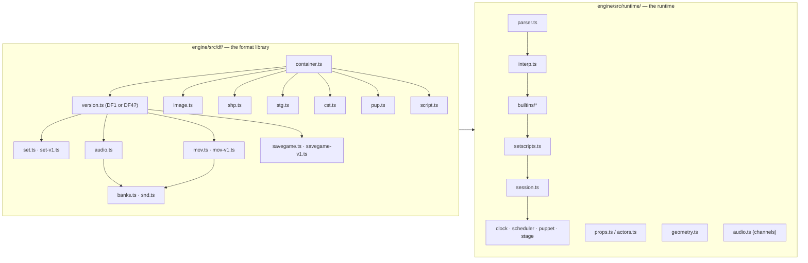

# Engine architecture

*Prerequisite: [How the game works](how-a-game-works.md).*

This doc is about *this project* — how the TypeScript code is organised — as
opposed to the game's file formats (those get their own docs). If you want to
find where something lives in the source, start here.

## Four packages, and which way they point

The repository is an npm workspace of five packages, and the arrangement is one
rule: **nothing shared knows which game it is.**

| Package | What it is | Imports |
|---|---|---|
| `engine/` | the DreamFactory engine — containers, interpreter, runtime, the browser layer around them | nothing |
| `site/` | the project's own web presence: the front door, the seven format editors, the chrome every page shares, the UI-language axis | `engine` |
| `taoot/` | *Titanic*: four pages, six editions and the demo, its own tools, the suites that play it to the end | `engine`, `site` |
| `dust/` | *Dust*: two pages, one disc, its own tools and suites | `engine`, `site` |
| `timelapse/` | *[Timelapse](../timelapse/)*: one page and four discs — its own palette, its own title card, and the boot log it started life as, now a panel the page opens over the picture | `engine`, `site` |

There is a test that says so — `site/tests/layering.ts` fails the build if
`engine/` reaches for a game, or if any of the three games reaches for another.

Everything below `## Where a game's own code lives` is a game shell. Everything
above it is the engine, and this page spends most of its length there, because
that is where most of the code is.

## Two layers inside the engine: "read the files" vs "run the game"

`engine/src/` splits cleanly in two, and it's worth keeping the split in your
head because the two halves came from very different places. A third directory,
`engine/src/web/`, puts the result on a canvas.



### `engine/src/df/` — the format library ("how to *read* the files")

This is a faithful TypeScript port of the decoding logic in
[DFET](https://github.com/M3tox/DFET). Its only job is: **given the raw bytes of a game file,
produce plain data structures** — a list of scenes, a decoded image, a
palette, a chunk of audio samples. It knows *nothing* about how the game
plays. Every file in here corresponds to a format doc:

| File | Reads | Doc |
|------|-------|-----|
| [`container.ts`](https://github.com/dhobi/dreamrefactory/blob/master/engine/src/df/container.ts) | the shared container skeleton | [DFile container](formats/README.md) |
| [`binary.ts`](https://github.com/dhobi/dreamrefactory/blob/master/engine/src/df/binary.ts) | low-level byte reading (endianness, strings) | [DFile container](formats/README.md) |
| [`version.ts`](https://github.com/dhobi/dreamrefactory/blob/master/engine/src/df/version.ts) | which DreamFactory wrote a file — 1 (*Dust*) or 4 (*Titanic*). Both engines put the tag as an i32 at container 0 + 0x02, the one field that never moved, so the version is **asked** rather than guessed | [DFile container](formats/README.md) |
| [`image.ts`](https://github.com/dhobi/dreamrefactory/blob/master/engine/src/df/image.ts) | compressed frames, palettes, depth maps | [Image codec](formats/image-codec.md) |
| [`set.ts`](https://github.com/dhobi/dreamrefactory/blob/master/engine/src/df/set.ts) | SET rooms/scenes/views | [SET](formats/set.md) |
| [`set-patch.ts`](https://github.com/dhobi/dreamrefactory/blob/master/engine/src/df/set-patch.ts) | the SET **write** path — the copy-on-write patches the set editor makes, kept out of the reader the runtime loads | [SET](formats/set.md) |
| [`set-v1.ts`](https://github.com/dhobi/dreamrefactory/blob/master/engine/src/df/set-v1.ts) | a DreamFactory 1 SET. Its own reader, not a branch: a v1 set has no turn rings and no roads but a **grid of cells** and one flat transition table in which a turn and a walk are the same record | [SET](formats/set.md#dreamfactory-1-dust) |
| [`set-v1-to-v4.ts`](https://github.com/dhobi/dreamrefactory/blob/master/engine/src/df/set-v1-to-v4.ts) | that grid rearranged into the `SetFile` the viewer already knows, so there is one viewer rather than two | [SET](formats/set.md#dreamfactory-1-dust) |
| [`set-any.ts`](https://github.com/dhobi/dreamrefactory/blob/master/engine/src/df/set-any.ts) | open a SET without knowing which engine wrote it — a tagged union, so the compiler asks which model you are holding | [SET](formats/set.md#dreamfactory-1-dust) |
| [`shp.ts`](https://github.com/dhobi/dreamrefactory/blob/master/engine/src/df/shp.ts) | SHP props | [SHP](formats/shp.md) |
| [`mov.ts`](https://github.com/dhobi/dreamrefactory/blob/master/engine/src/df/mov.ts) | MOV movies — the segment chain, and the patches the movie editor writes | [MOV](formats/mov.md) |
| [`mov-v1.ts`](https://github.com/dhobi/dreamrefactory/blob/master/engine/src/df/mov-v1.ts) | a DreamFactory 1 movie. The chain-of-segments **model** survives; almost every mechanic under it differs, and more of it is behaviour than layout — advance is an authored goto, a frame can block until the sound it started finishes, hotspots are typed records, two palette indices are transparent. The format where the two engines diverge most. The record layout is `DF.EXE`'s own, read out of its movie loop | [MOV](formats/mov.md#dreamfactory-1-dust) |
| [`mov-pace.ts`](https://github.com/dhobi/dreamrefactory/blob/master/engine/src/df/mov-pace.ts) | how fast a movie plays, in one place so the player and the editor cannot disagree | [MOV](formats/mov.md#timing) |
| [`mov-sound.ts`](https://github.com/dhobi/dreamrefactory/blob/master/engine/src/df/mov-sound.ts) | a segment's bed: which chunks, how much of the authored loop order, and whether it repeats — beside the pacing, and shared for the same reason | [MOV](formats/mov.md#whats-in-a-segment) |
| [`stg.ts`](https://github.com/dhobi/dreamrefactory/blob/master/engine/src/df/stg.ts) | STG stage/UI | [STG](formats/stg.md) |
| [`cst.ts`](https://github.com/dhobi/dreamrefactory/blob/master/engine/src/df/cst.ts) | CST casts (actor sprite sets) | [PUP / CST](formats/pup-cst.md) |
| [`pup.ts`](https://github.com/dhobi/dreamrefactory/blob/master/engine/src/df/pup.ts) | PUP puppets (conversation close-ups) | [PUP / CST](formats/pup-cst.md) |
| [`audio.ts`](https://github.com/dhobi/dreamrefactory/blob/master/engine/src/df/audio.ts) | TRK/SFX/11K audio banks | [Audio](formats/audio.md) |
| [`banks.ts`](https://github.com/dhobi/dreamrefactory/blob/master/engine/src/df/banks.ts) | shared chunk-directory walk for TRK/MOV banks | [Audio](formats/audio.md) |
| [`snd.ts`](https://github.com/dhobi/dreamrefactory/blob/master/engine/src/df/snd.ts) | `.SND` — the same role a `.TRK` plays, as DreamFactory 1 spells it. Same audio containers, no chunk tables: the names are inline in container 0 and the theme is the trailing run of consecutively numbered chunks | [Dust's music & sound](../dust/audio.md) |
| [`script.ts`](https://github.com/dhobi/dreamrefactory/blob/master/engine/src/df/script.ts) | the compiled-script binary | [Script container](formats/script-container.md) |
| [`script-asm.ts`](https://github.com/dhobi/dreamrefactory/blob/master/engine/src/df/script-asm.ts) | the way back: source text → the tokens `encodeScript` writes | [Script container](formats/script-container.md) |
| [`opcodes.ts`](https://github.com/dhobi/dreamrefactory/blob/master/engine/src/df/opcodes.ts) | the opcode-ID → name table the script decoder and the disassembly tools share | [Script container](formats/script-container.md) |
| [`savegame.ts`](https://github.com/dhobi/dreamrefactory/blob/master/engine/src/df/savegame.ts) | `.ti` saved games (read, decode, patch-write) | [Savegame](formats/savegame.md) |
| [`savegame-v1.ts`](https://github.com/dhobi/dreamrefactory/blob/master/engine/src/df/savegame-v1.ts) | `.rtd` saved games — the same container file three years earlier, so this module is only the **delta**: the offsets inside containers 0 and 1, and four record strides that moved | [Savegame, DF1](formats/savegame-v1.md) |
| [`save-vars.ts`](https://github.com/dhobi/dreamrefactory/blob/master/engine/src/df/save-vars.ts) | the variable list and string pool, the one part of a save that did **not** change between the two engines, so both readers share it rather than each carrying a copy | [Savegame](formats/savegame.md) |
| [`text.ts`](https://github.com/dhobi/dreamrefactory/blob/master/engine/src/df/text.ts) | the character set the text *bytes* are in — which no DF file declares, so it comes from the language tree | [Languages](../taoot/languages.md#the-code-page-is-not-in-the-data) |
| [`build.ts`](https://github.com/dhobi/dreamrefactory/blob/master/engine/src/df/build.ts) + `*-build.ts` | the **write** half: a container accumulator and the field writers, plus one builder per format (`set`, `shp`, `stg`, `mov`, `pup`, `cst`, `banks`) | [Writing one back](formats/README.md) |

### `engine/src/runtime/` — the runtime ("how the game *behaves*")

This is the part DFET never needed and never had: the actual **game engine**.
Its behaviour was reconstructed by watching the real game and by
disassembling `TI.EXE`. Key files:

| File | Responsibility |
|------|----------------|
| [`parser.ts`](https://github.com/dhobi/dreamrefactory/blob/master/engine/src/runtime/parser.ts) | turns a decoded script's tokens into a syntax tree |
| [`ast.ts`](https://github.com/dhobi/dreamrefactory/blob/master/engine/src/runtime/ast.ts) | the syntax-tree node types the parser emits and the interpreter walks |
| [`interp.ts`](https://github.com/dhobi/dreamrefactory/blob/master/engine/src/runtime/interp.ts) | **the interpreter** — runs the scripts; owns the builtin registry |
| [`builtins/`](https://github.com/dhobi/dreamrefactory/tree/master/engine/src/runtime/builtins) | the engine commands, grouped by family — `core` (pure language helpers), `dispatch` (the `sendto*` special forms), `scene`, `props`, `audio`, `timing`, `actors`, `puppets`, `pointer`, `helpers`, `savegame` — with `context.ts` as the shared plumbing and `index.ts` registering everything against a session (duplicates throw). The full command inventory is the **[builtin reference](../reference/builtins.md)** |
| [`setscripts.ts`](https://github.com/dhobi/dreamrefactory/blob/master/engine/src/runtime/setscripts.ts) | binds one SET's scripts to the interpreter and routes the event chain |
| [`props.ts`](https://github.com/dhobi/dreamrefactory/blob/master/engine/src/runtime/props.ts) | the prop runtime — visibility, animation, compositing |
| [`actors.ts`](https://github.com/dhobi/dreamrefactory/blob/master/engine/src/runtime/actors.ts) | the actor (CST) runtime — walking characters and their poses |
| [`geometry.ts`](https://github.com/dhobi/dreamrefactory/blob/master/engine/src/runtime/geometry.ts) | shared 3D math — projection, depth, occlusion, compass `bearing` |
| [`audio.ts`](https://github.com/dhobi/dreamrefactory/blob/master/engine/src/runtime/audio.ts) | playback channels (sound / voice / theme) and the sound library |
| [`session.ts`](https://github.com/dhobi/dreamrefactory/blob/master/engine/src/runtime/session.ts) | **GameSession** — ties everything together and owns cross-set state |
| [`clock.ts`](https://github.com/dhobi/dreamrefactory/blob/master/engine/src/runtime/clock.ts) | the fine time base behind `delay(n)` waits |
| [`scheduler.ts`](https://github.com/dhobi/dreamrefactory/blob/master/engine/src/runtime/scheduler.ts) | the heartbeat — loops (`makeloop`), crickets, walks, looping sounds |
| [`puppet.ts`](https://github.com/dhobi/dreamrefactory/blob/master/engine/src/runtime/puppet.ts) | `PuppetController` — PUP conversation close-ups |
| [`stage.ts`](https://github.com/dhobi/dreamrefactory/blob/master/engine/src/runtime/stage.ts) | `StageController` — the STG UI band / full-screen screens |
| [`saveload.ts`](https://github.com/dhobi/dreamrefactory/blob/master/engine/src/runtime/saveload.ts) | saving/loading `.ti` games at the session level (what goes in, how a load restores) |
| [`saveload-v1.ts`](https://github.com/dhobi/dreamrefactory/blob/master/engine/src/runtime/saveload-v1.ts) | the same two halves for Dust's `.rtd`: the same choreography, and the two ends that genuinely differ — a `.rtd` gives a world position where a `.ti` names a scene and a view |
| [`masks.ts`](https://github.com/dhobi/dreamrefactory/blob/master/engine/src/runtime/masks.ts) | which globals are a **counter** rather than the story, in one place because three things ask: both playthrough hosts, and the debug panel's "what just moved" list |
| [`signature.ts`](https://github.com/dhobi/dreamrefactory/blob/master/engine/src/runtime/signature.ts) | a running hash of everything the next frame would be drawn from, so a composite can be skipped when the picture has not changed — hashing the *inputs* rather than counting mutations, because a revision counter can be forgotten at a write site |
| [`point.ts`](https://github.com/dhobi/dreamrefactory/blob/master/engine/src/runtime/point.ts) | the packed-point format `(x<<16)\|y` scripts pass coordinates in |
| [`input.ts`](https://github.com/dhobi/dreamrefactory/blob/master/engine/src/runtime/input.ts) | the event queue — input made while the engine was mid-gesture, and what `flushevents()` discards (recovered from the binary) |
| [`bootplan.ts`](https://github.com/dhobi/dreamrefactory/blob/master/engine/src/runtime/bootplan.ts) | what a game's boot needs, read out of its own BOOTFILE — the resource list, the landing room and the disc volumes that used to be hardcoded TAOOT filenames in the host ([the boot plan](runtime/host.md#the-boot-plan-what-a-game-says-it-needs)) |
| [`rng.ts`](https://github.com/dhobi/dreamrefactory/blob/master/engine/src/runtime/rng.ts) | the seedable source behind the session's two streams — script `random()` and the engine's own ambient draws — which is what makes a run reproducible ([why two](../taoot/verification.md#two-streams-because-the-clock-must-not-re-roll-the-story)) |
| [`trace.ts`](https://github.com/dhobi/dreamrefactory/blob/master/engine/src/runtime/trace.ts) | the state snapshot a [playthrough](../taoot/verification.md#the-playthrough-the-game-played-not-probed) asserts at each story beat |

The **[Scripting doc](scripting-language.md)** covers the interpreter and
builtins in detail; the rest of this doc is about how the pieces run together.

### `engine/src/web/` — the browser layer ("put it on a screen")

The third directory of the engine package, and the part that is *neither*
format knowledge *nor* recovered engine behaviour: it puts a session on a
canvas. It is still game-agnostic — it may not mention *Titanic* or *Dust* —
but it may mention `document`, and it is where a game shell attaches.

| File | Responsibility |
|------|----------------|
| [`host.ts`](https://github.com/dhobi/dreamrefactory/blob/master/engine/src/web/host.ts) | `GameHost` — what it means to *run* the game (set activation, prefetch, cold boot, resuming a save) with no reference to `document`; a shell passes its side in as a file source, five UI notifications and an `AudioSink`. See [the browser host](runtime/host.md#the-split-and-why-it-is-where-it-is) |
| [`viewer.ts`](https://github.com/dhobi/dreamrefactory/blob/master/engine/src/web/viewer.ts) | `SetViewer` — the navigation state machine over a parsed SET (turn/walk/teleport, the geometry of its own hit-testing), and one optional `RoomLayer` of the screen. It used to own the rendering and the click priority chain too; see the row below |
| [`screen-director.ts`](https://github.com/dhobi/dreamrefactory/blob/master/engine/src/web/screen-director.ts) | `ScreenDirector` — **who owns the screen, and who gets a click**: the five-way arbitration between a movie, a conversation, a fade, the world and a held frame, the flat/room compositor, the CLUT, the per-frame service of the whole session, and the input priority chain (`hittest`, clicks, keys, the cursor). Held by the host, and it works with **no room at all** — which is what lets *Timelapse*, a game with no `.SET` on any of its four discs, draw and play its films |
| [`screen-presenter.ts`](https://github.com/dhobi/dreamrefactory/blob/master/engine/src/web/screen-presenter.ts) | `ScreenPresenter` — the single persistent framebuffer every render path composites into, the fade overlays, and the [signature](https://github.com/dhobi/dreamrefactory/blob/master/engine/src/runtime/signature.ts) check that skips a composite when the picture has not changed. Held by the host, so it **outlives** the viewer a set change replaces |
| [`screen.ts`](https://github.com/dhobi/dreamrefactory/blob/master/engine/src/web/screen.ts) | the screen contract: how big the framebuffer is, and where a SET view sits inside it. 512×384 is the DF4 **default** (Titanic, Dust) rather than the law — Timelapse says 640×480 in every one of its stage headers |
| [`screen-gamma.ts`](https://github.com/dhobi/dreamrefactory/blob/master/engine/src/web/screen-gamma.ts) | the per-channel power curve `TI.EXE` applies to every palette entry before it reaches the screen (`pow(c/255, 0.65) * 255`) — the reason a faithful port looks *brighter* than a verbatim one |
| [`ring-cache.ts`](https://github.com/dhobi/dreamrefactory/blob/master/engine/src/web/ring-cache.ts) | the LRU of decoded turn/walk rings, on a byte budget — the viewer's memory story, on its own |
| [`movie-player.ts`](https://github.com/dhobi/dreamrefactory/blob/master/engine/src/web/movie-player.ts) | `MoviePlayer` — modal MOV playback: the segment chain, cutscenes, interactive close-ups, movie chains/calls, cues and the soundtrack |
| [`puppet-view.ts`](https://github.com/dhobi/dreamrefactory/blob/master/engine/src/web/puppet-view.ts) | `PuppetView` — draws conversation close-ups (layer compositing, subtitles, choice bevels); the conversation *logic* is `runtime/puppet.ts` |
| [`fonts.ts`](https://github.com/dhobi/dreamrefactory/blob/master/engine/src/web/fonts.ts) | the canvas font stacks and `wrapText` — including breaking a line that has no spaces in it |
| [`cursors.ts`](https://github.com/dhobi/dreamrefactory/blob/master/engine/src/web/cursors.ts) | `cursor(name)` as something `style.cursor` will take: the 32×32 monochrome `CURS.*` art a DreamFactory build keeps in its own executable, resampled (nearest neighbour, never blended) to the size the picture is being shown at — a whole-number zoom is exact pixel doubling and a fractional one an even mix of one- and two-pixel rows, capped at the 128×128 past which browsers ignore a cursor image outright. All three games have their own set, extracted from their own build by [`tools/dumpcursors.ts`](../reference/tools.md) — 15 for Timelapse, 11 for Titanic, 9 for Dust — because the sets differ: Timelapse navigates BY cursor (11,031 of its 13,200 `cursor(...)` calls are the two step arrows, and it redrew both), Dust's v1 build has no step arrows at all, and the two disagree about the pointing hand |
| [`photos-idb.ts`](https://github.com/dhobi/dreamrefactory/blob/master/engine/src/web/photos-idb.ts) | the IndexedDB store behind Timelapse's photo album (`plugin("camera", …)`) — the one thing this engine produces that the *player* made, and the one the original kept outside a saved game. Everything in it is allowed to fail: a blocked or full store costs persistence and nothing else |
| [`keys.ts`](https://github.com/dhobi/dreamrefactory/blob/master/engine/src/web/keys.ts) | whether a keypress belongs to whatever has focus or to the game. The page listens on `window`, so without this a filter box typing `mission` toggled the minimap on the M and sent all seven letters into the running game |
| [`save-browser.ts`](https://github.com/dhobi/dreamrefactory/blob/master/engine/src/web/save-browser.ts) / [`save-store.ts`](https://github.com/dhobi/dreamrefactory/blob/master/engine/src/web/save-store.ts) | the saved-games UI and its IndexedDB "file system" — parameterised on a `SaveKind`, so Titanic's `.ti` and Dust's `.rtd` get a database each off one implementation |

## Where a game's own code lives

The four packages above the engine. None of them adds engine behaviour; they
say which disc, which pages, and what the page around the canvas looks like.

### `site/` — the shared web presence

| File | Responsibility |
|------|----------------|
| [`editors/`](https://github.com/dhobi/dreamrefactory/tree/master/site/editors) | the seven format editors and the page that lists them — see [the browser editors](../editors/README.md) |
| [`front.ts`](https://github.com/dhobi/dreamrefactory/blob/master/site/src/front.ts) / [`games.ts`](https://github.com/dhobi/dreamrefactory/blob/master/site/src/games.ts) | the front door, and the registry of which games exist and what it takes to read one's data — here rather than in a game, because the editors need it and a shared package must not depend on a consumer |
| [`chrome.css`](https://github.com/dhobi/dreamrefactory/blob/master/site/src/chrome.css) | the topbar, pickers, titles, controls and panels every page shares. Not one colour in it: every value is a **role**, and the four palettes — Titanic's abyss-and-brass, Dust's dusk-and-ember, Timelapse's glass-and-chrome, the project's black-and-green — are four implementations of that one contract |
| [`editions.ts`](https://github.com/dhobi/dreamrefactory/blob/master/site/src/editions.ts) | the **edition** axis: which `gamefiles/` tree a page is showing. Remembered per game and carried across the play page, the editors and the collection |
| [`ui-languages.ts`](https://github.com/dhobi/dreamrefactory/blob/master/site/src/ui-languages.ts) / [`lang-menu.ts`](https://github.com/dhobi/dreamrefactory/blob/master/site/src/lang-menu.ts) / [`locales/`](https://github.com/dhobi/dreamrefactory/tree/master/site/src/locales) | the **UI-language** axis, which is a different question: what language the words on the page are in. Pages carry their English inline, so nothing is fetched for an English reader |
| [`site.ts`](https://github.com/dhobi/dreamrefactory/blob/master/site/src/site.ts) / [`version.ts`](https://github.com/dhobi/dreamrefactory/blob/master/site/src/version.ts) / [`bug-report.ts`](https://github.com/dhobi/dreamrefactory/blob/master/site/src/bug-report.ts) | where the site's root is from a page at any depth, the version in the top bar, and the Report-bug button that prefills a GitHub issue with the game, the build number and the screen |

### `taoot/` — Titanic's shell

Four pages: the front page, `/play/`, `/collection/`, and the unlisted
`/speedrun/` workbench.

| File | Responsibility |
|------|----------------|
| [`main.ts`](https://github.com/dhobi/dreamrefactory/blob/master/taoot/src/main.ts) | the play page: audio unlock, DOM wiring, the session and its host hooks, the automatic cold boot, input handlers, the rAF loop |
| [`files.ts`](https://github.com/dhobi/dreamrefactory/blob/master/taoot/src/files.ts) | `FileStore` — six editions, two CDs, per-disc basename collisions and an LRU for the 37 MB cutscenes |
| [`languages.ts`](https://github.com/dhobi/dreamrefactory/blob/master/taoot/src/languages.ts) / [`lang-chooser.ts`](https://github.com/dhobi/dreamrefactory/blob/master/taoot/src/lang-chooser.ts) | the table (codes, endonyms, [code pages](../taoot/languages.md#the-code-page-is-not-in-the-data)) and the authored `lang.stg` chooser — a real DreamFactory stage, not a dialog |
| [`collection.ts`](https://github.com/dhobi/dreamrefactory/blob/master/taoot/src/collection.ts) / [`booklet.ts`](https://github.com/dhobi/dreamrefactory/blob/master/taoot/src/booklet.ts) / [`home.ts`](https://github.com/dhobi/dreamrefactory/blob/master/taoot/src/home.ts) | the pages that are about the game rather than the game: the turnable box, the 32-page booklet, and the front page's top bar |
| [`save-seed.ts`](https://github.com/dhobi/dreamrefactory/blob/master/taoot/src/save-seed.ts) | the one-time seeding of the shipped `.ti` saves into the store |
| [`nightdive.ts`](https://github.com/dhobi/dreamrefactory/blob/master/taoot/src/nightdive.ts) | the intro film before the boot — a real MOV built by `mknightdive.ts` and played by the engine's own `MoviePlayer`, buttons and all |
| [`debug-panel.ts`](https://github.com/dhobi/dreamrefactory/blob/master/taoot/src/debug-panel.ts) / [`log-buffer.ts`](https://github.com/dhobi/dreamrefactory/blob/master/taoot/src/log-buffer.ts) | the state pane behind **X** (a list that patches rather than redraws, filtered by [`masks.ts`](https://github.com/dhobi/dreamrefactory/blob/master/engine/src/runtime/masks.ts)) and the bounded log a bug report carries the tail of |
| [`speedrun/`](https://github.com/dhobi/dreamrefactory/tree/master/taoot/src/speedrun) + [`speedrun-page.ts`](https://github.com/dhobi/dreamrefactory/blob/master/taoot/src/speedrun-page.ts) | the workbench: write a route as a sheet, press Play, watch it play, read which line broke. Deployed but unlisted — [`konami.ts`](https://github.com/dhobi/dreamrefactory/blob/master/taoot/src/konami.ts) is the door |
| [`cache-warmup.ts`](https://github.com/dhobi/dreamrefactory/blob/master/taoot/src/cache-warmup.ts) | pulls a whole edition through the browser cache before a timed run, so the fiftieth run of a leg costs what the second one did |

### `dust/` — Dust's shell

Two pages: the game and `/collection/`. Short on purpose — one volume, one
edition, one copy of every name.

| File | Responsibility |
|------|----------------|
| [`main.ts`](https://github.com/dhobi/dreamrefactory/blob/master/dust/src/main.ts) | the page: the boot, the films, the town, and the controls |
| [`files.ts`](https://github.com/dhobi/dreamrefactory/blob/master/dust/src/files.ts) | the CD as a `HostFiles`. Two things it has to get right: the BOOTFILE is at `INSTALL/ALT31/BOOTFILE` rather than in `DATA/`, and the boot's films need a room to draw through even though the boot opens none |
| [`saves.ts`](https://github.com/dhobi/dreamrefactory/blob/master/dust/src/saves.ts) | the store's Dust dimension (`.rtd`, its own database) and the seeding of the five saves that ship beside the disc — one of which is also the base a fresh save is patched into, because a save is a serialized heap and cannot be written from nothing |

### `timelapse/` — Timelapse's shell

One page, four discs. The shortest of the three and the only one that carries a
game's own **cursors**, because this is the game that navigates by them.

| File | Responsibility |
|------|----------------|
| [`main.ts`](https://github.com/dhobi/dreamrefactory/blob/master/timelapse/src/main.ts) | the page: the loader and its Enter button, the 640×480 plate blitted into a 1280×960 canvas, the input (mouse, keys, gestures), the position readout, and the boot log `b` opens |
| [`files.ts`](https://github.com/dhobi/dreamrefactory/blob/master/timelapse/src/files.ts) | four CDs as one flat basename index, every disc mounted at once — plus the fourteen installed files the manifest does not list, because the walker skips any directory called `install` |
| [`theme.css`](https://github.com/dhobi/dreamrefactory/blob/master/timelapse/src/theme.css) | the palette, sampled from the title card: void, nacre, glass, chrome, and one warm stair for the one control that commits |
| [`cursor-art.ts`](https://github.com/dhobi/dreamrefactory/blob/master/timelapse/src/cursor-art.ts) | the fifteen `CURS.*` cursors out of `tl.exe`, written by [`tools/dumpcursors.ts`](../reference/tools.md) — two 1bpp planes each, not PNGs |

## The GameSession: the thing that persists

`GameSession` ([session.ts](https://github.com/dhobi/dreamrefactory/blob/master/engine/src/runtime/session.ts)) is the top of the
runtime. There is **one interpreter** whose variables live for the whole
play session, so your inventory and progress survive when you walk from one
set to another. The session owns:

- the interpreter and its global variables,
- the currently open SET (via a per-set binding, `SetScripts`),
- the audio banks and playback channels,
- the props runtime and the open "shop" (SHP) files,
- the stage layer (STG) — the UI band and any full-screen screen.

When you travel to a new set, the *set* is swapped out but the *session*
stays. That's the key architectural fact: **sets are disposable, the session
is not**.

`GameSession` used to be one very large class. The cohesive sub-runtimes have
since been extracted into their own files — `Clock`, `Scheduler`,
`PuppetController`, `StageController` — which the session **composes**
(`this.scheduler`, `this.stageCtrl`, …).

For a while it also **forwarded** to them: a `session.makeLoop(...)` that called
`this.scheduler.makeLoop(...)`, and forty more like it, so that nothing outside
had to know the extraction had happened. Those are gone. A caller addresses the
subsystem it means — `session.scheduler.makeLoop(...)`,
`session.stageCtrl.gotoFlat(...)` — because a forwarder is a second name for one
thing, and a second name is somewhere for the two to drift apart. What stays on
the session is what genuinely belongs to it: the interpreter, the cross-set state,
and the fields more than one subsystem reads.

## The render picture: layers on a 512×384 screen

The screen is **512×384**. It is drawn back-to-front:

```
┌────────────────────────────────┐  y = 0
│                                │
│   the current SET view         │   ← 512 × 264, only when "set visible"
│   (a pre-rendered background)   │
│                                │
├────────────────────────────────┤  y = 264
│   UI band: menu, held item,     │   ← STG flat image + house.shp props
│   watch  (STG + SHP props)      │
└────────────────────────────────┘  y = 384
```

1. A **stage flat** image (from an STG file) is the bottom layer / background.
2. The current **SET view** is composited into the top 512×264 (when the set
   is visible — full-screen screens like the map hide it).
3. **Props** (SHP) are drawn on top, ordered by depth so nearer things cover
   farther ones. In-world props are placed using the 3D projection recovered
   from `TI.EXE`; UI-band props sit at fixed screen positions.

## How one mouse click flows through the system

This is the single most useful thing to understand, because the same
"event travels down a chain" idea appears everywhere.

```mermaid
sequenceDiagram
  participant U as You (mouse click)
  participant V as Viewer
  participant PR as Props
  participant SS as SetScripts
  participant BOOT as Boot library

  U->>V: click at (x, y)
  V->>PR: is a prop under the cursor?
  alt a prop is hit
    PR->>PR: run that prop's `mousedown` handler
  else no prop
    V->>SS: is a view hotspot under the cursor?
    SS->>SS: object script → scene script → set main script
    Note over SS: whoever handles it wins;<br/>`passcode` forwards to the next level
  end
```

The diagram is the shape of the thing; the *routing* is the game's own, not the
engine's. `BOOTFILE` 0001's `mousedown` is a `hittest` and a switch on `result()`
into the six `sendto*` paths, and where a title ships that handler it decides where
a click goes — the port's transcription is the fallback for one that doesn't (see
[the click priority chain](runtime/host.md#the-click-priority-chain)).

The chain for a pointer event over a hotspot is **object → scene → set main
→ stage**, and off the end of it the event keeps climbing the **containment**
chain — the file that holds the thing. Each level either handles the event (with an
`exitcode`) or passes it on (`passcode`, or simply having no handler). The full event
model is in the **[Scripting doc](scripting-language.md)**.

**A keyboard event is dispatched differently, in two ways that matter.**

It starts at the **boot**, not at the scene: TAOOT's boot holds a `keydown` that is a
*router* — it maps the player's own movement keys (`keynorth`/`keywest`/`keyeast`,
W/A/D by default and rebindable from the control panel) onto the arrows and then
re-routes with `sendtoscene(currentscene(), keydown(arg))`. Everything else the press
reaches, it reaches along that re-route, which is what carries the **mapped** value:
scene → set main → stage → the boot library's own `keydown`, the default that turns
`"leftarrow"` into `currentscene("left")`. Dispatching the boot's two containers side
by side instead handed the default the key the player actually pressed, so the arrows
worked and the W/A/D bindings did nothing at all (#14).

That mapping is a *script*, so everything above it is key-blind — and the
[event queue](runtime/host.md#keys) is above it. TI.EXE posts the record in its
window proc and pops it in the main loop, both of them before any script has said
what the key means, so a press made mid-move waits its turn whether the player
made it with an arrow or with the letter they bound. The port kept its queue in
the arrow path instead, one level *below* where the original keeps it, and the
letters were dropped while the arrows were kept (#207).

And a link that merely **finishes** does not end the walk — only `exitcode` does.
`deckbd.set`'s `keydown` is the proof: a ladder of `if currentview() = "viewNN" & arg
= "uparrow" … exitcode` that falls off the end for every other key. Under the pointer
event's rule that would consume the press, and no arrow would ever reach the default
movement. (This is also why a scene script can quietly steal ↑ to send you through a
door instead of walking — it takes the key with an `exitcode`.)

What keeps the router from resolving its own re-route back into itself is a
re-entrancy check: a script already running a handler further up the dispatch stack
is never given it again. Before that existed the boot had to be kept off every
fallback list, and reaching it was an out-of-memory rather than a wrong answer.

The boot is also where a title keeps its **defaults**, which is the other half of why
events walk that far. They are written against `target` rather than `me`, because the
boot is answering on something else's behalf — `initprop` hides a prop and zeroes it,
`resetactor` disowns an actor:

```
code initprop ()                    code resetactor ()
    propvisible (target, false)         actorowner (target, "none")
    propvalue (target, 0)               actorvalue (target, 0)
    propdeg (target, 0)                 initactor ()
```

Almost everything relies on them: of the 72 props TAOOT's two always-open shops give
you, only `door` and `signs` carry an `initprop` of their own, and no cast member in
the tree carries a `resetactor`. So a prop or an actor answering nothing for an event
is the normal case, not the broken one — and a **stub** target, with no script at all,
still has to reach them. TAOOT ships one: the purser is an actor record with an
eight-byte script container, and dropping his events as "target not loaded" is what
left him holding the cufflink into the next game (#89).

And a press may never reach the chain at all, because two things are modal ahead of
it: a **playing movie** and a **suspended conversation**. Both are places where the
original's own wait loop is the one popping the event queue, so the key is answered
there — ESC aborts the clip, ESC skips the line — and the scripts are never told
([host](runtime/host.md#keys), [conversations](runtime/characters.md#skipping-and-repeating)).

## The heartbeat and timed events

The engine has a **heartbeat** that ticks **20 times a second** — one service
step every 50 ms, which is `TI.EXE`'s own rate. On each tick it services timed
things: script-scheduled callbacks (`makeloop`), positional ambient sounds
(`makecricket`), and looping sounds. This is the job of [`scheduler.ts`](https://github.com/dhobi/dreamrefactory/blob/master/engine/src/runtime/scheduler.ts).
A separate, finer time base (1 tick = 1/60 s) in
[`clock.ts`](https://github.com/dhobi/dreamrefactory/blob/master/engine/src/runtime/clock.ts)
drives `delay(n)` waits.

This timing layer is fully recovered from `TI.EXE` and implemented; the
write-up is **[Timing](runtime/timing.md)**. The two headline facts:

- A "loop" is really a **one-shot delayed callback** — things *appear* to
  loop only because their handler re-schedules itself at the end.
- A "cricket" is a positional ambient one-shot bound to the current set,
  with stereo panning based on where it is relative to the camera; setting it
  to fire again with no gap makes a seamless loop, with a gap makes an
  intermittent hiss.

The runtime subsystems each have their own deep-dive under
**[Runtime](runtime/README.md)** — timing, the stage layer, characters,
audio playback, and saving/loading.

## Running and verifying

- **Five dev servers, one per root, so they can run at once.** The two that are
  about the whole project come first and the games follow in the order the engine
  shipped them: 5173 the front door and the editors (`npm run dev`), 5174 this
  documentation (`npm run docs:dev`), 5175 Titanic (`npm run dev:taoot`), 5176
  Dust (`npm run dev:dust`), 5177 Timelapse (`npm run dev:timelapse`). A link from
  one to another 404s in dev with a page naming the server that would serve it —
  five Vite roots cannot be one origin, and the deployed tree has no such
  problem.
- On Titanic's server, `/play/` cold boots itself into the game with nothing in
  front of it but the boot text. The saved-games browser reaches saves from the
  in-game menu and the editors reach every `.SET` under `gamefiles/`; the dev
  harness that used to sit beside them — story-state presets, puzzle-jump
  buttons — is gone, and what it was for is
  [the playthrough](../taoot/verification.md)'s job. Assets are fetched on
  demand. See **[the browser host](runtime/host.md)**.
- `npm test` — 534 Vitest tests across 38 files and all four packages: the
  end-to-end regression scenarios, savegame round-trips, recovered-builtin
  checks, the blackjack interpreter test, the editors' write path, the
  authoring and language suites, the text/audio encoding ones, Dust's movies
  and saves, and the layering rule itself. **Prefer extending `regression.ts`
  over writing throwaway tests.** The full map is **[the test
  reference](../reference/tests.md)**.
- `npm run test:playthrough` — the game *played* from the boot to the ending, 27
  segments carried as one session, asserting a recorded state trace per beat.
  What that buys, and the bugs it has caught that nothing else could, is
  **[how we know it's right](../taoot/verification.md)**.
- `tools/` has what works on any rip — the dumpers (`dumpset`, `dumpshp`,
  `dumpscripts`), `parse`, `scancmds`, `scandeg`, the manifest writer — and a
  tool that knows which game it is looking at lives in that game's own
  `tools/`: the `TI.EXE` mining tools and the flow-map generator are
  `taoot/tools/`. See **[the tool reference](../reference/tools.md)**. The dev
  server also hosts the seven **[browser editors](../editors/README.md)**, one
  per container format.

Now that you know where things live, the two deep topics are the
**[scripting language](scripting-language.md)** and, underneath all the
data, **[the DFile container format](formats/README.md)**.
