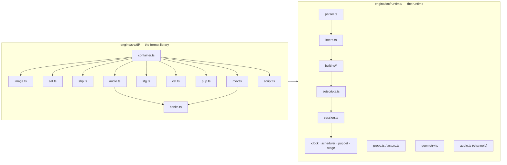

# Engine architecture

*Prerequisite: [How the game works](../taoot/how-the-game-works.md).*

This doc is about *this project* — how the TypeScript code is organised — as
opposed to the game's file formats (those get their own docs). If you want to
find where something lives in the source, start here.

## Two layers: "read the files" vs "run the game"

The code splits cleanly in two, and it's worth keeping the split in your head
because the two halves came from very different places.



### `engine/src/df/` — the format library ("how to *read* the files")

This is a faithful TypeScript port of the decoding logic in
[DFET](https://github.com/M3tox/DFET). Its only job is: **given the raw bytes of a game file,
produce plain data structures** — a list of scenes, a decoded image, a
palette, a chunk of audio samples. It knows *nothing* about how the game
plays. Every file in here corresponds to a format doc:

| File | Reads | Doc |
|------|-------|-----|
| [`container.ts`](https://github.com/dhobi/dreamrefactory/blob/master/engine/src/df/container.ts) | the shared container skeleton | [DFile container](formats/README.md) |
| [`binary.ts`](https://github.com/dhobi/dreamrefactory/blob/master/engine/src/df/binary.ts) | low-level byte reading (endianness, strings) | [DFile container](formats/README.md) |
| [`image.ts`](https://github.com/dhobi/dreamrefactory/blob/master/engine/src/df/image.ts) | compressed frames, palettes, depth maps | [Image codec](formats/image-codec.md) |
| [`set.ts`](https://github.com/dhobi/dreamrefactory/blob/master/engine/src/df/set.ts) | SET rooms/scenes/views | [SET](formats/set.md) |
| [`set-patch.ts`](https://github.com/dhobi/dreamrefactory/blob/master/engine/src/df/set-patch.ts) | the SET **write** path — the copy-on-write patches the set editor makes, kept out of the reader the runtime loads | [SET](formats/set.md) |
| [`shp.ts`](https://github.com/dhobi/dreamrefactory/blob/master/engine/src/df/shp.ts) | SHP props | [SHP](formats/shp.md) |
| [`mov.ts`](https://github.com/dhobi/dreamrefactory/blob/master/engine/src/df/mov.ts) | MOV movies — the segment chain, and the patches the movie editor writes | [MOV](formats/mov.md) |
| [`mov-pace.ts`](https://github.com/dhobi/dreamrefactory/blob/master/engine/src/df/mov-pace.ts) | how fast a movie plays, in one place so the player and the editor cannot disagree | [MOV](formats/mov.md#timing) |
| [`stg.ts`](https://github.com/dhobi/dreamrefactory/blob/master/engine/src/df/stg.ts) | STG stage/UI | [STG](formats/stg.md) |
| [`cst.ts`](https://github.com/dhobi/dreamrefactory/blob/master/engine/src/df/cst.ts) | CST casts (actor sprite sets) | [PUP / CST](formats/pup-cst.md) |
| [`pup.ts`](https://github.com/dhobi/dreamrefactory/blob/master/engine/src/df/pup.ts) | PUP puppets (conversation close-ups) | [PUP / CST](formats/pup-cst.md) |
| [`audio.ts`](https://github.com/dhobi/dreamrefactory/blob/master/engine/src/df/audio.ts) | TRK/SFX/11K audio banks | [Audio](formats/audio.md) |
| [`banks.ts`](https://github.com/dhobi/dreamrefactory/blob/master/engine/src/df/banks.ts) | shared chunk-directory walk for TRK/MOV banks | [Audio](formats/audio.md) |
| [`script.ts`](https://github.com/dhobi/dreamrefactory/blob/master/engine/src/df/script.ts) | the compiled-script binary | [Script container](formats/script-container.md) |
| [`script-asm.ts`](https://github.com/dhobi/dreamrefactory/blob/master/engine/src/df/script-asm.ts) | the way back: source text → the tokens `encodeScript` writes | [Script container](formats/script-container.md) |
| [`opcodes.ts`](https://github.com/dhobi/dreamrefactory/blob/master/engine/src/df/opcodes.ts) | the opcode-ID → name table the script decoder and the disassembly tools share | [Script container](formats/script-container.md) |
| [`savegame.ts`](https://github.com/dhobi/dreamrefactory/blob/master/engine/src/df/savegame.ts) | `.ti` saved games (read, decode, patch-write) | [Savegame](formats/savegame.md) |
| [`text.ts`](https://github.com/dhobi/dreamrefactory/blob/master/engine/src/df/text.ts) | the character set the text *bytes* are in — which no DF file declares, so it comes from the language tree | [Languages](../taoot/languages.md#the-code-page-is-not-in-the-data) |
| [`build.ts`](https://github.com/dhobi/dreamrefactory/blob/master/engine/src/df/build.ts) + `*-build.ts` | the **write** half: a container accumulator and the field writers, plus one builder per format (`set`, `shp`, `stg`, `mov`, `pup`, `cst`, `banks`) | [Writing one back](formats/README.md) |

### `engine/src/runtime/` — the runtime ("how the game *behaves*")

This is the part DFET never needed and never had: the actual **game engine**.
Its behaviour was reconstructed by watching the real game and by
disassembling `TI.EXE`. Key files:

| File | Responsibility |
|------|----------------|
| [`parser.ts`](https://github.com/dhobi/dreamrefactory/blob/master/engine/src/runtime/parser.ts) | turns a decoded script's tokens into a syntax tree |
| [`ast.ts`](https://github.com/dhobi/dreamrefactory/blob/master/engine/src/runtime/ast.ts) | the syntax-tree node types the parser emits and the interpreter walks |
| [`interp.ts`](https://github.com/dhobi/dreamrefactory/blob/master/engine/src/runtime/interp.ts) | **the interpreter** — runs the scripts; owns the builtin registry |
| [`builtins/`](https://github.com/dhobi/dreamrefactory/tree/master/engine/src/runtime/builtins) | the engine commands, grouped by family — `core` (pure language helpers), `dispatch` (the `sendto*` special forms), `scene`, `props`, `audio`, `timing`, `actors`, `puppets`, `pointer`, `helpers`, `savegame` — with `context.ts` as the shared plumbing and `index.ts` registering everything against a session (duplicates throw). The full command inventory is the **[builtin reference](../reference/builtins.md)** |
| [`setscripts.ts`](https://github.com/dhobi/dreamrefactory/blob/master/engine/src/runtime/setscripts.ts) | binds one SET's scripts to the interpreter and routes the event chain |
| [`props.ts`](https://github.com/dhobi/dreamrefactory/blob/master/engine/src/runtime/props.ts) | the prop runtime — visibility, animation, compositing |
| [`actors.ts`](https://github.com/dhobi/dreamrefactory/blob/master/engine/src/runtime/actors.ts) | the actor (CST) runtime — walking characters and their poses |
| [`geometry.ts`](https://github.com/dhobi/dreamrefactory/blob/master/engine/src/runtime/geometry.ts) | shared 3D math — projection, depth, occlusion, compass `bearing` |
| [`audio.ts`](https://github.com/dhobi/dreamrefactory/blob/master/engine/src/runtime/audio.ts) | playback channels (sound / voice / theme) and the sound library |
| [`session.ts`](https://github.com/dhobi/dreamrefactory/blob/master/engine/src/runtime/session.ts) | **GameSession** — ties everything together and owns cross-set state |
| [`clock.ts`](https://github.com/dhobi/dreamrefactory/blob/master/engine/src/runtime/clock.ts) | the fine time base behind `delay(n)` waits |
| [`scheduler.ts`](https://github.com/dhobi/dreamrefactory/blob/master/engine/src/runtime/scheduler.ts) | the heartbeat — loops (`makeloop`), crickets, walks, looping sounds |
| [`puppet.ts`](https://github.com/dhobi/dreamrefactory/blob/master/engine/src/runtime/puppet.ts) | `PuppetController` — PUP conversation close-ups |
| [`stage.ts`](https://github.com/dhobi/dreamrefactory/blob/master/engine/src/runtime/stage.ts) | `StageController` — the STG UI band / full-screen screens |
| [`saveload.ts`](https://github.com/dhobi/dreamrefactory/blob/master/engine/src/runtime/saveload.ts) | saving/loading `.ti` games at the session level (what goes in, how a load restores) |
| [`point.ts`](https://github.com/dhobi/dreamrefactory/blob/master/engine/src/runtime/point.ts) | the packed-point format `(x<<16)\|y` scripts pass coordinates in |
| [`input.ts`](https://github.com/dhobi/dreamrefactory/blob/master/engine/src/runtime/input.ts) | the event queue — input made while the engine was mid-gesture, and what `flushevents()` discards (recovered from the binary) |
| [`bootplan.ts`](https://github.com/dhobi/dreamrefactory/blob/master/engine/src/runtime/bootplan.ts) | what a game's boot needs, read out of its own BOOTFILE — the resource list, the landing room and the disc volumes that used to be hardcoded TAOOT filenames in the host ([the boot plan](runtime/host.md#the-boot-plan-what-a-game-says-it-needs)) |
| [`rng.ts`](https://github.com/dhobi/dreamrefactory/blob/master/engine/src/runtime/rng.ts) | the seedable source behind the session's two streams — script `random()` and the engine's own ambient draws — which is what makes a run reproducible ([why two](../taoot/verification.md#two-streams-because-the-clock-must-not-re-roll-the-story)) |
| [`trace.ts`](https://github.com/dhobi/dreamrefactory/blob/master/engine/src/runtime/trace.ts) | the state snapshot a [playthrough](../taoot/verification.md#the-playthrough-the-game-played-not-probed) asserts at each story beat |

The **[Scripting doc](scripting-language.md)** covers the interpreter and
builtins in detail; the rest of this doc is about how the pieces run together.

### `src/` — the browser host ("put it on a screen")

Everything directly under `src/` is the part that is *neither* format
knowledge *nor* recovered engine behaviour: it hosts the engine in a browser
page. If you are reading the code for the first time, these are the two files
you will open first — and the two biggest, so here is the map:

| File | Responsibility |
|------|----------------|
| [`main.ts`](https://github.com/dhobi/dreamrefactory/blob/master/src/main.ts) | the page: audio unlock, DOM wiring, the session + its host hooks, set activation, the automatic cold boot, input handlers, the rAF loop |
| [`host.ts`](https://github.com/dhobi/dreamrefactory/blob/master/engine/src/web/host.ts) | `GameHost` — what it means to *run* the game (set activation, prefetch, cold boot, resuming a save) with no reference to `document`; see [the browser host](runtime/host.md#the-split-and-why-it-is-where-it-is) |
| [`viewer.ts`](https://github.com/dhobi/dreamrefactory/blob/master/engine/src/web/viewer.ts) | `SetViewer` — the navigation state machine over a parsed SET (turn/walk/teleport, hit-testing, the click priority chain, rendering) |
| [`screen-presenter.ts`](https://github.com/dhobi/dreamrefactory/blob/master/engine/src/web/screen-presenter.ts) | `ScreenPresenter` — the single persistent framebuffer every render path composites into, the fade overlays, and the signature check that skips a composite when the picture has not changed. Held by the host, so it **outlives** the viewer a set change replaces |
| [`ring-cache.ts`](https://github.com/dhobi/dreamrefactory/blob/master/engine/src/web/ring-cache.ts) | the LRU of decoded turn/walk rings, on a byte budget — the viewer's memory story, on its own |
| [`movie-player.ts`](https://github.com/dhobi/dreamrefactory/blob/master/engine/src/web/movie-player.ts) | `MoviePlayer` — modal MOV playback: the segment chain, cutscenes, interactive close-ups, movie chains/calls, cues and the soundtrack |
| [`puppet-view.ts`](https://github.com/dhobi/dreamrefactory/blob/master/engine/src/web/puppet-view.ts) | `PuppetView` — draws conversation close-ups (layer compositing, subtitles, choice bevels); the conversation *logic* is `engine/puppet.ts` |
| [`files.ts`](https://github.com/dhobi/dreamrefactory/blob/master/src/files.ts) | `FileStore` — every game file by lowercase basename, with lazy dev-server fetching |
| [`screen.ts`](https://github.com/dhobi/dreamrefactory/blob/master/engine/src/web/screen.ts) | the screen contract: 512×384, and where a SET view sits inside it |
| [`fonts.ts`](https://github.com/dhobi/dreamrefactory/blob/master/engine/src/web/fonts.ts) | the canvas font stacks and `wrapText` — including breaking a line that has no spaces in it |
| [`languages.ts`](https://github.com/dhobi/dreamrefactory/blob/master/src/languages.ts) / [`lang-chooser.ts`](https://github.com/dhobi/dreamrefactory/blob/master/src/lang-chooser.ts) / [`lang-menu.ts`](https://github.com/dhobi/dreamrefactory/blob/master/src/lang-menu.ts) | the language axis: the table (codes, endonyms, [code pages](../taoot/languages.md#the-code-page-is-not-in-the-data)), the authored `lang.stg` chooser, and the 🌐 picker in the page's top bar |
| [`editions.ts`](https://github.com/dhobi/dreamrefactory/blob/master/src/editions.ts) / [`collection.ts`](https://github.com/dhobi/dreamrefactory/blob/master/src/collection.ts) / [`booklet.ts`](https://github.com/dhobi/dreamrefactory/blob/master/src/booklet.ts) / [`home.ts`](https://github.com/dhobi/dreamrefactory/blob/master/src/home.ts) | the site around the game rather than the game: the shared edition control (one choice carried by the play page, the editors and `/collection/`), and `/collection/`'s own turnable box and 32-page booklet |
| [`save-browser.ts`](https://github.com/dhobi/dreamrefactory/blob/master/engine/src/web/save-browser.ts) / [`save-store.ts`](https://github.com/dhobi/dreamrefactory/blob/master/engine/src/web/save-store.ts) / [`save-seed.ts`](https://github.com/dhobi/dreamrefactory/blob/master/src/save-seed.ts) | the saved-games UI, its IndexedDB "file system", and the one-time seeding from shipped saves |

## The GameSession: the thing that persists

`GameSession` ([session.ts](https://github.com/dhobi/dreamrefactory/blob/master/engine/src/runtime/session.ts)) is the top of the
runtime. There is **one interpreter** whose variables live for the whole
play session, so your inventory and progress survive when you walk from one
set to another. The session owns:

- the interpreter and its global variables,
- the currently open SET (via a per-set binding, `SetScripts`),
- the audio banks and playback channels,
- the props runtime and the open "shop" (SHP) files,
- the stage layer (STG) — the UI band and any full-screen screen.

When you travel to a new set, the *set* is swapped out but the *session*
stays. That's the key architectural fact: **sets are disposable, the session
is not**.

`GameSession` used to be one very large class. The cohesive sub-runtimes have
since been extracted into their own files — `Clock`, `Scheduler`,
`PuppetController`, `StageController` — which the session **composes**
(`this.scheduler`, `this.stageCtrl`, …).

For a while it also **forwarded** to them: a `session.makeLoop(...)` that called
`this.scheduler.makeLoop(...)`, and forty more like it, so that nothing outside
had to know the extraction had happened. Those are gone. A caller addresses the
subsystem it means — `session.scheduler.makeLoop(...)`,
`session.stageCtrl.gotoFlat(...)` — because a forwarder is a second name for one
thing, and a second name is somewhere for the two to drift apart. What stays on
the session is what genuinely belongs to it: the interpreter, the cross-set state,
and the fields more than one subsystem reads.

## The render picture: layers on a 512×384 screen

The screen is **512×384**. It is drawn back-to-front:

```
┌────────────────────────────────┐  y = 0
│                                │
│   the current SET view         │   ← 512 × 264, only when "set visible"
│   (a pre-rendered background)   │
│                                │
├────────────────────────────────┤  y = 264
│   UI band: menu, held item,     │   ← STG flat image + house.shp props
│   watch  (STG + SHP props)      │
└────────────────────────────────┘  y = 384
```

1. A **stage flat** image (from an STG file) is the bottom layer / background.
2. The current **SET view** is composited into the top 512×264 (when the set
   is visible — full-screen screens like the map hide it).
3. **Props** (SHP) are drawn on top, ordered by depth so nearer things cover
   farther ones. In-world props are placed using the 3D projection recovered
   from `TI.EXE`; UI-band props sit at fixed screen positions.

## How one mouse click flows through the system

This is the single most useful thing to understand, because the same
"event travels down a chain" idea appears everywhere.

```mermaid
sequenceDiagram
  participant U as You (mouse click)
  participant V as Viewer
  participant PR as Props
  participant SS as SetScripts
  participant BOOT as Boot library

  U->>V: click at (x, y)
  V->>PR: is a prop under the cursor?
  alt a prop is hit
    PR->>PR: run that prop's `mousedown` handler
  else no prop
    V->>SS: is a view hotspot under the cursor?
    SS->>SS: object script → scene script → set main script
    Note over SS: whoever handles it wins;<br/>`passcode` forwards to the next level
  end
```

The diagram is the shape of the thing; the *routing* is the game's own, not the
engine's. `BOOTFILE` 0001's `mousedown` is a `hittest` and a switch on `result()`
into the six `sendto*` paths, and where a title ships that handler it decides where
a click goes — the port's transcription is the fallback for one that doesn't (see
[the click priority chain](runtime/host.md#the-click-priority-chain)).

The chain for a pointer event over a hotspot is **object → scene → set main
→ stage**, and off the end of it the event keeps climbing the **containment**
chain — the file that holds the thing. Each level either handles the event (with an
`exitcode`) or passes it on (`passcode`, or simply having no handler). The full event
model is in the **[Scripting doc](scripting-language.md)**.

**A keyboard event is dispatched differently, in two ways that matter.**

It starts at the **boot**, not at the scene: TAOOT's boot holds a `keydown` that is a
*router* — it maps the player's own movement keys (`keynorth`/`keywest`/`keyeast`,
W/A/D by default and rebindable from the control panel) onto the arrows and then
re-routes with `sendtoscene(currentscene(), keydown(arg))`. Everything else the press
reaches, it reaches along that re-route, which is what carries the **mapped** value:
scene → set main → stage → the boot library's own `keydown`, the default that turns
`"leftarrow"` into `currentscene("left")`. Dispatching the boot's two containers side
by side instead handed the default the key the player actually pressed, so the arrows
worked and the W/A/D bindings did nothing at all (#14).

That mapping is a *script*, so everything above it is key-blind — and the
[event queue](runtime/host.md#keys) is above it. TI.EXE posts the record in its
window proc and pops it in the main loop, both of them before any script has said
what the key means, so a press made mid-move waits its turn whether the player
made it with an arrow or with the letter they bound. The port kept its queue in
the arrow path instead, one level *below* where the original keeps it, and the
letters were dropped while the arrows were kept (#207).

And a link that merely **finishes** does not end the walk — only `exitcode` does.
`deckbd.set`'s `keydown` is the proof: a ladder of `if currentview() = "viewNN" & arg
= "uparrow" … exitcode` that falls off the end for every other key. Under the pointer
event's rule that would consume the press, and no arrow would ever reach the default
movement. (This is also why a scene script can quietly steal ↑ to send you through a
door instead of walking — it takes the key with an `exitcode`.)

What keeps the router from resolving its own re-route back into itself is a
re-entrancy check: a script already running a handler further up the dispatch stack
is never given it again. Before that existed the boot had to be kept off every
fallback list, and reaching it was an out-of-memory rather than a wrong answer.

The boot is also where a title keeps its **defaults**, which is the other half of why
events walk that far. They are written against `target` rather than `me`, because the
boot is answering on something else's behalf — `initprop` hides a prop and zeroes it,
`resetactor` disowns an actor:

```
code initprop ()                    code resetactor ()
    propvisible (target, false)         actorowner (target, "none")
    propvalue (target, 0)               actorvalue (target, 0)
    propdeg (target, 0)                 initactor ()
```

Almost everything relies on them: of the 72 props TAOOT's two always-open shops give
you, only `door` and `signs` carry an `initprop` of their own, and no cast member in
the tree carries a `resetactor`. So a prop or an actor answering nothing for an event
is the normal case, not the broken one — and a **stub** target, with no script at all,
still has to reach them. TAOOT ships one: the purser is an actor record with an
eight-byte script container, and dropping his events as "target not loaded" is what
left him holding the cufflink into the next game (#89).

And a press may never reach the chain at all, because two things are modal ahead of
it: a **playing movie** and a **suspended conversation**. Both are places where the
original's own wait loop is the one popping the event queue, so the key is answered
there — ESC aborts the clip, ESC skips the line — and the scripts are never told
([host](runtime/host.md#keys), [conversations](runtime/characters.md#skipping-and-repeating)).

## The heartbeat and timed events

The engine has a **heartbeat** that ticks **20 times a second** — one service
step every 50 ms, which is `TI.EXE`'s own rate. On each tick it services timed
things: script-scheduled callbacks (`makeloop`), positional ambient sounds
(`makecricket`), and looping sounds. This is the job of [`scheduler.ts`](https://github.com/dhobi/dreamrefactory/blob/master/engine/src/runtime/scheduler.ts).
A separate, finer time base (1 tick = 1/60 s) in
[`clock.ts`](https://github.com/dhobi/dreamrefactory/blob/master/engine/src/runtime/clock.ts)
drives `delay(n)` waits.

This timing layer is fully recovered from `TI.EXE` and implemented; the
write-up is **[Timing](runtime/timing.md)**. The two headline facts:

- A "loop" is really a **one-shot delayed callback** — things *appear* to
  loop only because their handler re-schedules itself at the end.
- A "cricket" is a positional ambient one-shot bound to the current set,
  with stereo panning based on where it is relative to the camera; setting it
  to fire again with no gap makes a seamless loop, with a gap makes an
  intermittent hiss.

The runtime subsystems each have their own deep-dive under
**[Runtime](runtime/README.md)** — timing, the stage layer, characters,
audio playback, and saving/loading.

## Running and verifying

- `npm run dev` — dev server; the front page has a Play button and `/play/`
  cold boots itself into the game, with nothing in front of it but the boot text.
  The saved-games browser reaches saves from the in-game menu and the editors reach
  every `.SET` under `gamefiles/`; the dev harness that used to sit beside them —
  story-state presets, puzzle-jump buttons — is gone, and what it was for is
  [the playthrough](../taoot/verification.md)'s job. Assets are fetched on demand. See
  **[the browser host](runtime/host.md)**.
- `npm test` — 302 Vitest tests: the end-to-end regression scenarios, savegame
  round-trips, recovered-builtin checks, the blackjack interpreter test, the
  editors' write path, the authoring and language suites, and the text/audio
  encoding ones. **Prefer extending `regression.ts` over writing throwaway
  tests.** The full map is **[the test reference](../reference/tests.md)**.
- `npm run test:playthrough` — the game *played* from the boot to the ending, 27
  segments carried as one session, asserting a recorded state trace per beat.
  What that buys, and the bugs it has caught that nothing else could, is
  **[how we know it's right](../taoot/verification.md)**.
- `tools/` has standalone dumpers (`dumpset`, `dumpshp`, `dumpaudio`,
  `dumpscripts`), the `TI.EXE` mining tools (`exetable`, `disasmcmd`,
  `scancmds`) and the flow-map generator — see
  **[the tool reference](../reference/tools.md)**. The dev server also hosts the
  seven **[browser editors](../editors/README.md)**, one per container format.

Now that you know where things live, the two deep topics are the
**[scripting language](scripting-language.md)** and, underneath all the
data, **[the DFile container format](formats/README.md)**.
