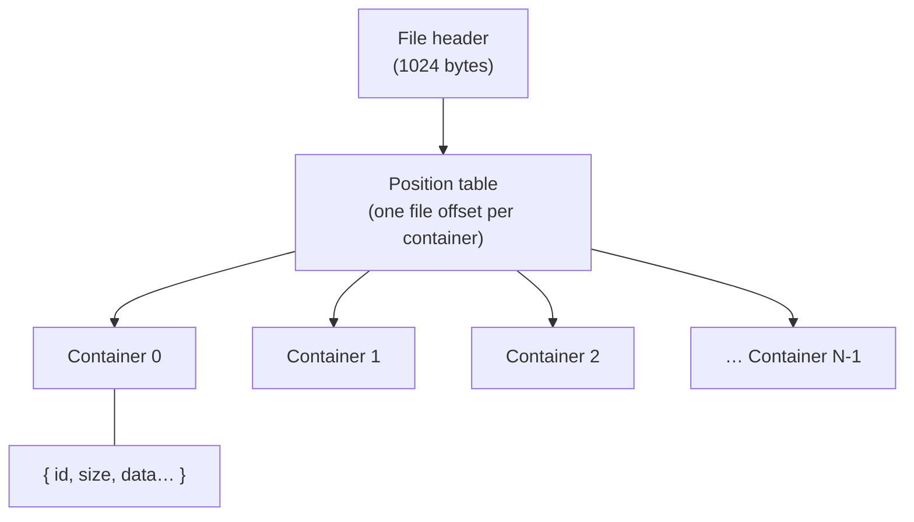

# The DFile container format

*Prerequisite: [How the game works](../how-a-game-works.md). **Read this
before any specific format doc** — they all build on it.*

Every DreamFactory data file — a room (`.SET`), a movie (`.MOV`), a set of
props (`.SHP`), an audio archive (`.TRK`), the `BOOTFILE`, all of them — uses
the **same outer skeleton**. Learn it once and every format becomes "the same
box with different things inside."

## The mental model: a box of numbered drawers

A DFile is like a filing cabinet:

- The **file header** is a label on the front telling you how many drawers
  there are.
- A **position table** is an index card listing where each drawer starts.
- Each **container** is a numbered drawer holding a blob of data.

The engine never reads a file straight through top to bottom. It reads the
header, reads the index, and then jumps straight to whichever drawer it wants.
"Container" is just DreamFactory's word for "drawer." Different formats put
different things in the drawers — one drawer might hold a palette, another a
compressed image, another a script — but the cabinet is always built the same
way.

Reference implementation: [`engine/src/df/container.ts`](https://github.com/dhobi/dreamrefactory/blob/master/engine/src/df/container.ts),
ported from DFET's `readFileIntoMemory` in
[`DFfile.cpp`](https://github.com/M3tox/DFET/blob/main/libs/DFfile/DFfile.cpp).

## Two things to know about the bytes first

You can skim these, but they explain choices you'll see everywhere.

### Endianness — which end of a number comes first

A number bigger than one byte can be stored "little end first" or "big end
first." DreamFactory does something unusual:

- **Whole numbers (integers) are little-endian** — the normal PC order.
- **Decimals (floats and doubles) are big-endian** — the *reverse*.

That split is a fingerprint of the engine's **Macintosh heritage** (the
development tools were Apple-flavoured). The byte reader
([`binary.ts`](https://github.com/dhobi/dreamrefactory/blob/master/engine/src/df/binary.ts)) has a method per type so you never
have to think about it again: `i32()` reads a little-endian integer, `f64be()`
reads a big-endian double.

> **If you ever decode a coordinate and get an absurd number like
> 1.2×10³⁰⁷**, you almost certainly read a big-endian double as little-endian.
> This is the single most common decoding mistake.

#### …unless the disc is Skull Cracker's, and then every integer flips too

That split describes every disc anyone had looked at for a long time.
*Skull Cracker* (1996) is the same formats with their integers **big-endian** as
well — so on that disc the rule is simply "everything is big-endian", and the odd
split above turns out to be the *converted* form rather than the original one.
Something byte-swapped the integers on the way across and left the floats alone.

**It is a property of the title, not of the platform**, and it is worth being
careful about because the obvious shorthand is wrong. Skull Cracker's disc is a
Macintosh one, which makes "Mac discs are big-endian" an inviting guess — but
Titanic's Dutch release is a hybrid disc whose `INSTALL_MAC/` holds a PowerPC
executable beside a `bootfile`, a `Local/` and a `Tour/`, and every one of those
data files is little-endian. Titanic's Mac build ran on converted data. So the
order is asked, never assumed.

Nothing above the container reader is told which is which:
[`byte-order.ts`](https://github.com/dhobi/dreamrefactory/blob/master/engine/src/df/byte-order.ts)
asks the file. The header's size field holds the file's own length, so exactly one
of the two readings equals the bytes in hand — and little-endian is tried first
and wins ties, so no disc that read correctly before can be re-read as something
else. `readContainerFile` records the answer on the file and every reader
downstream inherits it.

Three details worth knowing if you go looking:

- The **version tag moves**. It is an i32 at container 0 +0x02 on a PC file and a
  u16 at +0x00 on a Mac one — the only field in the whole suite that does this.
  Ask `versionOf()` rather than reading the offset.
- Several fields are **32 bits wide** where this port used to read 16. Harmless on
  a little-endian file (you get the low half, and the high half is zero); on a
  big-endian one you get the empty half, and a bank quietly reports no music.
- The **two reserved palette entries are the host platform's**. Windows reserves
  black at 0 and white at 255, so a PC rip is corrected to those; the palette as
  *stored* is the Macintosh pair (white at 0, black at 255) in every rip, and a
  Mac rip needs no correction at all.

See **[Skull Cracker](../../skullcracker/)** for how that was worked out.

### Pascal strings — length first, no terminator

Text is stored **Pascal-style**: a single **length byte** followed by exactly
that many characters. There is no zero terminator like C uses. Often the
string sits in a **fixed-size field** (say 32 bytes reserved) with junk after
the real characters — you read the length byte, take that many characters,
and skip to the end of the reserved field. The reader's `pstr(fieldSize)`
handles both cases.

## The file header (first 1024 bytes)

The header is a fixed **1024 bytes**. Only a handful of fields are used —
switch to the block view and that is the whole point of the picture: every
field the engine reads is in the first 32 bytes, and the remaining 31 rows are
padding.

<ByteMap layout="df-header" />

Everything up to byte 1024 is header/padding; the real index starts there.

> **About these maps.** Every byte layout in this section is switchable:
> **Table view** is the offset table these docs have always had, **Block view**
> is the same regions drawn to scale from byte 0 at the top left, and hovering a
> block says what it is for. On a whole-file map, hovering also **rings every
> container the hovered one points at** — the pointer itself is four bytes inside
> somebody else's payload, far too small to see, so the map draws the relation
> between the two containers instead. Every format page in this section has one;
> they are generated from real game files by
> [`tools/blockmap.ts`](../../reference/tools.md), and what is committed is
> offsets and roles only, never game content.

## The position table (starts at byte 1024)

Immediately after the header is the **position table**: `containerCount`
32-bit offsets, one per container, each pointing at where that container
begins in the file.

Some entries are **gaps** — placeholder drawers with nothing in them. How a
gap is detected depends on the file's `type`:

- **type 0** (normal): an entry is a gap if its offset points inside the
  header (≤ 1024) — i.e. it doesn't point at real data.
- **type 1 / type 2**: the gap is at the specific index named by `gapWhere`
  (type 2 marks two adjacent indices). This lets a file reserve a drawer
  number without storing anything for it.

The reader represents a gap as an empty container so that **container indices
stay stable** — container #7 is always #7, whether or not #5 was a gap. That
matters because scripts and tables refer to containers **by index**.

## A single container

Follow a (non-gap) offset and you find one container laid out as:

<ByteMap layout="df-container-record" />

Eight bytes of bookkeeping in front of a payload that is usually thousands of
times bigger — which is why the block view of a whole file below is almost
entirely payload, and why the container format costs so little to carry.

That payload is where formats diverge. Which drawer holds what is
**convention per format**, and those conventions are what the rest of the
format docs describe. A few conventions are near-universal, though:

- **Container 0 usually holds the colour palette** (for files that have
  images) — see the [image codec](image-codec.md).
- **Container 1 is often the "main" script** of the file.
- **One image = one container.** Frames are never split across drawers.
- **Audio is the exception:** a single sound is *split across many*
  containers, each usually under 64 KB, that must be concatenated — see
  [Audio](audio.md).

## A whole file, to scale

Here is all of that on a real file — `LNGHALL.SET`, the first-class lounge, one
of the smaller rooms on the ship. The header and the position table are the two
slivers at the top left; everything after them is drawers. Hover any block to
see which structure claims it, and click to pin it.

<ByteMap map="lnghall.set" />

Three things are worth reading off it, because they are true of nearly every
file in the game and none of them is obvious from a table:

- **A room is mostly pictures.** The scene registers, view tables, hotspot
  records and scripts — everything the engine *reasons* about — are the thin
  band at the start. The rest is frames.
- **The index is tiny.** 436 bytes of position table address 1.3 MB of content.
- **A few containers go unclaimed, and they are not random.** Walking the SET
  reader names 102 of 109; the seven left over are **three pairs of equal-sized
  containers plus one small singleton**, and that shape holds across every set
  checked: `wireless` (1 scene, no roads) has one pair and a singleton,
  `lnghall` three pairs, `c59` (3 scenes, 2 roads) five, `hallf2c` (14 and 13)
  twenty-seven — one pair per scene *and* per road, every time, plus exactly one
  singleton per file. Whatever they hold is per-standpoint and per-walk, and
  nothing in this port reads them yet.

## Writing one back

Every format doc here describes a reader, and for a long time that was all there
was: the browser [editors](../../editors/README.md) *patched* fields inside a file
you gave them, and could not have produced a DF file from nothing.

They can now. Beside each `engine/src/df/<fmt>.ts` reader sits a
`engine/src/df/<fmt>-build.ts` writer — SET, SHP, STG, PUP, CST, MOV and the audio banks
— over one shared piece of scaffolding,
[`build.ts`](https://github.com/dhobi/dreamrefactory/blob/master/engine/src/df/build.ts): a
container accumulator that hands back each index as it allocates one (which is how
every cross-reference in these formats is expressed), the little-endian field
writers, the palette block, and the "empty script" a required slot can hold.

Where a format's structure has more than one level, the builder carries it:
`buildMovFile` takes a whole **chain of MOV segments**, gives each its own header
container, points the previous header's `+0x2c` at it and stores each segment's
locations relative to itself ([MOV](mov.md#a-file-is-a-chain-of-segments)) — which
is what lets the editors' tests exercise a multi-segment film without one on disk.

Patching an existing file is the other half, and where it is big enough it lives
apart from the reader for the same reason a builder does:
[`set-patch.ts`](https://github.com/dhobi/dreamrefactory/blob/master/engine/src/df/set-patch.ts)
holds the SET write path so `set.ts`, which the runtime loads on every set change,
carries only the read path.

A builder places content; it never invents it. Art comes from `encodeFrame` /
`encodeShpFrame`, audio from `encodeAudioContainer`, depth images from
`encodeZLayer`, and scripts from
[`script-asm.ts`](https://github.com/dhobi/dreamrefactory/blob/master/engine/src/df/script-asm.ts),
which lexes source text into the token stream `encodeScript` writes
([the script container](script-container.md#writing-one-back)).

Two things fall out of having a writer:

- **The editors' tests got stronger.** Their fixtures used to be hand-laid byte
  arrays inside the test file, which only ever proved an edit worked on bytes the
  test itself chose. They are now built by the library, so read → edit → write is
  checked against a file the write path produced — and the fixtures say what they
  mean (`{ identifier: "closeclosed", frames: swing, order: [3, 2, 1] }` instead of
  `i16(d, 46 + i * 2, o)`).
- **Authoring is possible at all.** `public/lang.stg`, the language chooser, is a
  stage this project wrote from nothing and the engine opens like any shipped file
  ([writing a stage](stg.md#writing-a-stage), [the chooser at
  runtime](../../taoot/languages.md)).

One idea worth naming, because it shows up in three of the builders: **sharing is
expressed by identity**. A door's `openclosed` and `closeclosed` are the same three
pictures with the play order reversed; a turn ring's standpoint frame *is* the view
it depicts. Pass the same art object twice and it is written once, exactly as the
shipped files store it.

## How the format docs use this

From here on, each format doc assumes you know all of the above and focuses on
**what its containers mean**: which index holds the palette, which holds the
scene table, what the records inside look like. When a doc gives an offset
table like the one above, remember it's describing the bytes *inside one
container's `data`*, not the whole file.

Start with the thing most formats share — **[the image codec](image-codec.md)**
— then move on to [SET](set.md), [SHP](shp.md), [MOV](mov.md), and the rest.

One format here belongs to a game with no interpreter at all:
**[SBK](sbk.md)**, Skull Cracker's sprite books. Its cels are SHP's transparent
codec unchanged, and what is its own is the arrangement — a cel directory, a
named level plan, and a parallax backdrop.
