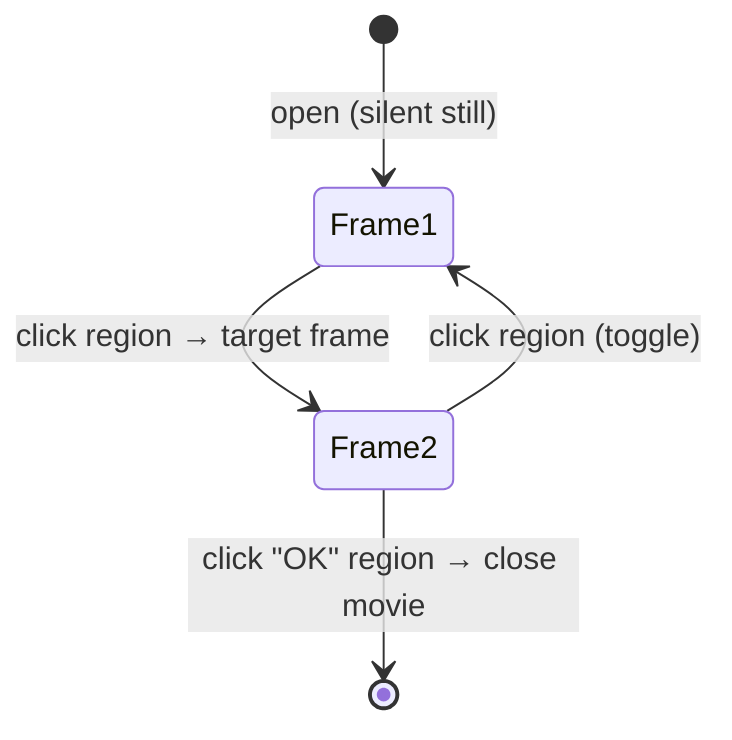

# MOV — movies & inspectable objects

*Prerequisite: [The DFile container format](README.md),
[The image codec](image-codec.md), and
[The scripting language](../scripting-language.md).*

**MOV** is the "does everything visual that isn't a room" format. The same
file type covers:

- a **single still image** of an object you can inspect,
- a **set of images you click through** (a close-up you rotate or flip),
- a full **animation**, and
- a complete **cutscene with audio**.

DFET already decodes the frames and audio; on top of that, the *interactive*
behaviour — what a click actually does — was pieced together from `TI.EXE`'s
movie loop. It's one of the more involved parts of the port, and the rules
below came slowly and with some wrong turns along the way.

Reference implementation:
[`engine/src/df/mov.ts`](https://github.com/dhobi/dreamrefactory/blob/master/engine/src/df/mov.ts)
(decoding, and the copy-on-write patches the editor writes through),
[`engine/src/df/mov-pace.ts`](https://github.com/dhobi/dreamrefactory/blob/master/engine/src/df/mov-pace.ts)
(the pacing rule, kept in one place so the player and the editor cannot each have
their own idea of it),
[`engine/src/df/mov-build.ts`](https://github.com/dhobi/dreamrefactory/blob/master/engine/src/df/mov-build.ts)
(the write half — a movie, or a chain of segments, built from nothing) and
[`engine/src/web/movie-player.ts`](https://github.com/dhobi/dreamrefactory/blob/master/engine/src/web/movie-player.ts)
(`MoviePlayer` — the playback state machine described below; see also
[the browser host](../runtime/host.md#movieplayer)).

## The big idea: a movie is a state machine of frames

Do not think of a MOV as a linear video. Think of it as a **flip-book where
each page can have buttons on it**. The player sits on a frame; the frame may
just play and advance, or it may **wait for you to click**. Where a click
takes you is defined per-region, per-frame. That's a **state machine**, and
it's why one format can be both a passive cutscene and an interactive
close-up.



- A **cutscene** is the degenerate case: frames with no click regions, so they
  just play through, with the file's looping audio as a soundtrack.
- An **interactive object** (the Turkish-bath mirror, a curtain you open and
  close, a lamp you toggle) is frames *with* regions that wait for clicks.

## A file is a chain of SEGMENTS

The single most important recovered fact, and the last one to fall: **a MOV
file is not one film but a linked list of them.** Header `+0x2c` holds the
container index of the **next segment's header** (0 = last), and a segment is
the whole structure below over again — its own palette, frame table, audio
tables and cue table, with **every stored container location relative to its
own header's index**. `TI.EXE`'s movie loop plays them back to back
(`0x449bb7`: a segment's exit reloads the bias from `+0x2c` and re-enters
setup; every container fetch adds the bias), so:

- A **type-1 EXIT ends the segment** — only the last segment's exit ends the
  movie. ESC still ends the whole chain (state 2 clears the next-segment
  pointer), and so does a type-3 chain-out.
- Between segments the engine halts only the **event channel**; a segment
  whose loop table has **no records inherits the still-playing bed**
  (`0x44956f`), which is how one soundtrack scores a many-segment film. A
  segment that brings its own bed replaces the playing one.

The demo's `TRAILER.MOV` is 13 segments (698 frames — reading only the frame
table at container 0 sees 139, which is 9.8 s of picture under 92 s of
narration: the reported "ends way too soon"). `TOUR.MOV` is 20, one per
narrated slide. The full game does it too: `SINK1..6`, `DEBRIS`, `LOGO` and
above all `LEAVE.MOV` — **10 segments, 1628 frames, the entire sinking
montage**, which is what a "70-frame" file was doing being 37.5 MB.

### How the reader and the write path are shaped around it

Worth stating, because it is the difference between an edit landing on the frame
you were looking at and landing on an unrelated one:

- `readMovFile` walks the chain and returns a `MovFile`, which **IS its first
  segment** — `segments[0]` and the file are the same object, so a
  single-segment movie reads exactly as it did before the chain was known. A
  self-referencing `+0x2c` cannot loop the reader (it keeps a seen-set; the
  engine would loop the *player* instead).
- Every parsed location is **absolute**: the reader adds the segment's own
  `bias` as it goes. `MovSegment.bias` is that header's container index — 0 for
  the first — and it is what every header-level patch writes into.
- So **every patch is addressed to a `MovSegment`, not to the file**:
  `patchKeySkips(mov.segments[2], …)` writes segment 2's header,
  `patchKeySkips(mov, …)` the first segment's. These used to hardcode container
  0, which is only the *first* segment's header — an edit made while looking at
  a later segment wrote its frame name into segment 0's table at the same record
  offset, silently renaming an unrelated frame.

The write path mirrors it: `buildMovFile` takes `segments` after the first, gives
each its own header container, points the previous header's `+0x2c` at it and
stores each segment's locations relative to itself
([the write path](README.md#writing-one-back)).

## What's in a segment

Everything below lives in, or is pointed at from, the segment's **header
container** — container 0 for the first segment, `+0x2c` of its predecessor for
every later one. Offsets are into that container; the locations it stores are
**relative to its own index**, and the reader adds the bias back so nothing
downstream has to know which segment it is looking at.

| Where | Contents |
|-------|----------|
| Header `+0x02` | i32 **format version** — 4 (4.0) is the only one the reader accepts |
| Header `+0x18` | **playback flags** — see [Escaping a movie](#escaping-a-movie) |
| Header `+0x1c` | i32 **minimum frame hold**, in ticks — the film's own frame rate, and a FLOOR rather than a cap. See [pacing](#a-movie-carries-its-own-pacing) |
| Header `+0x24`/`+0x26` | i16 x/y **screen origin** — where the picture sits on the 512×384 screen. (0,0) everywhere but the demo's letterboxed 512×264 films, which centre themselves with (0,60); the engine draws there and subtracts it from the mouse before region hit-testing (`0x44ad08`) |
| Header `+0x28` | i32 the CD drive's **KB/s**, written at load — read only to compute the cue table's streaming lead (below), and 300 (2× CD-ROM) when it is 0 |
| Header `+0x2c` | i32 container index of the **next segment**, 0 = last |
| Header `+0x40` / `+0x50` | the two **action-frame names**, each a `pstr(15)` — the frames `actionframe(1)` / `actionframe(2)` report having passed through. `""` = the slot is unused, and each segment carries its own pair |
| Header `+0x60` | i32 location of the **one-shot chunk table** (below) |
| Header `+0x64` | i32 location of the **loop-chunk table** — container 1 on every shipped first segment, but read from here (`0x449477`), and later segments point past their own bias |
| Header `+0x68` | i32 location of the **cue table** (below) |
| Header `+0x6c` | the 256-colour **palette**, 8 bytes an entry (as usual) |
| Header `0x870` | i16 height, i16 width — the size **every** frame of the segment decodes to |
| Header `0x878` | i32 **frame count** |
| Frame table @ `0x87c` | one **42-byte record per frame**: the dirty rectangle's height/width (`+8`/`+10`), the art container (`+12`), the logic container (`+16`, **0 = the frame has none**) and the frame's `pstr(15)` name (`+26`). The i32 at `+0` is authoring metadata the engine never reads |
| Frame image containers | the pictures, in the **SET delta codec** — see [image codec](image-codec.md) |
| Loop-chunk table | the **looping soundtrack** — a scored bed, played under cutscenes *and* interactive movies. Its i32 at `+0` is the **loop-back order index**: the engine chains the loaded chunks by a next-pointer and wires the last order entry back to `order[loopBack]` (`0x4496c4`), so a bed's tail repeats forever (usually a short outro chunk looping under whatever follows) |
| Non-looping chunk block | **named** one-shot audio chunks (42-byte records) — the movie's own sound library. TWO `pstr(15)` name fields, not one 31-char one: the sound's own name at `+0xa`, and at `+0x1a` a **jump-frame name** — see below |

A film to scale — `TOUR4.MOV` from disc 1, one segment, 16 frames and the
narration under them:

<ByteMap map="tour4.mov" />

A movie is the format where the block view earns its keep, because a MOV holds
two kinds of bulk at once: the frames and the soundtrack. The header, the frame
table and the per-frame logic containers are the handful of small blocks at the
start; everything after them is a picture or a slice of sound, and which is
which is the thing a table cannot show you.


### The cue table: timed jumps

Records of `{i32 tick, i32 firedFlag, i32 adjustedTick, pstr(15) frameName}`
after an i32 count. A cue fires ONCE when the **segment-relative** clock
passes `tick` (units of 50/3 ms), jumping playback to the named frame **out of
any wait** — a frame hold or a region frame's modal click wait; the engine
polls the table from both wait loops (`0x44ae90`). `adjustedTick` is computed
at load: `tick − frameBytes×60/((hdr+0x28 ‖ 300)<<10)` — the authored tick
minus a **CD-streaming lead** (header `+0x28` is the drive's KB/s, 300 = 2×
CD-ROM), so the original starts pulling the target frame off the disc early; a
port with pre-decoded frames uses the authored tick.

One shipped movie uses it, and it is load-bearing: `TOUR.MOV`'s first segment
authored its ship's-logo animation as a **backward goto loop** (frame 6, a
type-2 goto to frame 5) and escapes it with the single cue
`tick 200 → "Name 12"` — 3.33 s of looping logo, then on with the tour.
Without the cue, playback ping-pongs 5↔6 forever, which was exactly the
reported symptom ("behaves normally at the beginning, then never advances").

### A sound can name the frame that follows it

The second name field of a one-shot record (`+0x1a`) is the frame playback jumps
to **when that sound ends**, and it works like a cue: it comes due out of any
wait, a region frame's modal one included. Playing a sound from a frame entry (or
a region click) ends by arming it — `[0x48c58c] = findFrameByName(record+0x1a)`,
with the sound's own name copied beside it at `0x48c500` (`0x44ad39`) — and the
poll every wait loop runs compares that name against what the sound channel is
playing; once it no longer matches, the stored frame becomes current
(`0x44a7f5`). A sound whose field is empty stores −1, i.e. **clears** the pending
jump, which is how a movie interrupts its own chain.

`BEDCARDS.MOV` is the corpus's only user — 30 records across the six editions,
all of them this one film — and it is load-bearing: the pocket watch's monologue
is five chunks over ONE still picture, chained
`01 → "blah1" → 02 → "blah2" → 03 → "blah5" → 06 → "blah6" → 07 → "endwatch"`,
27.1 s in all. The port fired the first chunk and sat on the frame for ever
("missing voice line upon picking up watch, plays only first part of it").

**This page is why.** It described the field and then concluded that no shipped
movie used it, so the port dropped it — and a documented wrong answer is worse
than a documented gap, because nothing goes looking for it. Measured, 30 records
across the six editions use the field, all of them this one film. The
watch frames also show what the clearing rule is for: every one of them carries
an exit region and a whole-screen region to `endwatch`, whose entry sound is
`sil` — a second of **silence** that both takes the channel from the line and
disarms the chain, so clicking away really does shut the watch up.

Because frames use the delta codec, a "patch" frame that only changes a small
area still decodes to a **full 512×384 image**; the frame table's width/height
is just the **dirty rectangle** (what changed), so there's no separate
compositing step.

## Per-frame logic: sounds and click regions

The interactive behaviour lives in a **logic container per frame**, named by the
frame record's `+16`. Its whole layout:

| Offset | Type | Field |
|-------:|------|-------|
| +0 | i16 | the frame's own **action type** (the codes below) |
| +2 | i32 | how long the frame is **held**, in ticks — see [pacing](#a-movie-carries-its-own-pacing) |
| +6 | byte | per-frame **flag bits** (same section) |
| +0x12 | pstr | **entry sound** (below) |
| +0x22 | pstr | **event** — a movie to chain to (types 3/4) |
| +0x32 | pstr | **target** — a frame to jump to (types 2/4) |
| +1090 | i32 | **region count**, then the records (below) |

Two absences are load-bearing. A frame whose record stores **0** has no logic
container at all — it is a plain animation frame that plays and advances, and no
logic edit can touch it until the file gives it a container to write into. (0 is
never a real pointer: container 0 is the file header in every DF format, and a
frame read as pointing there took its action type from the fourCC's low half.)
And a container **shorter than `0x42`** is not trusted for any of the fields
above; one shorter than `1094` simply has no region table.

Two things hang off the container:

### 1. A sound that fires when you enter the frame

At offset **`+0x12`** the frame's logic container holds a Pascal **sound name**
that plays the moment playback *enters* that frame. In `FAUCET.MOV`, for
example, frame 2 fires the "faucet on" sound, a later frame the running-water
loop, and frame 29 the "faucet off" sound — the water cycle turns *itself*
off. (The faucet is a "runs once" toy, not a toggle you can stop mid-run.)

### 2. A table of clickable regions

Inside the frame's own logic container: an i32 **count** at **`+1090`** *(the
constant `0x442` = 1090 is how the routine was found in the disassembly)*, then
**64-byte records** from `+1094`. Per region:

| Offset | Type | Field |
|-------:|------|-------|
| +0 | i16 | type (see below) |
| +8 | — | coordinates, **Y-first** |
| +16 | pstr | sound to play on click (movie's named chunks, then banks) |
| +32 | pstr | event — a movie to chain to |
| +48 | pstr | target frame to jump to |

The frame *itself* carries the same three fields one record back (`+0`, `+0x22`,
`+0x32`), which is what lets a **regionless** frame take an automatic action while
a frame **with** regions waits for a click.

### The type codes (same set for frames and regions)

| Type | Action |
|-----:|--------|
| 1 | exit (close the movie) |
| 2 | goto the target frame |
| 3 | exit **and** chain to the event movie |
| 4 | push (movie, target) on a 5-deep return stack, then chain to the event movie |
| 5 | pop / resume from that stack |
| 6 | advance one frame |
| 7 | step back one frame |

### A chain can start at a region, not only at a frame

Worth stating on its own, because assuming otherwise produced a wrong conclusion
about the game that stood for a while: **a movie's parked REGIONS chain as well as
its frames.** The car keys in the Purser's office looked unobtainable, because
`docarkeys()` gives them on `actionframe(1)` and neither `maino2.mov` nor the
`man.mov` its "blackframe" leads to declares an action frame 1. Both halves of
that are true and the conclusion was wrong: `maino2.mov` frame 0 parks with two
type-4 regions sharing the target "win 1", one of which chains to **`key.mov`** —
which does declare action frame 1. So the keys are a gesture: click them on the
wall, click them again in the close-up (that frame *is* the action frame), click
the plaque.

`key.mov` is a good model of the shape: frame 0's plaque steps to a type-5 POP
(look, and leave with nothing) while the "KEYS 3" region steps to the action
frame, whose plaque steps to a type-1 EXIT that ends the whole chain. Look, or
take — and taking puts you out of the office.

So when a script's `actionframe(n)` does not match the movie it names, dump that
movie's **regions** before concluding anything, not just its frame table.
`SetViewer.movieRegions` carries each region's `event` field for exactly this
reason, so a caller can name a region by the movie it leads to rather than by a
rectangle.

## The behaviour rules that took a while to pin down

These are the non-obvious rules, verified against `MENU.MOV`, `TURKNMES.MOV`,
`CURTAINS.MOV`, `BEDLAMP.MOV` and `FAUCET.MOV`:

- **Interactive movies open as a silent still** and pause on region frames
  (starting with the first) — *unless* the frame sets [flags bit 2](#a-movie-carries-its-own-pacing),
  which says "these regions are live but do not stop for them". Clicks
  **outside** any region do nothing.
- **A click plays the region's sound, then jumps** per its type. A target that
  is itself a region frame → a hard cut (the menu zoom toggle). A forward
  target, or no target with nothing left to pause on → the movie **closes
  immediately** (that's how "OK" buttons work; the trailing "exit animation"
  frames in the file are simply never played). A backward/near target →
  animate along to the next region frame (the endless curtain open/close
  toggle).
- **Only the loop table plays by itself.** The engine's sole self-started
  audio is the loop chain, kicked off at segment start (`0x426170`); every
  *one-shot* chunk is an **event** sound — fired by a click or by entering a
  frame (`FAUCET.MOV`), never as music and never automatically. (The port
  briefly treated a loop-less segment's one-shots as a play-once soundtrack;
  for the single-chunk cutscenes that model was built on, the chunk is also
  frame 0's entry sound, so nothing audible distinguished the two — until
  `LEAVE.MOV`'s segment 2 played its smokestack crash at segment start.) An
  interactive movie with a bed — `PLAYMODE.MOV` (the main menu: one 8 s chunk
  listed 4×, and no event sounds at all), `PLAYMORE.MOV`, `CREDITS.MOV`,
  `CASH.MOV`, `PENOTE.MOV`, all scored as screens rather than props — waits
  on the player, so its bed is looped rather than cut to a runtime.
- Two fields that *look* meaningful are **authoring leftovers the engine never
  reads**: the frame table's "kind"/condition and the record's i16 at `+6`.
  Two earlier heuristic models were built on them and both were wrong — a good
  reminder that "there's a field here" doesn't mean "the engine uses it."
- The word at **`+4` was a third suspect, and the demo build's movie loop
  settled it**: it is the high half of the **i32 hold at `+2`** — the frame's
  authored duration in ticks (`0x44b10f` reads the full dword), so it is not a
  field at all. The `TOUR.MOV` mystery it was blamed for ("frame 6 is a hold
  and a backward `goto`, so frames 7..13 never show") had a different answer
  entirely: the **cue table** jumps playback out of that authored loop at tick
  200, and the "second half of the tour" is nineteen more **segments** — see
  [A file is a chain of SEGMENTS](#a-file-is-a-chain-of-segments).

## Escaping a movie

**ESC aborts the movie on screen — and everything the sequence would have gone
on to play.** It is the game's own speed-up, and the only key its movie loop
acts on.

The chain of evidence, from `TI.EXE` (the `bin` build, whose `.text` runs
`0x401000`–`0x4597a6`):

1. The window proc's `WM_KEYDOWN` arm (`0x41acda`) runs a jump table over
   VK `0x1b`..`0x7b`. VK_ESCAPE is entry 0, and its case (`0x41ad68`) does
   `mov al,0x2e` — ESC is handed on as the character `.` — and `or esi,0x1fa0`,
   the marker the engine puts on ESC and on anything held with Ctrl. It posts
   a **kind-3** event (kind 5 for an auto-repeat, which is therefore ignored).
2. The movie's per-frame input step (`0x44a120`) pops the pending event and
   runs it through the movie key filter (`0x44a460`), which accepts *only*
   kind 3 carrying the `0x1fa0` marker, then switches on the character.
   `.` (ESC) and `Q`/`q` (Ctrl+Q) both land on `0x44a4a3`:
   **`return movieHeader[0x18] & 1`**. Ctrl+`0`..`9` and Ctrl+T are the only
   other keys with cases, and neither aborts.
3. A nonzero answer makes the frame loop leave with state **2**, and state 2
   is what `0x4493a9` reads when deciding whether to follow the movie's
   next-segment pointer: it **clears** it instead. One press ends the whole
   sequence, not just the clip you are looking at.

So the abort is authored **per movie**, in header flag bit 0 — and all **218**
distinct movies in the corpus set it, `LEAVE.MOV` (37.5 MB) through the
smallest close-up. The other bits seen in the corpus:

| Bit | Meaning | Set by |
|----:|---------|--------|
| 0 | ESC / Ctrl+Q aborts this movie | all 218 |
| 2 | an alternate frame blit (`0x438900` rather than `0x438850`) | `BOMBHELP`, `AFTWASH`, `PORTWASH`, `STARWASH` — we don't distinguish the two paths |
| 3 | *any* key aborts | none — and because the loop **flushes the pending events at movie start** unless this bit is set, a key pressed *before* a movie began can never skip it |

### Where the rule lives

Worth being precise about, because it is easy to put in the wrong place: in the
original, **no part of this is in the window proc**. That layer only translates
(VK_ESCAPE → `.` + marker) and posts to one shared event queue; whichever modal
loop is running pops from it — the main interactive loop takes anything
(`0x431c43`), a text prompt takes keys only (`0x440756`), the movie loop takes
keys and its own kinds (`0x44a16b`). A live movie is therefore the *consumer* of
the keystroke, which is both why it can abort and why the key never reaches the
script chain while a movie plays.

We mirror that split exactly:

| Layer | Ours | TI.EXE |
|---|---|---|
| translate the keystroke, decide nothing | `main.ts` `DF_KEY` / `isSpecialKey` — `Escape` → `"."`, marker set | the window proc (`0x41acda`) |
| route it to whoever is modal | `SetViewer.keyDown` — the movie branch first, the same precedence `click()` gives it | one event queue, popped by the modal loop |
| interpret it | `MoviePlayer.key` — the filter, the header flag, the abort | the movie key filter (`0x44a460`) |

So with no movie up, ESC goes down the script chain as `.` and is ignored (the
boot's `keydown` forwards unknown keys to the scene), which is also what the
original does. Ctrl+Q is left unbound in the browser — the filter knows it, but
it is a browser-level shortcut here.

Aborting drops the type-4 return stack, does **not** run the frame's own action,
and resolves the blocked `playmovie()` exactly as a natural end would. What the
movie already did stands: `actionframe()` bits are recorded on *entering* a
frame, so a movie skipped after passing its action frame still reports it —
and one skipped before still doesn't, which is a real way to change the game
(`PLAYMODE.MOV`'s action frame is what decides `tour`).

## Timing

Every movie's frames carry an authored hold; the old claim here — that interactive
movies pace at ~145 ms/frame, derived from `FAUCET.MOV`'s water audio — was a
measurement of the wrong thing. Its frames are authored at **50 ms**; the water loop
repeats about three times under the 3.62 s sound.

**Regionless cutscenes** carry their own per-frame timing — see
[A movie carries its own pacing](#a-movie-carries-its-own-pacing)
below, which is the rule the player uses. What the file does *not* say is whether a
movie is self-paced at all, and that is the one pacing decision still the port's:
`chooseFrameInterval` in
[`mov-pace.ts`](https://github.com/dhobi/dreamrefactory/blob/master/engine/src/df/mov-pace.ts)
answers 0 for a movie that waits on clicks — a close-up with regions and no step
frames — and non-zero for one that runs on the clock, in which case *how fast* is
the authored holds and nothing else. (A later segment always plays itself out: its
picture is mid-film, so the close-up shape cannot apply to it.) The same module
holds `isBed` and `framesLoop`, which are **reporting only** — the movie editor
shows them, nothing paces on them, and both were once read as "the picture repeats
until the bed is done", which segments and cues turned out to be the real answers
to.

Their **soundtrack** still has twists that a naïve reading gets wrong, and they
matter for playing the audio itself:

- The loop-chunk table is a **play `order`** over a small set of records, and it
  usually ends in a **repeated tail** — a bed that loops behind the animation.
  `LOGO.MOV`'s "cybermix" plays chunks 01/02/03 once, then loops chunk 04
  **twenty times**. Where a length is wanted, take the **unique** content (each
  distinct chunk once), *not* the expanded order — otherwise the 318-frame logo
  reads as ~86 s of picture (~4 fps) instead of ~23 s.
- Chunks can be at **different sample rates** — the cybermix intro is 22050 Hz,
  its looping bed 11025 Hz (the rate is a per-chunk header field; see
  [audio](audio.md)). This is *not* the `.11K` scheme (those are shorter songs
  for low-RAM machines, not a downsample). Resample every chunk up to the
  highest rate present before concatenating, or the low-rate bed plays at double
  speed.
- How much of the order to take is **how long the bed will be on screen, plus a
  margin** — and "on screen" is three things, each of which was got wrong once.

  It is not `interval × frames`: that is a rate the player never uses. The film's
  own length is its **authored holds** added up (`segmentPictureMs`), and the two
  disagree by 8.3 s over `OCREDITS.MOV`'s 1225 frames — a bed cut to the
  prediction ended before the picture did, reported as the fly-in to C73 losing
  its audio and carrying on silent.

  It is not this segment either. A segment whose loop table is empty **inherits
  the playing bed**, so one bed scores a whole chain (`bedRuntimeMs` walks
  forward until a segment brings its own, or stops for a click).

  And it is not the holds alone: a frame flagged `waitsForVoice` holds until the
  event sound an earlier frame fired has finished. `OPEN.MOV`'s last segment is
  4.83 s of authored holds and **8.1 s** on screen, because its frame 6 waits out
  the 6.64 s `punch.01` that frame 2 started.

  Missing all three at once is what made the 1996 demo's opening restart its own
  music: a 23-entry order holding 156 s, cut to 25.18 s — one segment's
  prediction — under a film that runs 31.4 s. The player takes **110%** of the
  measured runtime out of the authored order, which for `OPEN.MOV` is 33.87 s and
  never reaches the end.

  The loop is the backstop, and it applies **only when the order itself ran out**.
  Reaching the end of a bed that was cut short is the *cut* having been short, and
  rewinding there plays the author's first chunk, which is never what comes next.
  Across all three discs no bed now falls short of its film, so the distinction
  costs nothing and removes a whole class of wrong. The bed is halted with the
  film either way — `TI.EXE`'s own teardown does that on the no-next-segment path
  (`0x449d40`).

### A movie carries its own pacing

Recovered out of the demo build's engine. The port derived a frame rate from the
soundtrack for years and did not have to: the timing is **in the file**, and it
is per frame.

| Where | Field |
|-------|-------|
| frame's logic container `+2` | i32 **hold**, in ticks of 50/3 ms (60 a second) |
| the **segment's** header `+0x1c` | i32 **floor** — the film's own frame rate. Measured across the corpus it is 2, 3 or 4 ticks: 33, 50 or 67 ms, i.e. 30, 20 or 15 fps |
| frame's logic container `+6` | flag bits (below) |

The deadline is `max(frame hold, movie floor)` — the floor is a MINIMUM, so a frame
may be authored longer but never shorter. Most frames carry a hold of 0 (take the
floor) or 20 (333 ms). Read out of the movie loop:

```
0x44b0fe: test byte ptr [ecx + 6], 8   ; bit 3: don't reset the deadline
0x44b104: mov  [0x48844c], eax         ;   else deadline = now
0x44b10f: mov  edx, dword ptr [ecx+2]  ; the frame's hold
0x44b118: mov  ecx, dword ptr [ecx+0x1c] ; the movie's floor
0x44b11b: cmp  edx, ecx / jge / add    ; deadline += the LARGER
```

The flag bits at logic `+6`:

- **bit 0 — wait for the spoken line.** The loop will not leave the frame while the
  VOICE channel is busy (`0x44a8e0`: `test byte ptr [eax+6], 1`, then spin on
  `voicedone`, interruptibly). Rare and deliberate: one frame of `TOUR.MOV` (8) and
  one of `LEAVE.MOV` (68) — the latter being exactly why that film's last line
  outlives its picture, which the port had previously reproduced by hand.
- **bit 2 — do not WAIT on this frame's click regions**: honour them only if a
  click is already queued, else run the frame's own action and play on. Retail
  `0x44979f`, right before the region count at `+0x442`:

  ```
  0x44979f: test byte ptr [edx + 6], 4  ; bit 2
  0x4497a3: mov  ecx, [ecx + 0x442]     ; the region COUNT
  0x4497a9: je   0x4497b2               ; clear -> the count stands, wait modally
  0x4497ab: test ax, ax                 ; set: has the pump a click in hand?
  0x4497ae: jne  0x4497b2               ;   yes -> honour the region
  0x4497b0: xor  ecx, ecx               ;   no  -> ZERO it: do not wait
  0x4497b4: jg   0x4497da               ; count > 0 ? region path : frame's own action
  ```

  It is an animation that can be clicked through, not a picture that stops for
  one, and it is NOT rare — **2028 frames across the six editions**, 2022 of them
  carrying regions, in **seven** movies: `CAMELSEE.MOV` and `CAMRIDE.MOV` (the
  Cairo camel ride, every frame carrying the same skip rect), `AFTWASH.MOV`,
  `PORTWASH.MOV`, `STARWASH.MOV`, `SMFIRE.MOV` and `LOFIRE.MOV`.

  **This is where their loops come from, and there is no "loop" field anywhere in
  the format.** The cycle is authored as a plain backward `goto` on its last
  frame — `CAMELSEE.MOV` frames 41..44 are each a type-2 to frame 1, and 41 is
  the one the gallop actually reaches, so a lap is frames 1..41 and the three
  after it are there for the late clicks below — and playback only ever reaches
  that action by falling through the zeroed region count. Miss bit 2 and
  the animation stops on its own first frame instead, which is what the port did
  until [#172](https://github.com/dhobi/dreamrefactory/issues/172): the horses in the
  gym showed one frame and then advanced a frame per click.

  The regions on those frames are not decoration either. `CAMELSEE.MOV` gives
  frames 2..44 one region each, targeting the **phase-matched** stop frame
  (*N* → `HORSE N+44`), so a click during the run picks up the stopping animation
  at the leg position the horses are actually in. Forty-three stop frames only
  make sense for an animation that is *running* while its regions are live.
- **bit 3 — do not reset the deadline** to "now": add to the one already running, so
  a long film does not lose a frame's worth of time per frame. `OCREDITS.MOV` sets
  it on 1224 of its 1225 frames.

**Which engine.** Both builds' movie loops consult audio, and this page said
otherwise for a while on a bad measurement (a scan for `sounddone`'s callers, which
is the wrong primitive — the movie code calls `voicedone`'s, `0x424cf0`). In the
retail `TI.EXE` (7 Oct 1996) the voice wait is `0x44a0e0`, called from the frame
body once the frame's own wait is over, and the sound-driven jump above polls the
channel from every wait loop. The **demo** ships its own build
(`INSTALL/BIN/TI.EXE`, 18 Jul 1996, 448,512 bytes against the retail 461,312) whose
same routine sits at `0x44a8e0`; its dispatch tables are at `0x427f58` (value) and
`0x43e1d0` (action) if you need to go back in. What is still true is that neither
build derives a frame RATE from audio — the pacing is the authored holds, below.

**Why it matters.** Deriving the rate from audio played the demo's `TRAILER.MOV` at
**1.5 fps** (139 frames spread over 92 s of narration; that segment is authored at
**9.8 s**, and the narration covers the file's THIRTEEN segments) and `TOUR.MOV` at
a picture every **6.7 s** (its first segment is authored at **4.7 s**). Checked the
other way, on films whose length is known from their soundtrack: `BERG.MOV` computes
35.3 s against 40.0 s of audio, `LEAVE.MOV`'s first segment 5.2 s against its 5.6 s
bed, `OCREDITS.MOV` 89.1 s against 72.0 s — and `OCREDITS` is the one that sets
bit 3, which pulls it in.

It also settles `FAUCET.MOV`: the 145 ms/frame this page used to quote was derived
from its water audio (3.62 s over 25 frames). Authored, its frames are **50 ms** —
the water loop simply repeats about three times under the sound.

Re-recording the goldens for it moved **only** `attentionspan`, `clockcount`,
`fourcount`, `jonesframe`, `ladycount`, `lastsail`, `paintframe`, `sec` and
`secframe` — counters and stock-line rotators. No story field moved, and `min`/`clock`
did not move at all.

Cutscenes with **no audio at all** but which self-advance (frame step actions —
the date captions) are still paced by their authored holds. The fixed ~3 s total
`chooseFrameInterval` computes for them, clamped to a sane per-frame rate, is only
what makes the interval non-zero — i.e. what says the film runs on the clock rather
than waiting for a click. Nothing advances a frame but the holds.

## In the engine

The `playmovie` builtin fetches the MOV on demand and hands it to the session's
movie mode; the boot library's `spotmovie` helper wraps it
(premovie/playmovie/postmovie). While a movie plays, input is blocked except
for the clicks the movie itself defines — a playing movie is the very first
link in [the click priority chain](../runtime/host.md#the-click-priority-chain).
Chained movies (types 3/4/5 above) share a five-deep call stack and one
`playmovie()` wait — details in [the browser host](../runtime/host.md#movieplayer).

## DreamFactory 1 (Dust)

The **model** survives: a chain of segments, a frame state machine, click
hotspots, chained films. Almost every **mechanic** under it is different, and
more of it is behaviour than layout — how a frame decides what comes next, how
long it is held, what a click record looks like, and which palette indices draw
at all. This is the format where the two engines diverge most, and the reason
`mov-v1.ts` is a separate reader rather than a branch here.

`engine/src/df/mov-v1.ts`'s module comment is the full account, and it is
DF.EXE's own rather than a statistical fit: the record base comes
from the engine's indexing (`lea esi, [frame*80 + header + 0x8c2]`), each field
from the instruction that reads it, and the blit semantics from the
disassembly at `0x421b40`. The short version of what differs from v4:

`CACTUS.MOV`, a Dust film, mapped through `mov-v1.ts` and drawn with the same
labels as a v4 one — 43 frames of a 512×264 picture:

<ByteMap map="cactus.mov" />

Beside [TOUR4.MOV](#what-is-in-a-segment) the family resemblance is the point:
same header container, same table, same one-picture-per-container rule. The
differences the rest of this section is about are in what the records *say*, not
in how the file is arranged.

- **Advance is an authored goto.** A frame is `action 2, target = next frame`
  (0-based, clamped); a loop is a backward target (BELL.MOV's bell idles
  through frames 2–21 and 21 points back at 1); actions are the same codes v4
  uses — 1 exit, 2 goto, 3 exit + chain, 4 call, 5 return.
- **Hotspots are typed records** walked from a per-frame offset (record
  `+0x24`), first hit wins: type 2 (16 bytes) carries a click **sound** and a
  goto **target**, type 1 (14 bytes) exits with a sound. How many a frame owns
  is the count at record `+0x00`, and a frame that owns any of them **blocks
  until one is hit** unless `+0x1a` bit 2 says to play through — that is how
  ARMOPEN.MOV's opening animation is steerable mid-swing, at frame 16, where
  three of its four boxes put the diary back.

  The port read `+0x06` for both until #324, and that is not a field the movie
  loop touches: its bits amount to "first frame" and "last frame", so frame 0
  was the only frame that ever waited and every frame reached *by* a click ran
  on to the end of the film. Two reports, one cause — the Mayor's letters
  (`maylett.mov`) and the hotel room's blinds (`hwin.mov`) each opened for a
  single frame and then closed. The count also bounds the run, which the old
  unbounded walk did not: runs are adjacent, each exactly its own count of
  records long, so a frame owning none answered clicks with the next frame's
  boxes. All 520 counted runs on the disc decode cleanly for exactly their
  count; 372 are ones the walk over-read.
- **A frame can wait for the sound it started.** Record `+0x1a` bit 0 makes the
  loop block on the sound channel before advancing (`0x404ab0` → `0x429bd0`),
  so the frame is held for `max(hold, what is left of the sound)`. Nothing in
  the file says how long a chunk is, and this is how a film times itself to one:
  152 frames across 69 of the disc's 185 segments, in 50 of its 160 films. DOG1.MOV fires one 0.88 s
  growl twice and waits after each, so the dog growls twice over 2.4 s instead
  of once over 1.0 s; MAYOREND.MOV runs 61 s rather than 15 s, which is the
  difference between hearing the mayor's last speech and hearing a quarter of it.
- **Sounds are per frame and per click, not tables.** Frame record `+0x20`
  names the chunk a frame starts (negative = interleaved with the pictures),
  the hotspot its click sound; whatever nothing references is the bed.
- **Chains end the film.** A type-3 exit sets the abort flag and posts the
  movie named on its own record `+0x30` — no return, no stack. ARMOPEN.MOV
  runs its opening straight into Diary.mov; the put-the-diary-back half is
  reachable only by the click-away hotspots during the animation.
- **Action frames are 1-based positions**, i16s at header `+0x2e`/`+0x30`,
  where v4 keeps names.
- **A mid-film exit ends the whole film.** The segment teardown follows the
  next-segment pointer only when playback stopped **on the last frame**
  (`0x404b9c`), so leaving a segment any other way — a type-1 exit, a hotspot
  that exits — drops the rest of the chain. v4 reaches the same place by a
  narrower route: there it is ESC that clears the pointer.
- **Indices 0 and 255 are transparent in the blit.** The engine keys them out
  through a monochrome mask and an SRCINVERT composite, which is what a v1
  frame authored as solid `0xff` means: hold the picture already on screen.
  The decode buffer keeps the raw bytes for the delta chain — so does the
  port's (`compositeFrameV1`).

## Related tools

- **[the movie editor](../../editors/movies.md)** (`/editors/movies.html`)
  — this page's state machine, walkable: pick a **segment** of the chain, scrub its
  frames, follow the machine at the film's own authored pace, click the regions and
  see where they go, and edit the action codes, targets, region rectangles,
  action-frame slots and the ESC flag — each written into the segment you are
  looking at. Frame art is read-only there, for the delta-chain reason described
  above.
- **[`taoot/tools/mknightdive.ts`](https://github.com/dhobi/dreamrefactory/blob/master/taoot/tools/mknightdive.ts)**
  — a worked example of the write half: an animated GIF becomes a movie
  (`npm run mknightdive -- some.gif`). The film is one segment — every GIF frame
  scaled into the 512×384 screen, a type-6 STEP on each and a type-1 EXIT on the
  last, paced by the GIF's own delays through the segment's frame-rate floor
  (`+0x1c`) with a per-frame hold only where a frame disagrees with it. A second
  segment is a question drawn over the film's last lit frame, parked on a frame
  with two click regions, whose answer leaves through the header's two
  **action-frame** slots rather than through anything the page installed. Two
  things it is a reminder of: a region-less segment that never steps is read as a
  close-up and waits for a click (`chooseFrameInterval`), and a segment's palette
  is per segment — sharing one is what lets a screen be an *overlay* on the film
  rather than a screen of its own.
- **[`taoot/tests/auto/mov-format.ts`](https://github.com/dhobi/dreamrefactory/blob/master/taoot/tests/auto/mov-format.ts)**
  pins the three recovered facts on this page against the shipped corpus rather
  than against a synthesized file: the segment chain, the cue table, and the screen
  origin. It skips wholesale when the tree it needs is not installed.

Next: full-screen UI screens and the deck map — **[STG](stg.md)**.
