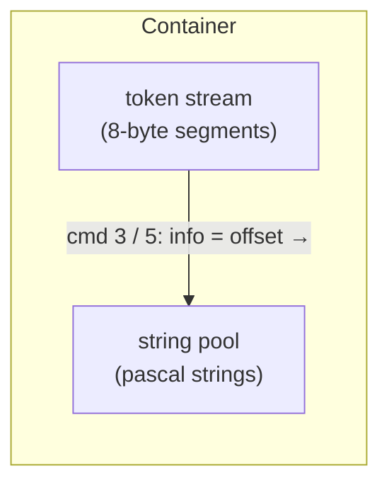
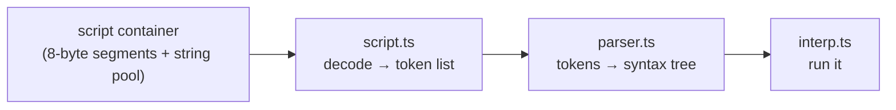

# The script container on disk

*Prerequisite: [The DFile container format](README.md) and
[The scripting language](../scripting-language.md). This is the deepest
format doc — you only need it if you're working on the decoder itself.*

Scripts don't live in their own files. A script is **one container** inside
whatever file owns it — a SET, an STG, the BOOTFILE. This doc explains what
that container's bytes look like.

Reference implementation: [`engine/src/df/script.ts`](https://github.com/dhobi/dreamrefactory/blob/master/engine/src/df/script.ts), ported
from DFET's [`DFscript`](https://github.com/M3tox/DFET/blob/main/libs/DFfile/DFscript.cpp).

## First surprise: the script is *bigger* compiled than as text

You might expect a compiled script to be a compact stream of one-byte opcodes.
It isn't — the on-disk form is **larger** than the readable text. The reason is
**speed, not size**: the format is laid out so the 1996 engine could step
through it with almost no parsing. Every token is a fixed-width record it can
read in one go. It was already "interpreted" (tokenised) at build time.

## The token stream: fixed 8-byte segments

A script container is a sequence of **8-byte segments**, terminated by a zero
segment. Each segment is:

| Offset | Type | Field |
|-------:|------|-------|
| +0 | u16 | `cmd` — what kind of token this is |
| +2 | u32 | `info` — a value whose meaning depends on `cmd` |
| +6 | u16 | padding (always 0) |

So reading a script is just: walk 8 bytes at a time, and for each segment look
at `cmd`.

### The five kinds of token

Four `cmd` values are "special" (they carry data); everything else is a
**command or operator ID**:

| `cmd` | Kind | What `info` means |
|------:|------|-------------------|
| 3 | string literal | a **byte offset** from this segment to a Pascal string (stored later in the container) |
| 4 | integer literal | the integer value itself |
| 5 | variable name | like a string — an offset to the variable's name |
| 6 | line break | the **indent level** (in tabs) — cosmetic, for pretty-printing |
| *anything else* | a command / operator | the value **is** the command ID |

This is why DFET's notes say strings "are defined at the bottom of the
container": literals and variable names are stored as a **string pool** after
the token stream, and the tokens just point into it by offset. Integers, being
fixed-size, sit right in the `info` field.



## Command IDs: the opcode table

When `cmd` isn't 3/4/5/6, it's an **opcode** — a number naming a built-in
command or operator. The IDs are banded by purpose:

| Band | Purpose | Examples |
|------|---------|----------|
| 4xxx | control flow / syntax | `code`, `if`, `switch`, `case`, `exitcode`, `passcode`, `me`, `target` |
| 8xxx | operators | `+` `-` `*` `/`, `&` `\|`, `@` (concat), `=` `!=` `>` `<` |
| 12xxx | actions | `delay`, `makeloop`, `playmovie`, `voicesound`, `opensetfile`, `sendtoprop` |
| 16xxx | property get/set | `propxy`, `propview`, `propvisible`, `currentscene`, `setvisible` |
| 20xxx | queries / functions | lookups and computed values |
| 24xxx | visual transitions | screen fades and wipes |

The full table (~351 entries) is the `OPCODES` map in
[`opcodes.ts`](https://github.com/dhobi/dreamrefactory/blob/master/engine/src/df/opcodes.ts)
(re-exported by `script.ts`, which decodes against it). It originally came from DFET's
[`DFscript.h`](https://github.com/M3tox/DFET/blob/main/libs/DFfile/DFscript.h),
and was then **validated byte-for-byte against `TI.EXE`**: the
executable contains a plaintext table of 6-byte records `{ char* name, u16 id
}` mapping every command name to its ID. The tool that extracts that table is
[`taoot/tools/exetable.ts`](https://github.com/dhobi/dreamrefactory/blob/master/tools/exetable.ts).

> **Names vs. behaviour — the crucial gap.** Having the ID→name table means we
> can *decompile* a script into readable text. It does **not** tell us what
> each command *does*. `propxy` is command 16018 — but *how* it places a prop
> had to be recovered from the disassembly. Recovering these per-command
> semantics, one at a time, is the bulk of the reverse-engineering work; the
> [scripting doc](../scripting-language.md) explains where they land
> (the interpreter's builtin registry).

## From bytes to a running script

The pipeline, end to end:



1. **[`script.ts`](https://github.com/dhobi/dreamrefactory/blob/master/engine/src/df/script.ts)** turns the container's bytes into a
   flat list of `Token`s (and can decompile them straight back to text).
2. **[`parser.ts`](https://github.com/dhobi/dreamrefactory/blob/master/engine/src/runtime/parser.ts)** turns the token list into an
   abstract syntax tree, tolerating the original compiler's quirks (see the
   [scripting doc](../scripting-language.md#values-operators-and-quirks)).
3. **[`interp.ts`](https://github.com/dhobi/dreamrefactory/blob/master/engine/src/runtime/interp.ts)** executes the tree.

The parser handles **100%** of the shipped scripts — about 2,050 script
containers across every file type — which is the main evidence that the
format above is understood correctly. (`tools/parse.ts` reruns the claim over
the whole corpus; see [the test reference](../../reference/tests.md).)

## Writing one back

The same regularity that makes a script fast to read makes it easy to *emit*:
`encodeScript` in
[`script.ts`](https://github.com/dhobi/dreamrefactory/blob/master/engine/src/df/script.ts)
writes the segment stream, a zero segment to terminate it, and the pascal-string
pool the string/variable segments point into — each by an offset **from its own
segment**, which is the one fiddly part. Identical text is pooled once (only the
segment's `cmd` distinguishes a variable from a string literal), and a negative
integer is refused: `info` is unsigned, so a negative literal is the unary `-`
operator applied to a positive one, exactly as the original compiler emitted it.

On top of it,
[`script-asm.ts`](https://github.com/dhobi/dreamrefactory/blob/master/engine/src/df/script-asm.ts)
lexes source text into those tokens — enough to author a handler by writing it:

```
code mousedown()
	global taootlang
	taootlang = "de"
	gotoflat("wait")
endcode
```

Identifiers become commands when the opcode table names them and variables
otherwise, except where the grammar can only mean a name (after `code`,
`global`/`local`, `for`, and in a `code` header's parameter list) — without that,
a handler named `code delay()` would compile to command 12004 and the parser would
reject the file it just wrote.

The round trip that matters is **tokens → bytes → tokens**, not byte equality with
CyberFlix's own encoding of the same source: their pool order was their compiler's
business. `taoot/tests/auto/script-encode.ts` asserts the former, and that compiled
source parses into the handlers it declared. The first real user is the language
chooser's stage — [Languages & the chooser](../../taoot/languages.md).

## Related tools

- `tools/dumpscripts.ts` — decompile every script in a file back to text, plus
  an opcode-frequency count.
- `tools/parse.ts` — run the parser over the whole corpus and report
  coverage.
- `taoot/tools/exetable.ts` — extract the command-name → ID table from `TI.EXE`.

Back to the [format index](README.md), or on to the last format —
**[PUP & CST characters](pup-cst.md)**.
