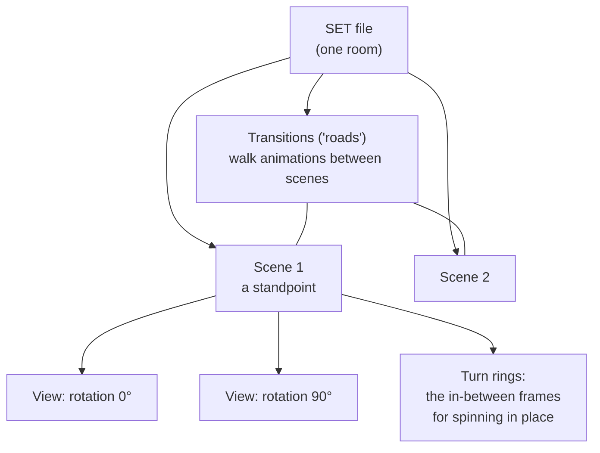

# SET — rooms, scenes & views

*Prerequisite: [The DFile container format](README.md) and
[The image codec](image-codec.md).*

A **SET** file is one room or section of the ship — the Lounge, cabin B59, the
Grand Staircase. It's the format you spend the most time inside, and it ties
together everything from the concept doc: **a set has scenes, a scene has
views, and roads connect the scenes.**

Reference implementation: [`engine/src/df/set.ts`](https://github.com/dhobi/dreamrefactory/blob/master/engine/src/df/set.ts), ported from
DFET's [`DFset`](https://github.com/M3tox/DFET/tree/main/libs/DFfile/DFset).

> The name is not "ship." SHP files are the props; **SET** files are the
> rooms. Blame CyberFlix's fondness for movie-industry words: a *set* is where
> you shoot a scene.

## The hierarchy



- A **Scene** is a *standpoint* — a fixed spot with a map position
  (`xAxisMap`, `zAxisMap`, `yAxisMap`).
- A **View** is a direction you can face from that standpoint: a single
  pre-rendered background plus the hotspots and objects you can interact with
  while facing that way.
- A **turn ring** is the sequence of frames that animate you rotating from one
  view to the next, so turning looks smooth instead of snapping.
- A **transition** (the game's word; we call them *roads*) is the walking
  animation that carries you from one scene to another. Roads can be diagonal
  or curved, with waypoints — the world isn't locked to a grid.

## What's in the file

The SET's top-level fields (decoded into `SetFile`) include the set name, the
default scene/view to start on, the **viewport size** (the pre-rendered
picture is **512×264**, sitting in the top of the 512×384 screen), map
overview parameters, the main-script container index, and the palette.

Then the meat:

- **`scenes`** — the standpoints, each with its views and its two turn rings.
- **`transitions`** — the roads between scenes.
- **`actors`** — placement markers for characters (the characters themselves
  come from [PUP/CST](pup-cst.md)).

All of it, to scale, on `LNGHALL.SET` — the first-class lounge, two scenes and
one road between them. Hover a block for what claims it; the
[container page](README.md#a-whole-file-to-scale) reads the same map from the
container format's side:

<ByteMap map="lnghall.set" />

The proportions are the lesson. Everything the engine *reasons* about — the
scene register, the view tables, the hotspot records, the scripts — is the thin
band at the front; the other 95% is turn rings and walks. A room with three ways
out costs almost nothing more to describe and a great deal more to picture.

### A frame's metadata (`FrameInfo`)

Every rendered frame — a standpoint view, a turning frame, a walking frame —
carries camera metadata: its 3D position, its horizontal rotation (`axisX`,
in radians), which container holds the actual image, and a **`motionInfo`**
tag:

| `motionInfo` | Meaning |
|-------------:|---------|
| 0 | an in-motion frame (mid-turn or mid-walk) |
| 1 | a standpoint, low-resolution |
| 2 | a standpoint, high-resolution |

### A gotcha worth memorising: two kinds of view ID

There are **two different numbering schemes** for views, and mixing them up
misplaces the player:

- A turn ring's `viewID` is a **scene-local** index — "the 3rd view *of this
  scene*."
- A road's `viewIDstart` / `viewIDend` are **global** view IDs — numbered
  across the whole set.

This distinction is easy to miss and caused real, user-visible bugs until it
was pinned down.

## Hotspots: where you can click

Each view carries **objects** (`ObjectEntry`) — the clickable regions. Each
has a rectangle and a script location. The rectangle is stored **Y-first**:
`(top, left, bottom, right)`, *not* the `(x, y, …)` you'd expect. DFET's
struct labels these X-first — which never mattered for DFET, since it only
*extracts* data and never draws a hotspot, but it does matter once you use the
coordinates to hit-test clicks (they showed up here as a consistent
bottom-left offset until the axes were swapped back).

When you hover, the engine finds the hotspot under the cursor and asks its
script (via `setcursor`) what cursor to show; when you click, it fires
`mousedown`. Both travel the event chain from
[the scripting doc](../scripting-language.md).

## Roads: getting from scene to scene, facing the right way

Walking a road plays its animation frames and drops you at the destination
scene. Two subtleties, both learned from bugs:

- A road register's `destination` is the **container index of the arrival
  scene's view table** — not a view ID directly.
- The road's endpoint view faces *back along the road* (you'd be looking at
  where you came from). So the **arrival facing** is chosen by matching the
  **last walked frame's camera angle** against the destination scene's view
  rotations, and snapping to the closest one. The engine carries the last
  rotation across the transition to make this continuous.

Set-to-set travel (walking through a door into a *different* SET file) is a
level above this and is handled by the boot library's `changeset` /
`gotospecial`; see [BOOTFILE](bootfile.md) and
[the scripting doc](../scripting-language.md).

## Stars, and the routes between them

The actor register's records are a fixed **54 bytes**, and one record can hold
**two** stars: the primary `{rotation8, X, Z, Y, id}` at `+4` and an optional
nested secondary at `+30`. The tail that looks like leftover heap is not — HALLA's
`sasha.1` record carries `sasha.2` there, and `ex1` carries `ex2`.

A paired record may also carry the **walking route** between its two stars, as an
i16 container ref at `+28` (the gap between the primary's identifier field and the
secondary's `rotation8`; TI.EXE reads a dword there, which agrees only because
every secondary `rotation8` in the corpus is 0). That container is a polyline:

| Offset | Type | Field |
|-------:|------|-------|
| +0 | i32 | total route length, in world units |
| +8 | i32 | point **count** |
| +12 | 4×i16 | bounding box, `Zmin, Xmin, Zmax, Xmax` |
| +20 | — | `count` × 8-byte points: `{i16 X, i16 Z, i16 Y, i16 distance-from-previous}` |

The first point is the primary star and the last is the secondary, so everything
between them is the authored detour. `walkonpath` is what walks it, in either
direction — and where no route is authored, the straight line *is* the route. The
whole corpus holds **six**, and only three bend:

| Set | Route | Points | Route vs. straight line |
|-----|-------|-------:|------------------------|
| `deckbd` | `ga.1` → `ga.2` | 10 | 2508 vs 2257 units, up to 396 off the diagonal |
| `scot3` | `hack1` → `hack2` | 9 | 8661 vs 6804, up to 2013 off |
| `halla` | `sasha.1` → `sasha.2` | 5 | 2432 vs 1973, up to 581 off |
| `b70`, `decka`, `halla` | `ga`, `max`, `ex1`→`ex2` | 2 | straight |

Those three are the difference between walking the deck and walking through it —
the per-point distances and the total are what let the walk service run the whole
polyline on one progress scalar
([characters at runtime](../runtime/characters.md)).

Those distances are not a re-measure of the geometry, and cannot be: each is
`TI.EXE`'s **truncating integer sqrt** (`0x435950`), which is a different function
from rounding the real length down. HALLA's third leg spans 101 × 259, whose true
length is 278.0004, and the file stores **277** — because 278² = 77284 overshoots
77282. Every leg of all six routes matches that, and every header total is the
exact sum of its own legs, so the writer uses the same arithmetic and a route
round-trips byte for byte.

## The camera, and placing things in 3D

Even though you only ever see pre-rendered stills, each view stores a real
**camera** — position, rotation, and height — because the engine needs it to
place *movable* props (an item on a bed, a character) correctly into the
picture. The camera height is the per-view double that early analysis
mislabeled "unknown"; it turned out to be the eye height (in the set's world
units) that the world→screen projection needs.

The projection itself — the formula that turns a prop's 3D world coordinate
into a screen pixel and a scale — was recovered from `TI.EXE`. The gist:

```
dx, dy, dz = prop position − camera position
depth   = (dy·sin + dx·cos) >> 14      (fixed-point trig, angle in 1/256 turns)
lateral = (dy·cos − dx·sin) >> 14
screen x = centreX + lateral · f / depth
screen y = centreY − dz     · f / depth
```

where `f` is half the viewport's larger dimension. If `depth ≤ 0` the prop is
behind the camera and hidden. Sprites also **scale with depth**, so a teacup
looks bigger up close. The full derivation lives in the project README and the
props code; you need it only when working on in-world prop placement.

## DreamFactory 1 (Dust)

Everything above is a **v4** set, as *Titanic* writes them. *Dust* writes
version 1, and this is the format where the two engines differ most — not in
the bytes, but in the **model of movement**. It is worth reading even if you
only care about v4, because v1 is where v4's rings and roads came from.

### A grid and one table, not rings and roads

A v4 scene is a standpoint carrying two full 360° turn rings, joined to other
scenes by roads. A v1 set has neither. It has a **grid of cells**, and one flat
table of transitions in which a turn and a walk are the same kind of record:

    from (x, z, facing)  ->  to (x, z, facing)   + a run of frames

Turning is the record where the cell is equal and the facing differs; walking is
the record where the facing is equal and the cell differs.

`UNDERTAK.SET` — the undertaker's, a 2×3 grid with eight moves — mapped as the v1
file it is rather than through the v4 shapes:

<ByteMap map="undertak.set" />

Two things a v4 set never shows: the file carries **three palettes** (a v1 set can
be relit by script), and four of its containers are **gaps** — drawer numbers
reserved with nothing in them, which the reader keeps so the indices after them
do not shift.
 `APOTH.SET` has 28 of
them, and 28 is exactly 3 walkable cells × 8 turns (four facings, each way
round) + 4 walks (0↔1, 1↔2). Nothing else is stored because nothing else exists:
**there is no way to face a direction the table has no record for.** Titanic's
rings and roads are that table with the turns factored out of it.

The two engines also pack the header differently. The registers a v4 set spreads
over eight bytes sit close together in v1: the transition register is the i32 at
0x1e and the actor register the i32 at 0x22 — 44 and 43 in `APOTH`, 89 and 1 in
`UNDERTAK` — and DF.EXE reads both as dwords when it opens a set (`DFPENT.EXE`
0x419a3b and 0x419a18). The palette sits at 0x50 rather than 0xf2, and every
offset after it shifts.

**The main script is not in that run.** Reading the i32 at 0x1c as a packed pair
— `0x002c0001` in `APOTH`, a "main script" of 1 beside the transition register —
is a coincidence, because that low half is a constant: it is 1 in all 35 sets on
the disc, and DF.EXE never uses it as a container index. All it does with it is
check the word is non-zero, alongside the same test on `defaultFacing` at 0x34,
and refuse the file if either is (0x419962, error line 5402).

The real reference is the i32 at **0x1b78**, immediately before the set name at
0x1b7c, which set-open copies into the set's own state for the lazy load the way
a scene's script is taken from `scene+0x18`:

```
0x419981  mov eax, dword ptr [edi + 0x1b78]
0x419987  mov dword ptr [esi + 0x24], eax
```

It is the only offset in the whole header that names each set's real main script
across all 35 of them, and 34 of those say 1 — which is why the wrong reading
survived. `undertak.set` is the one that says 2, because its container 1 is the
actor register (it is the only set where `actorRegister` and container 1 collide,
and the bytes there are the star record `under.side.side`). Reading 0x1c cost
that room its whole script: no main, so no `openset`, and its openset is the only
thing in the corpus that places the undertaker.

### The frame runs, and the sixth container

A transition record names its **first** frame container and not how many follow.
Each is allotted six containers, of which the move is the first **five**, ending
on the arrival standpoint's picture. A move wanting fewer leaves the tail as
gap containers — which is how `APOTH.SET` comes to have 40 gaps among its 192
frame slots.

The sixth, where it exists at all, is not part of the move: it is the **hi-res
standing view of the standpoint the transition departs from** — v4's
`motionInfo == 2` twin, which v4 stores at the head of a register and v1 at the
tail of the slot. Counting it as part of the move breaks the set outright: a
standpoint's picture is agreed on by 44 of 44 arrivals and departures when the
run is five, and by 12 of 44 when it is six, which showed up as a turn ending on
a view of somewhere else entirely.

### Read as v1, played as v4

Three modules, and the split is deliberate:

| | |
|---|---|
| [`set-v1.ts`](https://github.com/dhobi/dreamrefactory/blob/master/engine/src/df/set-v1.ts) | reads the file **as what it is** — grid, cells, transitions. Its own reader, because a shared one would have to pretend the two models are one thing, and reading v1 through the v4 shapes would mean synthesizing rings nobody authored |
| [`set-v1-to-v4.ts`](https://github.com/dhobi/dreamrefactory/blob/master/engine/src/df/set-v1-to-v4.ts) | rearranges that into the `SetFile` the viewer already knows, so there is one viewer rather than two |
| [`set-any.ts`](https://github.com/dhobi/dreamrefactory/blob/master/engine/src/df/set-any.ts) | opens either without knowing which, as a tagged union, so the compiler asks which model you are holding |

The rearrangement is **exact rather than approximate**, and for a reason worth
stating: a v1 cell has exactly eight turns, so its two rings are already
authored and merely not adjacent; a v1 turn is five frames ending on the
arrival, which is precisely a ring walked from one standpoint to the next; and
v4 wants each standpoint twice, low-res in the right ring and hi-res in the
left, which is exactly the two pictures v1 stores. The viewer's
settle-sharpens-the-picture behaviour therefore comes out of Dust's own art
rather than being simulated.

### What is derived, and how each number was pinned down

A v4 `FrameInfo` carries the camera's world position and rotation. A v1 frame
carries no pose at all, so the original engine must have derived one from the
grid — and so does this, from measurements off the disc rather than from
choices:

- **the scale**, 256 world units per cell, from the actor registers: across
  every set with a cast the largest actor coordinate falls just under
  `gridWidth * 256` and never over it;
- **the eye height**, from the header word at 0x1a — the only one that varies
  with the room (90 in the courtroom, 230 in the Chinese laundry);
- **the headings**, from the walks: a v1 walk keeps the same facing at both ends
  on 26 of 26 sets, so the cell delta names the heading, and read that way the
  disc has no contradictions at all.

The **field of view** was the last of the four and the only one that did not come
off the disc: it came out of the executable. DF.EXE writes `0x136` = 310 into the
world camera at both of the sites that reset it (`0x4331e5` and `0x433418`), and
that word is read in exactly one place — the projection at `0x433c60`, where it
multiplies both the lateral offset and the height drop before the truncating
divide by depth. So a v1 set carries `focalLength: 310`
([`set-v1-to-v4.ts`](https://github.com/dhobi/dreamrefactory/blob/master/engine/src/df/set-v1-to-v4.ts)),
and `max(w, h) / 2` is the **v4** default only — the viewer takes
`set.focalLength ?? max(w, h) / 2`.

It matters by more than the phrase "field of view" suggests. At the v4 default
(`max(512, 264) / 2` = 256) every Dust sprite sat about 21% too close to the
centre of the screen on both axes: an actor at depth 176 had its feet at row 222
where DF.EXE puts them at 241, which read in play as actors "misplaced and
floating" against rooms whose perspective is baked into the art. The constant
moves where a sprite *stands* and never how big it is — the sprite scale in both
renderers carries no focal term at all.

There *is* a Z layer in a v1 frame — all 10,616 of them carry one, in the same
place and encoding v4 uses — so scenery occludes sprites here too. What v1 has
no header field for is the depth quantization, and both of its numbers are
measured instead.

`npx tsx dust/tools/dustsets.ts` reads every SET on the disc through the v1
reader and prints what came out. Its last line is the one that matters:
`warnings` is everything the reader had to assume and could not confirm, which
is how each of the claims above was settled.

## Related tools

- `npm run dump -- taoot/gamefiles/en/titanic2/DATA/b59.set out/` — decode a set and write its
  frames as PNGs ([tools/dumpset.ts](https://github.com/dhobi/dreamrefactory/blob/master/tools/dumpset.ts)).
- `npx tsx taoot/tools/navdump.ts taoot/gamefiles/en/titanic2/DATA/b59.set out/` — headless
  navigation test.
- [`site/editors/sets.html`](../../editors/sets.md) — the browser editor:
  browse the scenes, views, hotspots, rings, roads, actor marks, maps and
  scripts of a set, play a turn or a walk, edit the names, the hotspot
  rectangles and the actor placement, replace a view's art, and export the
  repacked file.

Next: the things drawn *on top* of these views — **[SHP props](shp.md)**.
