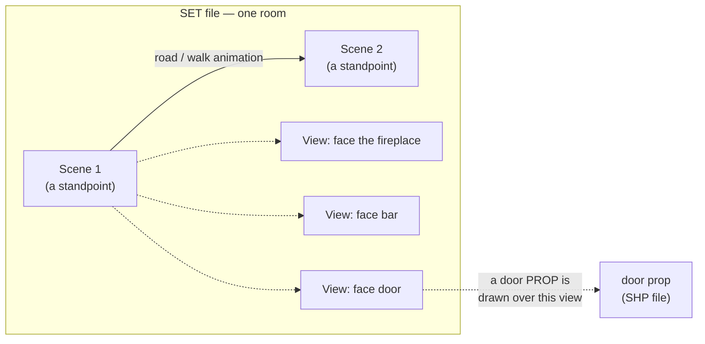
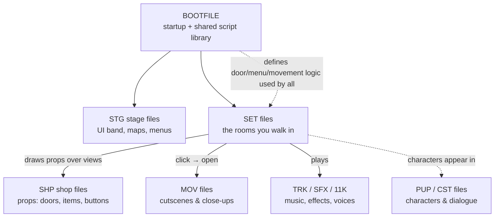

# How a DreamFactory game works

*Prerequisite: none. Start here.*

## What kind of game is this?

A DreamFactory game is a first-person adventure. You explore a place, look at
things, pick up objects, and talk to people to solve a mystery — a liner two days
from an iceberg in *Titanic: Adventure Out of Time* (1996), a mining town in *Dust:
A Tale of the Wired West* (1995). The important thing to understand — because it
shapes *everything* about the file formats — is **how** the engine draws that
world.

It is **not** a real-time 3D world. In the mid-nineties no home computer could
render scenery this detailed in real time. Instead, CyberFlix pre-rendered
thousands of still images on powerful machines ahead of time, and the game
simply **shows you the right pre-rendered picture** for wherever you're
standing and whichever way you're facing.

Think of it like a museum audio tour where you can only stand on marked
spots on the floor, and at each spot you can slowly spin in place. Every
direction you could look has already been photographed. Walking from one
spot to the next plays a short pre-recorded "walking" clip. This is what
people mean when they call it a game **"on rails"** — you move along fixed
paths between fixed viewpoints.

Anything that *moves* — a character walking past, a door swinging open, an
item you pick up — is **drawn on top** of the still background. Those moving
pieces are separate, smaller images. So the whole game is really:

> a slideshow of pre-rendered backgrounds, with little animated cut-outs
> composited on top, glued together by scripts that decide what happens
> when you click.

## The four words you need: Set, Scene, View, Prop

Almost every format maps onto these four ideas.

| Term | Everyday meaning | Example |
|------|------------------|---------|
| **Set** | A room, or a section of one place. One file. | Titanic's First-Class Lounge or cabin B59; Dust's saloon or apothecary |
| **Scene** | A *standpoint* inside a set — a spot you can stand on. | The middle of the lounge; just inside the saloon door |
| **View** | One *direction you can face* from a scene. | Facing the fireplace; facing the bar |
| **Prop** | A movable image drawn on top. | A door, a teacup you pick up, a button |

So a **Set** contains several **Scenes**; each **Scene** contains several
**Views** (plus the in-between frames for smoothly turning around); and
**Props** get drawn over whichever view you're currently looking at.

Between scenes there are **roads** (the game calls them *transitions*): the
short walking animations that carry you from one standpoint to the next,
sometimes along a curve or diagonally, not just on a grid.

There is one more subtle piece. Because the world was rendered in 3D
originally, each background also ships with a hidden **depth map** (a "Z
layer") — a second image that records how far away every pixel is. That's
how the engine knows a character should be hidden behind a chair that's
closer to the camera. More on that in the [image codec doc](../engine/formats/image-codec.md).

## What happens when you launch the game — the main flow

Here's the journey from launch to walking around, in order. Each step points
to the doc that covers it in depth.

### 1. Boot

The engine loads the **BOOTFILE** first. This is not a room — it's a bundle
of **scripts** that act as the game's startup routine *and* its shared
"standard library" of behaviour (how doors work, how the menu works, how you
move). The boot script decides what to load first and hands control to the
first real screen. See **[BOOTFILE](../engine/formats/bootfile.md)**.

### 2. The UI and the first set

The boot brings up the on-screen furniture — the bottom **UI band** with the
menu button, your held item, the watch — which lives in **STG** (stage) files
and **SHP** (prop) files, and then opens the first **SET**. See
**[STG](../engine/formats/stg.md)** and **[SHP](../engine/formats/shp.md)**.

### 3. You see a View

The engine picks the current scene + view, decodes that background image, and
draws it. The picture fills the top **512×264** area of a **512×384** screen;
the strip below is the UI band. See **[SET](../engine/formats/set.md)** and the
**[image codec](../engine/formats/image-codec.md)**.

### 4. You look around and walk

- Press **←/→**: the engine plays the scene's *turn ring* — the sequence of
  in-between frames that animate you rotating in place — and lands on the
  next view.
- Press **↑**: if there's a road leading out of this scene in the direction
  you're facing, the engine plays the walking animation and arrives at the
  next scene.

Crucially, **the keyboard doesn't move you directly**. A key press is an
*event* that first runs through the scripts (a scene can decide "you can't
walk here yet" or "walking through this door actually takes you to another
set"). Only if no script intercepts it does the default movement happen —
BOOTFILE's own `keydown` is the last link in that chain, and *it* is what calls
`currentscene("strait"/"left"/"right")`. See
**[Scripting](../engine/scripting-language.md)**.

That applies to **turning**, not just walking. One set relies on it: the 2nd
class staircase (`STAIR2C`) is the only SET in the game whose `keydown` takes
←/→. Its two landing scenes carry eight views — the four standpoints
interleaved with four in-between corners — so it turns *twice* per press and
consumes the key, which is what keeps you off the corners. Turn the camera
straight from the key handler and you stop on views the game never lets you
stand on, where the nav arrow is red and ↑ does nothing — and the first
non-red arrow you meet turning away from the landing's corridor is the flight
*up*, not the door out (the example is Titanic's Grand Staircase, where this was
first got wrong).

### 5. You interact

Move the mouse over the picture and the engine checks whether you're over a
**hotspot** — a rectangle attached to the current view. If so it asks the
relevant script what cursor to show. Click, and a `mousedown` event fires
through the scripts: maybe a door prop appears and a sound plays, maybe a
close-up **movie** opens, maybe an item goes into your inventory. See
**[MOV](../engine/formats/mov.md)** for close-ups and cutscenes.

### 6. You travel between sets

Walking through a door often means *leaving one SET file and loading
another*. The boot library's `changeset`/`gotospecial` routines close the
current set, load the next one, and drop you at the correct arrival scene and
facing — usually with a short fade to cover the load. Your game state (what's
in your pockets, what you've done) lives in the interpreter and survives the
switch. See **[Scripting](../engine/scripting-language.md)** and
**[Engine architecture](../engine/architecture.md)**.

### 7. Time passes

Some things happen on a timer rather than in response to you: a faucet runs
and shuts itself off, someone knocks on a door, ambient steam hisses every
few seconds. The engine has a heartbeat (20 times a second, one step every
50 ms) that services these timed events. This is the "timing model"; its
recovered behaviour is written up in **[Timing](../engine/runtime/timing.md)**.

## How everything fits together

Every one of those boxes is a **DFile container file** with the same basic
skeleton. That skeleton is the next thing to understand:
**[the DFile container format](../engine/formats/README.md)**.
