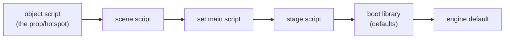

# The scripting language

*Prerequisite: [How the game works](how-a-game-works.md) and
[Engine architecture](architecture.md).*

DreamFactory games are mostly **scripted**. The engine (`TI.EXE`) is a fixed
program that knows how to draw views, play sounds, and move props — but *what*
happens, *when*, is decided by little scripts stored inside the game files.
Getting the scripts to run is what turns a decoded pile of images into a game.

This doc explains the language, the event model, and the interpreter. The
*binary* layout of a compiled script on disk is a separate topic —
see **[the script container doc](formats/script-container.md)**.

## What the language looks like

The scripts read like a small C-ish language. Here's the shape (illustrative):

```
main
{
  code openset
  {
    if propvisible ("door") = "no"
    {
      voicesound ("welcome")
    }
    passcode
  }

  code mousedown
  {
    sendtoprop ("door", setupprop ("b59-hallb"))
    exitcode
  }
}
```

Things to notice:

- An object's script is a bag of named **`code` handlers**. Each handler is
  fired by a specific engine **event** — `openset`, `mousedown`, `setcursor`,
  `idle`, and so on. You don't call handlers by looping; the engine calls them
  when something happens.
- **`exitcode`** means "I handled this event, stop here." **`passcode`** means
  "not mine, pass it along." (More on that below — it's the heart of the
  event model.)
- Function-like things — `propvisible`, `voicesound`, `sendtoprop` — are
  **commands** (the language calls them all the same way whether they're
  built into the engine or defined by another script).

### Values, operators and quirks

There are numbers and strings, and the operators have a couple of surprises
that took reverse engineering to pin down:

| Operator | Meaning | Note |
|----------|---------|------|
| `+ - * /` | arithmetic | |
| `@` | **string concatenation** | not `+` |
| `&` `\|` | logical and / or | **short-circuit** |
| `=` | equality | **case-insensitive for strings** |

Two gotchas that the interpreter has to honour exactly, or real scripts
misbehave:

- **Mixed-type `=` compares as text.** An uninitialised global variable is
  `0`, and scripts rely on `"uparrow" = 0` being *false*. So comparisons
  coerce to text.
- **`dumpglobal` looks like a declaration and is a demolition.** `global x, y`
  brings variables into scope; `dumpglobal x, y` *destroys* them. All 64 uses in
  the corpus are in a teardown — `closeset`, `closestage`, `closeenigma`,
  `endfight`, or a `dump…globals()` helper called from one — and
  `TURBINE.STG`'s exists for nothing else: `dumpturbineglobals` is four
  `dumpglobal` lines and no other statement, against `initvalue`'s plain
  `global` + assignment on the way in. `BRIDGE.STG`'s `monkey()` proves it from
  the author's side, because it works around it: `arg = drifthappen`, then
  `dumpglobal drifthappen`, then every test against `arg` — a copy that is
  pointless unless the next line destroys the original. The shipped saves agree
  from the far side: `coal`, `valve1..3`, `pump1`, `pump2` and `savenorth` are
  dumped on a stage close and have a record in **none** of the 109 (#85).
- The original compiler emitted some **oddities** the parser must tolerate:
  `//` comment lines that tokenize as two division operators, unterminated
  blocks, dead statements before the first `case`, and the occasional
  misspelled bare identifier (`reutrn`). The parser handles 100% of the
  shipped corpus — about 2,050 script containers across every file type
  (SET, STG, SHP, MOV, PUP, CST and the BOOTFILE).

  **A handler's boundary outranks every block inside it.** `endcode`, and the
  `code` that starts the next handler, close whatever is still open — because
  "unterminated blocks" is not only a handler ending in a bare `exitcode`
  (TURBINE's `boilsound`), it is also a `switch` that never gets its
  `endswitch`. SMETH1.PUP's `stewardwell` nests a second plaque inside `case
  101` and closes only the inner one, and a parser still hunting for `case` or
  `endswitch` reads clean through `endcode` and eats the handlers that follow —
  four of them there, one of which is why Smethells never turned you away from
  the first class lounge ([#177](https://github.com/dhobi/dreamrefactory/issues/177)).
  Measured across all six editions: every handler declared in every script
  container is now parsed, the only exception being `gang.cst`'s container 1267,
  which really does declare `endwalk` twice.

## The event model: objects, handlers, and the chain

Every **object** in the game owns a script: the set, each scene, each prop,
each puppet, the stage, the boot. The engine turns things that happen into
**events**, and delivers each event to the relevant object's matching `code`
handler.

Common events:

| Event | Fires when |
|-------|-----------|
| `openset` / `closeset` | a set is entered / left |
| `openscene` / `closescene` | you arrive at / leave a scene |
| `mousedown` | you click on a hotspot |
| `setcursor` | the mouse hovers a hotspot (the handler picks the cursor) |
| `keydown` | a key is pressed (arg is a name like `"uparrow"`) |
| `idle` | the per-frame heartbeat |

### The chain, and how an event is "consumed"

An event is **not** delivered to just one handler. It flows down a **chain**
of objects, and each link either consumes it or forwards it:



The rule: run the current link's handler. If it ends with **`exitcode`**, the
event is consumed and the chain stops. If it ends normally *or* with
**`passcode`** — or the object has no handler for that event at all — the
event **forwards to the next link**.

**"Consumed" means a handler of *this* event exitcoded**, and the qualifier is the
whole of it. A handler routinely calls routines and fires other events, and those
end in `exitcode` for their own reasons, so a flag set from any depth answers a
question nobody asked — "did anything, anywhere under here, stop?" rather than "was
the player's event consumed?". The interpreter therefore tests the `exitcode`'s own
frame **by handler name** against the event under dispatch. Two shipped scripts pay
the bill when it doesn't:

- `STAIR2C.SET`'s deck rung calls `setupshayhack()` and `setupcsea()` — both of
  which end in `exitcode` — and then `passcode`s, precisely so the engine's default
  move can walk you up out of the standpoint it just placed you on. Read as
  consumed, the walk never runs, and the 2nd-class staircase cannot be climbed
  past C deck.
- `recept1c`'s `openset` does `sendtoactor("elev", setupactor())` and then
  `passcode`s; `setupactor` exitcodes, so the `openset` looked consumed and the
  boot's own `openset` (`setupsound`) was skipped — the room came up silent on the
  wrong theme.

The one case that must still consume looks the same from a distance: `boot1`'s
`keydown` routes the event on with `sendtoscene(currentscene(), keydown(arg))`, and
a set `keydown` that exitcodes *there* is overriding the default move on purpose.
Same name, same event, consumed — while a helper routine and a foreign event are
neither.

**Which event a frame belongs to is carried by the frame**, not by the
interpreter, because this port runs more than one chain at a time and the original
never does. TI.EXE's main loop pops one event and runs it to completion; here the
heartbeat overlaps a player's press deliberately — `serviceGameClock` dispatches
`calctime` so that it does *not* count as a busy script, or a press posted while it
settled would sit in the queue — so a press drained on the same tick begins while
`calctime` is still suspended at an `await`. Answering "which event?" from one
interpreter-wide field set at nesting depth zero therefore gave the press
`calctime`'s name, every `exitcode` in its chain compared against the wrong event
and quietly declined to consume, and the chain ran on into the boot library's
default move. That is how a held key walked through the smokestack crates
([#232](https://github.com/dhobi/dreamrefactory/issues/232)): `SMSTACK2`'s set main is
nothing but `if blocked & arg = "uparrow" exitcode`, and the flag was right every
time — it was the *consumption* that was lost. Each frame now carries the name its
own chain was dispatched under, inherited across routine calls and `sendto*`
re-routes alike, so two chains in flight cannot answer for one another.

**A `passcode` off the *end* of a chain keeps climbing.** `passcode` means "not
mine, ask whoever holds me", and that is as true of the last link as of any other:
when a chain runs out on one, the event carries on up the **containment** chain —
the file that holds the thing — exactly as an event nobody had a handler for
already did. For a prop the chain is a single link, so this used to be a dead end
and the shop main behind it was unreachable. `inven.shp`'s notebook (container
0088) is the measured case: its own `setcursor` claims the one place the notebook
is scenery rather than luggage and `passcode`s everywhere else, onto the shop
main's distance-gated answer —

```
if propview (target) = "small"
    if realdist (target) < hotdist ()   cursor ("touch")   exitcode
    endif
    passcode
endif
cursor ("touch")
```

— which is where the hand cursor over a takeable thing comes from in the whole
game, and it could not be reached. Two rules come with it: a link the chain
**already ran must not run twice** (a scene's chain is scene → set main → stage,
and the stage is also the last thing containment tries, so a passcoding stage
handler was the one that got run again), and a `passcode` *inside* the containment
walk keeps climbing too, for the same reason it does along the chain.

This one mechanism explains a lot of the game's behaviour:

- **Default movement lives at the bottom.** Pressing ↑ fires `keydown` down
  the whole chain. Normally nothing consumes it and it reaches the boot
  library's default handler, which walks you forward. But a scene script can
  add its own `keydown` that consumes the event (`exitcode`) and instead send
  you through a door to another set. Same key, different outcome, decided by a
  script — no engine change needed.
- **Doors closing on exit.** The boot's default `closescene` handler sends
  the door prop back to its closed state, so props can't leak into the next
  scene.

### Talking to other objects: `sendto*`

A handler often needs to make *another* object do something. That's the
`sendto*` family: `sendtoprop`, `sendtoscene`, `sendtoset`, `sendtostage`,
`sendtoboot`. They look like function calls but they are **special forms**:

```
sendtoprop ("door", setupprop ("b59-hallb"))
```

means *"run `setupprop("b59-hallb")` inside the **door** prop's script."* The
second argument is a **deferred call** — it is not evaluated where it's
written; it's shipped to the target and run there, with the target as `me`.
The arguments *inside* it, though, are evaluated in the caller's frame first.

If the target has no such handler, the call falls back to the **boot library**
with `me` set to the target's name — that's how generic routines like
`initprop()` work for any prop.

**`target` is the addressee, not the caller** — for the four that address a
*thing*: `sendtoprop`, `sendtoactor`, `sendtoscene`, `sendtoflat` and their `fx`
twins. `me` says who is running, `target` says who was addressed, and a great many
shipped handlers are written as `switch target` or read it directly:
`propview(target)`, `realdist(target)`, and BOOTFILE's own `trackbut`, whose body
is `pointinbutton(currentflat(), target, mouse())` and which every OK button in
the game borrows. It is *not* "always the addressee", and the suite drew that line
in one run: `sendtoshopfx("house.shp", watchidle())` addresses a **file**, where
there is no thing being addressed and the caller's context is what the handler
reads. So the addressee for a thing, the caller for a shop, a cast, a stage, a
puppet, the boot.

**And the command says what KIND of thing** — which matters because a name can be
claimed twice. Two shops in the corpus name a prop after a character, and both are
a mini-game's opponent drawn as a screen-space sprite over the room he is standing
in: `fight.shp`'s `vlad` and `fence.shp`'s `willie`. `sendtoactor("vlad", …)` has
to reach the *cast member* even while the fistfight overlay is up, which is exactly
where the fistfight ends — `endfight` puts Vlad down on the catwalk with
`sendtoactor("vlad", setupactor("lostfight"))` and the prop has no such handler, so
resolving the prop first dropped the line and left him standing (#84).

## The boot library = the standard library

The **BOOTFILE**'s scripts are special: they define ~76 handlers that any
script can call by name — `changeset`, `spotmovie`, `progress`,
`setupactor`, and so on — plus `gotospecial` (defined in `MAIN.STG`). These
are the game's **standard library**.

That's why unqualified calls resolve in this order:

```
local script  →  engine builtins  →  stage script  →  boot library
```

So when a set script says `changeset(...)`, and no builtin or local handler
matches, it lands in the boot library, which ultimately calls the engine
primitives `opensetfile` / `closesetfile`. See
**[BOOTFILE](formats/bootfile.md)**.

## The interpreter

The runtime is three files:

1. **[`parser.ts`](https://github.com/dhobi/dreamrefactory/blob/master/engine/src/runtime/parser.ts)** — turns a decoded script's token
   stream into an abstract syntax tree (AST). It tolerates the compiler
   quirks listed above.
2. **[`interp.ts`](https://github.com/dhobi/dreamrefactory/blob/master/engine/src/runtime/interp.ts)** — the interpreter core: variable
   scopes (global + local), the operators, control flow (`if`, `switch`/
   `case`, loops), handler dispatch with `me`/`target` context, the
   `exitcode`/`passcode`/`return` signals, and a **builtin registry** where
   each engine command's real behaviour is filled in as it's recovered.
3. **[`setscripts.ts`](https://github.com/dhobi/dreamrefactory/blob/master/engine/src/runtime/setscripts.ts)** — binds a specific SET's
   scripts (main, per-scene, per-view-object) to interpreter instances and
   implements the event chain described above.

**Builtins** are the bridge from the language to the engine. `voicesound`,
`propxy`, `opensetfile`, `makeloop` — each is a TypeScript function registered
in the interpreter that does the real work (plays audio, moves a prop, swaps a
set). Reverse engineering the game is, in large part, discovering **what each
builtin is supposed to do** — the script *encoding* and the full command-name
table were already known from DFET and `TI.EXE`, but the per-command
*semantics* are documented nowhere and are recovered one command at a time
from the disassembly.

One more detail worth knowing: a builtin can be a **getter or a setter
depending on how many arguments it gets**. `propview(me)` reads a prop's
current view; `propview(me, "x")` sets it. Same name, arity decides.

### Where to look next

- How these scripts add up to the whole **plot** — the `mission`/`phase` model
  and the reconstructed story spine: **[the mission flow](../taoot/mission-flow.md)**.
- The **on-disk format** of a compiled script (the command table, the string
  pool at the end of the container): **[script container](formats/script-container.md)**.
- How the language actually starts the game: **[BOOTFILE](formats/bootfile.md)**.
- Every builtin the engine registers, family by family — including the
  deliberate no-ops: **[the builtin reference](../reference/builtins.md)**.
- The command-name → ID table lives inside `TI.EXE`; the tool that extracts it
  is [`taoot/tools/exetable.ts`](https://github.com/dhobi/dreamrefactory/blob/master/taoot/tools/exetable.ts), and the full opcode table is
  in [`engine/src/df/opcodes.ts`](https://github.com/dhobi/dreamrefactory/blob/master/engine/src/df/opcodes.ts).
