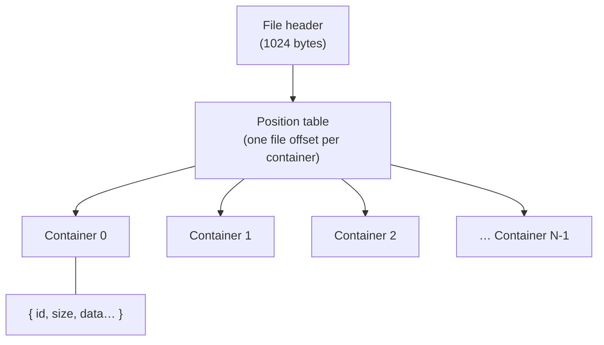

# The DFile container format

*Prerequisite: [How the game works](../01-how-the-game-works.md). **Read this
before any specific format doc** — they all build on it.*

Every DreamFactory data file — a room (`.SET`), a movie (`.MOV`), a set of
props (`.SHP`), an audio archive (`.TRK`), the `BOOTFILE`, all of them — uses
the **same outer skeleton**. Learn it once and every format becomes "the same
box with different things inside."

## The mental model: a box of numbered drawers

A DFile is like a filing cabinet:

- The **file header** is a label on the front telling you how many drawers
  there are.
- A **position table** is an index card listing where each drawer starts.
- Each **container** is a numbered drawer holding a blob of data.

The engine never reads a file straight through top to bottom. It reads the
header, reads the index, and then jumps straight to whichever drawer it wants.
"Container" is just DreamFactory's word for "drawer." Different formats put
different things in the drawers — one drawer might hold a palette, another a
compressed image, another a script — but the cabinet is always built the same
way.

Reference implementation: [`src/df/container.ts`](https://github.com/dhobi/taoot-web/blob/master/src/df/container.ts),
ported from DFET's `readFileIntoMemory` in
[`DFfile.cpp`](https://github.com/M3tox/DFET/blob/main/libs/DFfile/DFfile.cpp).

## Two things to know about the bytes first

You can skim these, but they explain choices you'll see everywhere.

### Endianness — which end of a number comes first

A number bigger than one byte can be stored "little end first" or "big end
first." DreamFactory does something unusual:

- **Whole numbers (integers) are little-endian** — the normal PC order.
- **Decimals (floats and doubles) are big-endian** — the *reverse*.

That split is a fingerprint of the engine's **Macintosh heritage** (the
development tools were Apple-flavoured). The byte reader
([`binary.ts`](https://github.com/dhobi/taoot-web/blob/master/src/df/binary.ts)) has a method per type so you never
have to think about it again: `i32()` reads a little-endian integer, `f64be()`
reads a big-endian double.

> **If you ever decode a coordinate and get an absurd number like
> 1.2×10³⁰⁷**, you almost certainly read a big-endian double as little-endian.
> This is the single most common decoding mistake.

### Pascal strings — length first, no terminator

Text is stored **Pascal-style**: a single **length byte** followed by exactly
that many characters. There is no zero terminator like C uses. Often the
string sits in a **fixed-size field** (say 32 bytes reserved) with junk after
the real characters — you read the length byte, take that many characters,
and skip to the end of the reserved field. The reader's `pstr(fieldSize)`
handles both cases.

## The file header (first 1024 bytes)

The header is a fixed **1024 bytes**. Only a handful of fields are used:

| Offset | Type | Field | Meaning |
|-------:|------|-------|---------|
| 0 | i32 | `fourCC` | a format/magic tag |
| 4 | i32 | `fileSize` | total file size |
| 8 | — | *(unused)* | 12 bytes skipped |
| 20 | i32 | `containerCount` | how many containers (drawers) |
| 24 | i32 | `type` | 0 = normal; 1 / 2 = variants with "gap" drawers |
| 28 | i32 | `gapWhere` | which index is the gap (for type 1/2) |

Everything up to byte 1024 is header/padding; the real index starts there.

## The position table (starts at byte 1024)

Immediately after the header is the **position table**: `containerCount`
32-bit offsets, one per container, each pointing at where that container
begins in the file.

Some entries are **gaps** — placeholder drawers with nothing in them. How a
gap is detected depends on the file's `type`:

- **type 0** (normal): an entry is a gap if its offset points inside the
  header (≤ 1024) — i.e. it doesn't point at real data.
- **type 1 / type 2**: the gap is at the specific index named by `gapWhere`
  (type 2 marks two adjacent indices). This lets a file reserve a drawer
  number without storing anything for it.

The reader represents a gap as an empty container so that **container indices
stay stable** — container #7 is always #7, whether or not #5 was a gap. That
matters because scripts and tables refer to containers **by index**.

## A single container

Follow a (non-gap) offset and you find one container laid out as:

| Offset | Type | Field | Meaning |
|-------:|------|-------|---------|
| +0 | i32 | `id` | the container's ID |
| +4 | u32 | `size` | length of the payload in bytes |
| +8 | … | `data` | `size` bytes of payload |

That payload is where formats diverge. Which drawer holds what is
**convention per format**, and those conventions are what the rest of the
format docs describe. A few conventions are near-universal, though:

- **Container 0 usually holds the colour palette** (for files that have
  images) — see the [image codec](image-codec.md).
- **Container 1 is often the "main" script** of the file.
- **One image = one container.** Frames are never split across drawers.
- **Audio is the exception:** a single sound is *split across many*
  containers, each usually under 64 KB, that must be concatenated — see
  [Audio](audio.md).

## How the format docs use this

From here on, each format doc assumes you know all of the above and focuses on
**what its containers mean**: which index holds the palette, which holds the
scene table, what the records inside look like. When a doc gives an offset
table like the one above, remember it's describing the bytes *inside one
container's `data`*, not the whole file.

Start with the thing most formats share — **[the image codec](image-codec.md)**
— then move on to [SET](set.md), [SHP](shp.md), [MOV](mov.md), and the rest.
