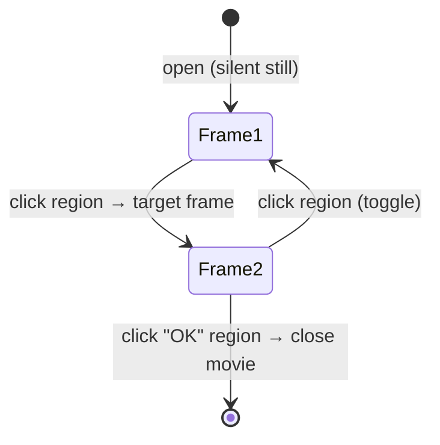

# MOV — movies & inspectable objects

*Prerequisite: [The DFile container format](README.md),
[The image codec](image-codec.md), and
[The scripting language](../03-scripting-language.md).*

**MOV** is the "does everything visual that isn't a room" format. The same
file type covers:

- a **single still image** of an object you can inspect,
- a **set of images you click through** (a close-up you rotate or flip),
- a full **animation**, and
- a complete **cutscene with audio**.

DFET already decodes the frames and audio; on top of that, the *interactive*
behaviour — what a click actually does — was pieced together from `TI.EXE`'s
movie loop. It's one of the more involved parts of the port, and the rules
below came slowly and with some wrong turns along the way.

Reference implementation: [`src/df/mov.ts`](https://github.com/dhobi/taoot-web/blob/master/src/df/mov.ts) (decoding).

## The big idea: a movie is a state machine of frames

Do not think of a MOV as a linear video. Think of it as a **flip-book where
each page can have buttons on it**. The player sits on a frame; the frame may
just play and advance, or it may **wait for you to click**. Where a click
takes you is defined per-region, per-frame. That's a **state machine**, and
it's why one format can be both a passive cutscene and an interactive
close-up.

- A **cutscene** is the degenerate case: frames with no click regions, so they
  just play through, with the file's looping audio as a soundtrack.
- An **interactive object** (the Turkish-bath mirror, a curtain you open and
  close, a lamp you toggle) is frames *with* regions that wait for clicks.

## What's in the file

| Where | Contents |
|-------|----------|
| Container 0 | 256-colour palette (as usual) |
| Frame table @ `0x870` | one **42-byte record per frame** (position, dirty rectangle, a keyframe flag) |
| Frame image containers | the pictures, in the **SET delta codec** — see [image codec](image-codec.md) |
| Loop-chunk table (container 1) | the **looping soundtrack** audio, for cutscenes |
| Non-looping chunk block (ref'd at header `+0x60`) | **named** one-shot audio chunks (42-byte records, 31-char names) — the movie's own sound library |

Because frames use the delta codec, a "patch" frame that only changes a small
area still decodes to a **full 512×384 image**; the frame table's width/height
is just the **dirty rectangle** (what changed), so there's no separate
compositing step.

## Per-frame logic: sounds and click regions

The interactive behaviour lives in a **logic container per frame**. Two things
hang off it:

### 1. A sound that fires when you enter the frame

At offset **`+0x12`** the frame's logic container holds a Pascal **sound name**
that plays the moment playback *enters* that frame. In `FAUCET.MOV`, for
example, frame 2 fires the "faucet on" sound, a later frame the running-water
loop, and frame 29 the "faucet off" sound — the water cycle turns *itself*
off. (The faucet is a "runs once" toy, not a toggle you can stop mid-run.)

### 2. A table of clickable regions

At offset **`0x870 + 1090`** *(the constant `0x442` = 1090 is how the routine
was found in the disassembly)* each frame's click-region container has a region
table: a count, then **64-byte records**. Per region:

| Offset | Type | Field |
|-------:|------|-------|
| +0 | i16 | type (see below) |
| +8 | — | coordinates, **Y-first** |
| +16 | pstr | sound to play on click (movie's named chunks, then banks) |
| +32 | pstr | event — a movie to chain to |
| +48 | pstr | target frame to jump to |

The frame *itself* also carries a type at `+0`, a chained-event movie name at
`+0x22`, and a target-frame name at `+0x32` — so a **regionless** frame can
take an automatic action, while a frame **with** regions waits for a click.

### The type codes (same set for frames and regions)

| Type | Action |
|-----:|--------|
| 1 | exit (close the movie) |
| 2 | goto the target frame |
| 3 | exit **and** chain to the event movie |
| 4 | push (movie, target) on a 5-deep return stack, then chain to the event movie |
| 5 | pop / resume from that stack |
| 6 | advance one frame |
| 7 | step back one frame |

## The behaviour rules that took a while to pin down

These are the non-obvious rules, verified against `MENU.MOV`, `TURKNMES.MOV`,
`CURTAINS.MOV`, `BEDLAMP.MOV` and `FAUCET.MOV`:

- **Interactive movies open as a silent still** and pause on region frames
  (starting with the first). Clicks **outside** any region do nothing.
- **A click plays the region's sound, then jumps** per its type. A target that
  is itself a region frame → a hard cut (the menu zoom toggle). A forward
  target, or no target with nothing left to pause on → the movie **closes
  immediately** (that's how "OK" buttons work; the trailing "exit animation"
  frames in the file are simply never played). A backward/near target →
  animate along to the next region frame (the endless curtain open/close
  toggle).
- **Interactive movies never auto-play their audio chunks as a soundtrack** —
  those chunks are the *event* sounds. Only regionless cutscenes use them as
  music.
- Two fields that *look* meaningful are **authoring leftovers the engine never
  reads**: the frame table's "kind"/condition and the record's i16 at `+6`.
  Two earlier heuristic models were built on them and both were wrong — a good
  reminder that "there's a field here" doesn't mean "the engine uses it."

## Timing

Interactive movies pace at **~145 ms per frame** (measured: the "Brook
Babbling" water loop runs 3.62 s across exactly its 25 water frames).

## In the engine

The `playmovie` builtin fetches the MOV on demand and hands it to the session's
movie mode; the boot library's `spotmovie` helper wraps it
(premovie/playmovie/postmovie). While a movie plays, input is blocked except
for the clicks the movie itself defines.

Next: full-screen UI screens and the deck map — **[STG](stg.md)**.
