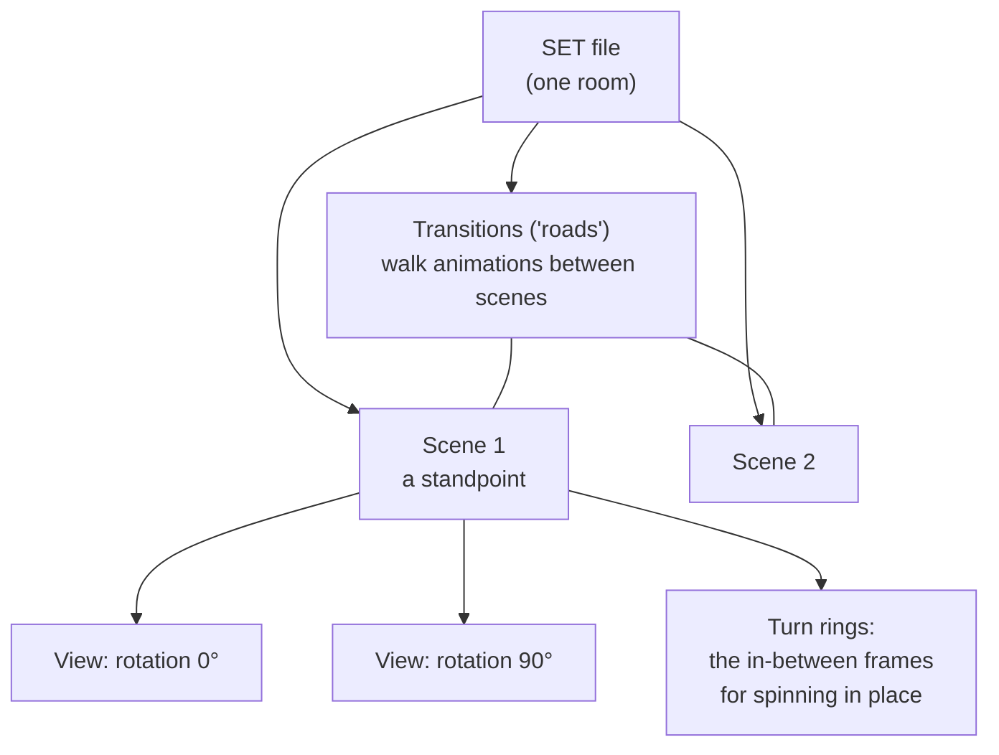

# SET — rooms, scenes & views

*Prerequisite: [The DFile container format](README.md) and
[The image codec](image-codec.md).*

A **SET** file is one room or section of the ship — the Lounge, cabin B59, the
Grand Staircase. It's the format you spend the most time inside, and it ties
together everything from the concept doc: **a set has scenes, a scene has
views, and roads connect the scenes.**

Reference implementation: [`src/df/set.ts`](https://github.com/dhobi/taoot-web/blob/master/src/df/set.ts), ported from
DFET's [`DFset`](https://github.com/M3tox/DFET/tree/main/libs/DFfile/DFset).

> The name is not "ship." SHP files are the props; **SET** files are the
> rooms. Blame CyberFlix's fondness for movie-industry words: a *set* is where
> you shoot a scene.

## The hierarchy



- A **Scene** is a *standpoint* — a fixed spot with a map position
  (`xAxisMap`, `zAxisMap`, `yAxisMap`).
- A **View** is a direction you can face from that standpoint: a single
  pre-rendered background plus the hotspots and objects you can interact with
  while facing that way.
- A **turn ring** is the sequence of frames that animate you rotating from one
  view to the next, so turning looks smooth instead of snapping.
- A **transition** (the game's word; we call them *roads*) is the walking
  animation that carries you from one scene to another. Roads can be diagonal
  or curved, with waypoints — the world isn't locked to a grid.

## What's in the file

The SET's top-level fields (decoded into `SetFile`) include the set name, the
default scene/view to start on, the **viewport size** (the pre-rendered
picture is **512×264**, sitting in the top of the 512×384 screen), map
overview parameters, the main-script container index, and the palette.

Then the meat:

- **`scenes`** — the standpoints, each with its views and its two turn rings.
- **`transitions`** — the roads between scenes.
- **`actors`** — placement markers for characters (the characters themselves
  come from [PUP/CST](pup-cst.md)).

### A frame's metadata (`FrameInfo`)

Every rendered frame — a standpoint view, a turning frame, a walking frame —
carries camera metadata: its 3D position, its horizontal rotation (`axisX`,
in radians), which container holds the actual image, and a **`motionInfo`**
tag:

| `motionInfo` | Meaning |
|-------------:|---------|
| 0 | an in-motion frame (mid-turn or mid-walk) |
| 1 | a standpoint, low-resolution |
| 2 | a standpoint, high-resolution |

### A gotcha worth memorising: two kinds of view ID

There are **two different numbering schemes** for views, and mixing them up
misplaces the player:

- A turn ring's `viewID` is a **scene-local** index — "the 3rd view *of this
  scene*."
- A road's `viewIDstart` / `viewIDend` are **global** view IDs — numbered
  across the whole set.

This distinction is easy to miss and caused real, user-visible bugs until it
was pinned down.

## Hotspots: where you can click

Each view carries **objects** (`ObjectEntry`) — the clickable regions. Each
has a rectangle and a script location. The rectangle is stored **Y-first**:
`(top, left, bottom, right)`, *not* the `(x, y, …)` you'd expect. DFET's
struct labels these X-first — which never mattered for DFET, since it only
*extracts* data and never draws a hotspot, but it does matter once you use the
coordinates to hit-test clicks (they showed up here as a consistent
bottom-left offset until the axes were swapped back).

When you hover, the engine finds the hotspot under the cursor and asks its
script (via `setcursor`) what cursor to show; when you click, it fires
`mousedown`. Both travel the event chain from
[the scripting doc](../03-scripting-language.md).

## Roads: getting from scene to scene, facing the right way

Walking a road plays its animation frames and drops you at the destination
scene. Two subtleties, both learned from bugs:

- A road register's `destination` is the **container index of the arrival
  scene's view table** — not a view ID directly.
- The road's endpoint view faces *back along the road* (you'd be looking at
  where you came from). So the **arrival facing** is chosen by matching the
  **last walked frame's camera angle** against the destination scene's view
  rotations, and snapping to the closest one. The engine carries the last
  rotation across the transition to make this continuous.

Set-to-set travel (walking through a door into a *different* SET file) is a
level above this and is handled by the boot library's `changeset` /
`gotospecial`; see [BOOTFILE](bootfile.md) and
[the scripting doc](../03-scripting-language.md).

## Stars, and the routes between them

The actor register's records are a fixed **54 bytes**, and one record can hold
**two** stars: the primary `{rotation8, X, Z, Y, id}` at `+4` and an optional
nested secondary at `+30`. The tail that looks like leftover heap is not — HALLA's
`sasha.1` record carries `sasha.2` there, and `ex1` carries `ex2`.

A paired record may also carry the **walking route** between its two stars, as an
i16 container ref at `+28` (the gap between the primary's identifier field and the
secondary's `rotation8`; TI.EXE reads a dword there, which agrees only because
every secondary `rotation8` in the corpus is 0). That container is a polyline:

| Offset | Type | Field |
|-------:|------|-------|
| +0 | i32 | total route length, in world units |
| +8 | i32 | point **count** |
| +12 | 4×i16 | bounding box, `Zmin, Xmin, Zmax, Xmax` |
| +20 | — | `count` × 8-byte points: `{i16 X, i16 Z, i16 Y, i16 distance-from-previous}` |

The first point is the primary star and the last is the secondary, so everything
between them is the authored detour. `walkonpath` is what walks it, in either
direction — and where no route is authored, the straight line *is* the route. The
whole corpus holds **six**, and only three bend:

| Set | Route | Points | Route vs. straight line |
|-----|-------|-------:|------------------------|
| `deckbd` | `ga.1` → `ga.2` | 10 | 2508 vs 2257 units, up to 396 off the diagonal |
| `scot3` | `hack1` → `hack2` | 9 | 8661 vs 6804, up to 2013 off |
| `halla` | `sasha.1` → `sasha.2` | 5 | 2432 vs 1973, up to 581 off |
| `b70`, `decka`, `halla` | `ga`, `max`, `ex1`→`ex2` | 2 | straight |

Those three are the difference between walking the deck and walking through it —
the per-point distances and the total are what let the walk service run the whole
polyline on one progress scalar
([characters at runtime](../runtime/characters.md)).

Those distances are not a re-measure of the geometry, and cannot be: each is
`TI.EXE`'s **truncating integer sqrt** (`0x435950`), which is a different function
from rounding the real length down. HALLA's third leg spans 101 × 259, whose true
length is 278.0004, and the file stores **277** — because 278² = 77284 overshoots
77282. Every leg of all six routes matches that, and every header total is the
exact sum of its own legs, so the writer uses the same arithmetic and a route
round-trips byte for byte.

## The camera, and placing things in 3D

Even though you only ever see pre-rendered stills, each view stores a real
**camera** — position, rotation, and height — because the engine needs it to
place *movable* props (an item on a bed, a character) correctly into the
picture. The camera height is the per-view double that early analysis
mislabeled "unknown"; it turned out to be the eye height (in the set's world
units) that the world→screen projection needs.

The projection itself — the formula that turns a prop's 3D world coordinate
into a screen pixel and a scale — was recovered from `TI.EXE`. The gist:

```
dx, dy, dz = prop position − camera position
depth   = (dy·sin + dx·cos) >> 14      (fixed-point trig, angle in 1/256 turns)
lateral = (dy·cos − dx·sin) >> 14
screen x = centreX + lateral · f / depth
screen y = centreY − dz     · f / depth
```

where `f` is half the viewport's larger dimension. If `depth ≤ 0` the prop is
behind the camera and hidden. Sprites also **scale with depth**, so a teacup
looks bigger up close. The full derivation lives in the project README and the
props code; you need it only when working on in-world prop placement.

## Related tools

- `npm run dump -- gamefiles/en/titanic2/DATA/b59.set out/` — decode a set and write its
  frames as PNGs ([tools/dumpset.ts](https://github.com/dhobi/taoot-web/blob/master/tools/dumpset.ts)).
- `npx tsx tools/navdump.ts gamefiles/en/titanic2/DATA/b59.set out/` — headless
  navigation test.
- [`editors/sets.html`](../editors/sets.md) — the browser editor:
  browse the scenes, views, hotspots, rings, roads, actor marks, maps and
  scripts of a set, play a turn or a walk, edit the names, the hotspot
  rectangles and the actor placement, replace a view's art, and export the
  repacked file.

Next: the things drawn *on top* of these views — **[SHP props](shp.md)**.
