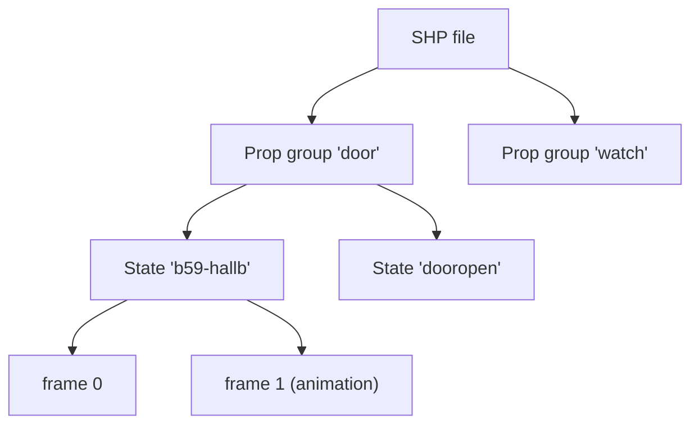

# SHP — props ("shop" files)

*Prerequisite: [The DFile container format](README.md) and
[The image codec](image-codec.md).*

A **SHP** file holds **props** — the images drawn *on top* of a SET's
background: doors, items you pick up, buttons you press, the watch and menu
button in the UI band. If it moves, appears, disappears, or reacts to a click,
it's almost certainly a prop.

Reference implementation: [`src/df/shp.ts`](https://github.com/dhobi/taoot-web/blob/master/src/df/shp.ts) (decoding) and
[`src/engine/props.ts`](https://github.com/dhobi/taoot-web/blob/master/src/engine/props.ts) (runtime).

> Despite the name, SHP is **not** "ship." CyberFlix called these **shop**
> files. (And SET files, confusingly, are the rooms.)

## The structure: groups → states → frames

A prop is organised in three levels:



- A **group** is one prop, addressed by name (`"door"`, `"watch"`, `"bag"`).
- A **state** is a named look or animation for that prop. The ship-wide
  `door` prop, for instance, has **135 route-named states** like
  `"b59-hallb"` — one per doorway it can represent.
- **Frames** are the individual images of a state; playing them in sequence is
  the animation.

Prop-state animations **play once and hold** — a door opens and *stays* open.
Anything that genuinely loops has to be re-triggered by a script
(`makeloop`); the format itself doesn't loop.

## Transparency: the prop only paints part of the screen

Unlike a SET background (which fills its rectangle), a prop is a **cut-out** —
a door occupies only a door-shaped region, the rest is transparent. So SHP
frames use the **transparent variant** of the [image codec](image-codec.md):
alongside the pixels there's an **opaque mask** marking which pixels are real
and which are see-through.

Each frame also stores its own **draw offset** in the header — where the
cut-out sits relative to the prop's anchor point — and, as with hotspots, the
offset is stored **Y before X**.

## Colour: props borrow the room's palette

A prop is decoded **palette-independently**: the loader keeps it as *indexed*
pixels plus the opaque mask, and does **not** bake in colours. The prop is
colourised only at **composite time, through the currently active SET's
palette** (a shared colour table — the `clut`/`mixclut` commands exist to
manage it). That's how the same door art looks right in every room it appears
in.

## Placing a prop on screen

There are two placement worlds, and knowing which one a prop is in explains a
whole class of bugs:

### Screen-space props (UI, inventory, cards)

Most props are positioned directly in screen pixels. The rule (validated
against dragged inventory items, blackjack cards, and UI-band buttons) is:

```
screenPosition = propxy − storedFrameOffset
```

with a default anchor at **(256, 192)** — the centre of the 512×384 screen.
The `propxy` command moves a prop in this screen space. UI-band props live
below y=264 (e.g. `propxy(me, 256, 324)`).

### World-space props (things sitting in the 3D room)

A prop placed with `propxyz` has a **3D world coordinate** instead. It is
**projected** into the current view using the camera math from
[the SET doc](set.md#the-camera-and-placing-things-in-3d) — so an item on a
bed appears at the right spot and shrinks with distance. `propscale` and
`propzclip` tune its size and its visibility cut-off. Calling `propxy` on such
a prop returns it to screen space — which is exactly what "picking it up"
does.

A world prop is bound to its set with `propset(name, set)`, so it only draws
in the room it belongs to. Getting the projection right is what finally let
the bag on the C73 bed render, be clicked, and go into the inventory.

## How props behave: they have their own scripts

Each prop group has a script whose `code` handlers respond to events
(`mousedown`, `setcursor`, `initprop`, …), joining the same event chain as
everything else (see [scripting](../03-scripting-language.md)). Two runtime
facts worth carrying:

- Prop clicks are hit-tested **front-to-back and pixel-accurately** (using the
  opaque mask), so you can only click the visible part of a prop, and the
  nearest prop wins.
- A prop script's **unqualified calls resolve through its "shop main"
  script** — the file's own top-level script. The bag's `mousedown` calls
  `watchidle()` / `mapidle()`, which are defined in the shop main, not in the
  bag; without that parent link the calls fail and the click silently dies.

## Boot-loaded, session-scoped props

Some SHP files are **loaded once at startup by the boot** and live for the
whole session, not per-set: `house.shp` (44 ship-wide props including the
135-state `door`), `inven.shp` (the inventory). That's why
`sendtoprop("door", …)` from any room reaches a real, already-loaded prop.
See [BOOTFILE](bootfile.md).

## Related tools

- `tools/dumpshp.ts` — decode a SHP and export its states/frames as images.
- **[the shop editor](../editors/shops.md)** (`/editors/shops.html`) —
  the same structure in a browser page, with the frames drawn where the engine
  would put them, animation playback, and the names/offsets/degrees editable.

Next: click-through close-ups and cutscenes — **[MOV](mov.md)**.
